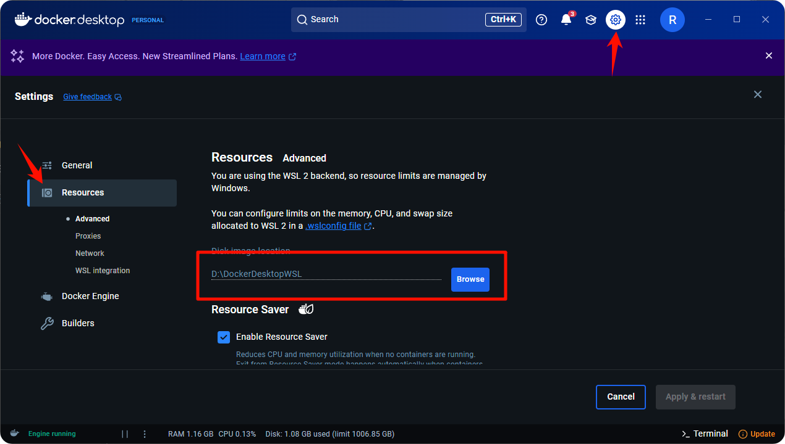
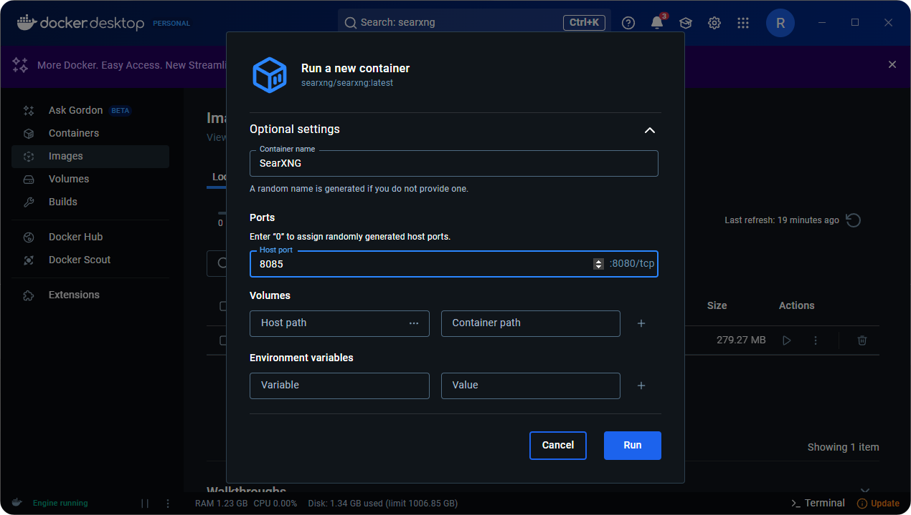
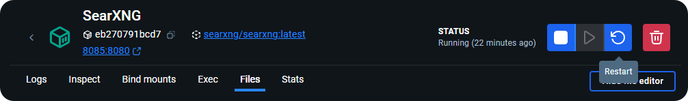

# SearXNG Local Deployment and Configuration



This document was translated from Chinese by AI and has not yet been reviewed.



CherryStudio supports network search through SearXNG. SearXNG is an open-source project that can be deployed locally or on a server, so its configuration method is slightly different from others that require API providers.

**SearXNG Project Link**: [SearXNG](https://github.com/searxng/searxng)

## Advantages of SearXNG

*   Open source and free, no API required
*   Relatively high privacy
*   Highly customizable

## Local Deployment

### 1. Direct Deployment with Docker

Since SearXNG does not require complex environment configuration and can be deployed by simply providing an available port without docker compose, the quickest way is to directly pull the image with Docker for deployment.

#### 1. Download, install, and configure [docker](https://www.docker.com/)

<figure><figcaption></figcaption></figure>

After installation, select an image storage path:

<figure><figcaption></figcaption></figure>

#### 2. Search and pull SearXNG image

Enter **searxng** in the search bar:

<figure><figcaption></figcaption></figure>

Pull image:

<figure><figcaption></figcaption></figure>

<figure><figcaption></figcaption></figure>

#### 3. Run the image

After successfully pulling, go to the **images** page:

<figure><figcaption></figcaption></figure>

Select the pulled image and click run:

<figure><figcaption></figcaption></figure>

Open settings for configuration:

<figure><figcaption></figcaption></figure>

Taking port `8085` as an example:

<figure><figcaption></figcaption></figure>

After successful operation, click the link to open SearXNG's frontend interface:

<figure><figcaption></figcaption></figure>

This page indicates successful deployment:

<figure><figcaption></figcaption></figure>

## Server Deployment

Given that installing Docker on Windows can be quite troublesome, users can deploy SearXNG on a server and share it with others. However, unfortunately, SearXNG itself does not currently support authentication, which could lead to others scanning and misusing your deployed instance through technical means.

To address this, Cherry Studio currently supports configuring [HTTP Basic Authentication (RFC7617)](https://developer.mozilla.org/zh-CN/docs/Web/HTTP/Guides/Authentication). If you intend to expose your deployed SearXNG to the public network, it is **essential** to configure HTTP Basic Authentication using reverse proxy software like Nginx. A brief tutorial is provided below, assuming you have basic Linux operation and maintenance knowledge.

### Deploying SearXNG

Similarly, deployment still uses Docker. Assuming you have installed the latest Docker CE on your server according to the [official tutorial](https://docs.docker.com/engine/install), here are one-stop commands suitable for a fresh installation on a Debian system:

```bash
sudo apt update
sudo apt install git -y

# Pull the official repository
cd /opt
git clone https://github.com/searxng/searxng-docker.git
cd /opt/searxng-docker

# If your server bandwidth is small, you can set this to false
export IMAGE_PROXY=true

# Modify configuration file
cat <<EOF > /opt/searxng-docker/searxng/settings.yml
# see https://docs.searxng.org/admin/settings/settings.html#settings-use-default-settings
use_default_settings: true
server:
  # base_url is defined in the SEARXNG_BASE_URL environment variable, see .env and docker-compose.yml
  secret_key: $(openssl rand -hex 32)
  limiter: false  # can be disabled for a private instance
  image_proxy: $IMAGE_PROXY
ui:
  static_use_hash: true
redis:
  url: redis://redis:6379/0
search:
  formats:
    - html
    - json
EOF
```

If you need to modify the local listening port or reuse an existing Nginx instance locally, you can edit the `docker-compose.yaml` file as follows:

```yaml
version: "3.7"

services:
# If you don't need Caddy and want to reuse an existing Nginx locally, remove the following. We don't need Caddy by default.
  caddy:
    container_name: caddy
    image: docker.io/library/caddy:2-alpine
    network_mode: host
    restart: unless-stopped
    volumes:
      - ./Caddyfile:/etc/caddy/Caddyfile:ro
      - caddy-data:/data:rw
      - caddy-config:/config:rw
    environment:
      - SEARXNG_HOSTNAME=${SEARXNG_HOSTNAME:-http://localhost}
      - SEARXNG_TLS=${LETSENCRYPT_EMAIL:-internal}
    cap_drop:
      - ALL
    cap_add:
      - NET_BIND_SERVICE
    logging:
      driver: "json-file"
      options:
        max-size: "1m"
        max-file: "1"
# If you don't need Caddy and want to reuse an existing Nginx locally, remove the above. We don't need Caddy by default.
  redis:
    container_name: redis
    image: docker.io/valkey/valkey:8-alpine
    command: valkey-server --save 30 1 --loglevel warning
    restart: unless-stopped
    networks:
      - searxng
    volumes:
      - valkey-data2:/data
    cap_drop:
      - ALL
    cap_add:
      - SETGID
      - SETUID
      - DAC_OVERRIDE
    logging:
      driver: "json-file"
      options:
        max-size: "1m"
        max-file: "1"

  searxng:
    container_name: searxng
    image: docker.io/searxng/searxng:latest
    restart: unless-stopped
    networks:
      - searxng
    # Default mapping to host port 8080. If you want to listen on 8000, change it to "127.0.0.1:8000:8080"
    ports:
      - "127.0.0.1:8080:8080"
    volumes:
      - ./searxng:/etc/searxng:rw
    environment:
      - SEARXNG_BASE_URL=https://${SEARXNG_HOSTNAME:-localhost}/
      - UWSGI_WORKERS=${SEARXNG_UWSGI_WORKERS:-4}
      - UWSGI_THREADS=${SEARXNG_UWSGI_THREADS:-4}
    cap_drop:
      - ALL
    cap_add:
      - CHOWN
      - SETGID
      - SETUID
    logging:
      driver: "json-file"
      options:
        max-size: "1m"
        max-file: "1"

networks:
  searxng:

volumes:
# If you don't need Caddy and want to reuse an existing Nginx locally, remove the following
  caddy-data:
  caddy-config:
# If you don't need Caddy and want to reuse an existing Nginx locally, remove the above
  valkey-data2:
```

Execute `docker compose up -d` to start. Execute `docker compose logs -f searxng` to view logs.

### Deploy Nginx Reverse Proxy and HTTP Basic Authentication

If you use server panel programs, such as Baota Panel or 1Panel, please refer to their documentation to add a website and configure Nginx reverse proxy. Then, locate where to modify the Nginx configuration file, and modify it according to the example below:

```conf
server
{
    listen 443 ssl;

    # This line is your hostname
    server_name search.example.com;

    # index index.html;
    # root /data/www/default;

    # If SSL is configured, these two lines should be present
    ssl_certificate    /path/to/your/cert/fullchain.pem;
    ssl_certificate_key    /path/to/your/cert/privkey.pem;

    # HSTS
    # add_header Strict-Transport-Security "max-age=31536000; includeSubDomains; preload";

    # By default, when configuring reverse proxy via the panel, the default location block looks like this
    location / {
        # Just add the following two lines to the location block; keep everything else as is.
        # This example assumes your configuration file is saved in the /etc/nginx/conf.d/ directory.
        # If using Baota, it should be saved in directories like /www; pay attention to this.
        auth_basic "Please enter your username and password";
        auth_basic_user_file /etc/nginx/conf.d/search.htpasswd;

        proxy_http_version 1.1;
        proxy_set_header Connection "";
        proxy_redirect off;
        proxy_set_header Host $host;
        proxy_set_header X-Forwarded-For $proxy_protocol_addr;
        proxy_pass http://127.0.0.1:8000;
        client_max_body_size 0;
    }

    # access_log  ...;
    # error_log  ...;
}
```

Assuming the Nginx configuration file is saved under `/etc/nginx/conf.d`, we will save the password file in the same directory.

Execute the command (replace `example_name` and `example_password` with the username and password you intend to set):

```bash
echo "example_name:$(openssl passwd -5 'example_password')" > /etc/nginx/conf.d/search.htpasswd
```

Restart Nginx (reloading the configuration also works).

Now you can open the webpage, and it will prompt you to enter your username and password. Please enter the username and password you set earlier to see if you can successfully access the SearXNG search page, thereby checking if the configuration is correct.

<figure><figcaption></figcaption></figure>

## Cherry Studio Related Configuration

After SearXNG is successfully deployed locally or on a server, the next step is CherryStudio's related configuration.

Go to the network search settings page and select Searxng:

<figure><figcaption></figcaption></figure>

If entering the locally deployed link results in verification failure, don't worry:

<figure><figcaption></figcaption></figure>

Because the JSON return type is not configured by default after direct deployment, data cannot be fetched, and the configuration file needs to be modified.

Go back to Docker, navigate to the Files tab, and find the tagged folder within the image:

<figure><figcaption></figcaption></figure>

Expand it and scroll down further; you will find another tagged folder:

<figure><figcaption></figcaption></figure>

Continue expanding and locate the **settings.yml** configuration file:

<figure><figcaption></figcaption></figure>

Click to open the file editor:

<figure><figcaption></figcaption></figure>

Go to line 78; you will see that only `html` is listed as a type

<figure><figcaption></figcaption></figure>

Add the `json` type, save, and restart the image

<figure><figcaption></figcaption></figure>

<figure><figcaption></figcaption></figure>

Return to Cherry Studio to verify; verification successful:

<figure><figcaption></figcaption></figure>

The address can be filled in as local: [http://localhost](http://localhost) : port number\
or as the Docker address: [http://host.docker.internal](http://host.docker.internal) : port number

If the user followed the previous example for server deployment and correctly configured the reverse proxy, and has enabled the JSON return type. After entering the address and verifying, since HTTP Basic Authentication has been configured for the reverse proxy, verification should now return a 401 error code:

<figure><figcaption></figcaption></figure>

Configure HTTP Basic Authentication in the client, enter the username and password set earlier:

<figure><figcaption></figcaption></figure>

Proceed with verification; it should be successful.

### Other Configurations

At this point, SearXNG has default internet search capabilities. If you need to customize search engines, you must configure them yourself.

It should be noted that the preferences here do not affect the configuration when large models are invoked.

<figure><figcaption></figcaption></figure>

To configure search engines that require large model invocation, you need to set them in the configuration file:

<figure><figcaption></figcaption></figure>

<figure><figcaption></figcaption></figure>

Configuration language reference:

<figure><figcaption></figcaption></figure>

If the content is too long and inconvenient to modify directly, you can copy it to a local IDE, modify it, and then paste it back into the configuration file.

## Common Reasons for Verification Failure

### Return format not including JSON format

Add `json` to the return format in the configuration file:

<figure><figcaption></figcaption></figure>

### Search engine not configured correctly

Cherry Studio defaults to selecting engines that include both 'web' and 'general' categories for searching. By default, engines like Google are selected, which leads to failure as Google and similar websites are not directly accessible in mainland China. Adding the following configuration to force SearXNG to use the Baidu engine can resolve this issue:

```
use_default_settings:
  engines:
    keep_only:
      - baidu
engines:
  - name: baidu
    engine: baidu 
    categories: 
      - web
      - general
    disabled: false
```

### Access rate too fast

SearXNG's `limiter` configuration is hindering API access. Please try setting it to `false` in the settings:

<figure><figcaption></figcaption></figure>