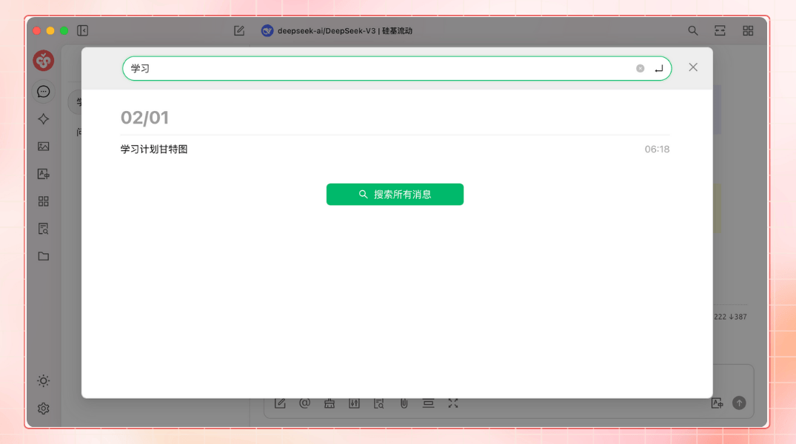

# Présentation du projet


Ce document a été traducido del chino por IA y aún no ha sido revisado.


<figure><figcaption></figcaption></figure>

Suivez-nous sur les réseaux sociaux : [Twitter (X)](https://x.com/CherryStudioAPP), [Xiaohongshu](https://www.xiaohongshu.com/user/profile/662b6853000000000b031d9a), [Weibo](https://weibo.com/u/7975656228), [Bilibili](https://space.bilibili.com/3546657515898892), [Douyin](https://www.douyin.com/user/MS4wLjABAAAAmw9A54m5J0hHVMQY5eGrVJ-EHDoOS0hgJ6M1F9MN2Tn2V163A0xrC4_KVzfmQSxC)

Rejoignez notre communauté : [Groupe QQ (575014769)](https://qm.qq.com/q/lo0D4qVZKi), [Telegram](https://t.me/CherryStudioAI), [Discord](https://discord.gg/wez8HtpxqQ), [Groupe WeChat (cliquez pour voir)](https://www.cherry-ai.com/#Community)

***

Cherry Studio est une plateforme tout-en-un d'assistant IA intégrant des fonctionnalités comme les conversations multi-modèles, la gestion de base de connaissances, la création artistique IA, la traduction, etc.\
Son design hautement personnalisable, ses puissantes capacités d'extension et son interface conviviale en font une solution idéale pour les utilisateurs professionnels et passionnés d'IA. Qu'ils soient débutants ou développeurs, tous trouveront dans Cherry Studio des fonctions IA adaptées pour améliorer leur productivité et créativité.

***

### **Fonctionnalités principales et caractéristiques**

#### **1. Fonctions de conversation basiques**

* **Réponses multiples** : Permet de générer simultanément des réponses à une même question via plusieurs modèles, facilitant la comparaison des performances. Voir [Interface de conversation](cherrystudio/preview/chat.md).

<figure><figcaption></figcaption></figure>

* **Regroupement automatique** : L'historique des conversations est automatiquement organisé par assistant pour un accès rapide.
* **Exportation des conversations** : Permet d'exporter des conversations complètes ou partielles vers Markdown, Word, etc.
* **Paramètres personnalisables** : Au-delà des paramètres basiques, possibilité de définir des paramètres personnalisés.

<figure><figcaption></figcaption></figure>

* **Marché d'assistants** : Propose des milliers d'assistants spécialisés par secteur (traduction, programmation, rédaction), avec création personnalisée.

<figure><figcaption></figcaption></figure>

* **Rendu multi-formats** : Prise en charge du rendu Markdown, des formules mathématiques et de la prévisualisation HTML.

<figure><figcaption></figcaption></figure>

#### **2. Intégration de fonctions spécifiques**

* **Création artistique IA** : Panneau dédié pour générer des images via descriptions textuelles.

<figure><figcaption></figcaption></figure>

* **Micro-applications IA** : Outils IA web gratuits intégrés sans changer de navigateur.
* **Traduction** : Prise en charge de la traduction contextuelle, de dialogue et de prompts.
* **Gestion des fichiers** : Fichiers organisés par catégories (conversations, créations artistiques, bases de connaissances).

<figure><figcaption></figcaption></figure>

* **Recherche globale** : Recherche rapide dans l'historique et les bases de connaissances.

<figure><figcaption></figcaption></figure>

#### **3. Gestion unifiée multi-fournisseurs**

* **Agrégation de modèles** : Prise en charge des modèles d'OpenAI, Gemini, Anthropic, Azure, etc.
* **Récupération automatique** : Liste complète des modèles disponible en un clic.
* **Rotation des clés API** : Utilisation cyclique de multiples clés pour éviter les limitations.
* **Avatars adaptés** : Attribution automatique d'avatars spécifiques à chaque modèle.
* **Fournisseurs personnalisés** : Compatibilité avec des services tiers respectant les normes OpenAI/Gemini/Anthropic.

<figure><figcaption></figcaption></figure>

#### **4. Interface et disposition personnalisables**

* **CSS personnalisé** : Personnalisation globale du style visuel.
* **Disposition de conversations** : Mode liste ou bulles, avec styles de messages personnalisés.
* **Avatars personnalisés** : Pour l'application et les assistants.
* **Barre latérale modifiable** : Masquage ou réorganisation des fonctionnalités selon les besoins.

<figure><figcaption></figcaption></figure>

#### **5. Système de base de connaissances locale**

* **Formats multiples** : Prise en charge de PDF, DOCX, PPTX, XLSX, TXT, MD.
* **Sources variées** : Fichiers locaux, URLs, sitemaps ou contenu manuel.
* **Exportation** : Partage des bases de connaissances traitées.
* **Vérification intégrée** : Test de segmentation après import.

<figure><figcaption></figcaption></figure>

#### **6. Fonctions de focus spécifiques**

* **Q&R rapides** : Assistants contextuels activables depuis n'importe quelle application.
* **Traduction rapide** : Traduction instantanée de mots/textes externes.
* **Synthèse de contenu** : Résumé rapide de longs textes.
* **Explications simplifiées** : Clarification en un clic sans prompts complexes.

<figure><figcaption></figcaption></figure>

#### **7. Protection des données**

* **Sauvegardes multiples** : Locales, WebDAV et planifiées.
* **Sécurité des données** : Utilisation entièrement locale avec modèles locaux pour éviter les fuites.

***

### **Avantages du projet**

1. **Accessibilité** : Interface adaptée aux débutants pour se concentrer sur le travail ou la création.
2. **Documentation complète** : Guides détaillés et FAQ pour résoudre rapidement les problèmes.
3. **Amélioration continue** : Mises à jour régulières basées sur les retours utilisateurs.
4. **Ouverture et extensibilité** : Code source ouvert pour personnalisations avancées.

***

### **Cas d'utilisation**

* **Gestion de connaissances** : Construction et interrogation de bases dédiées (recherche, éducation).
* **Conversations multi-modèles** : Génération rapide d'informations et de contenu.
* **Traduction et automatisation** : Fonctions de traduction et traitement documentaire.
* **Création artistique IA** : Génération d'images par descriptions textuelles.

### Star History

## Suivez-nous sur les réseaux sociaux

<table data-view="cards"><thead><tr><th></th><th data-hidden data-card-cover data-type="files"></th><th data-hidden data-card-target data-type="content-ref"></th></tr></thead><tbody><tr><td><a href="https://www.xiaohongshu.com/user/profile/662b6853000000000b031d9a?xsec_token=YB_1nKvlH4r5hPYVVbbsNHF8Y6n6AKlm5-DaggPCtd2DQ%3D&#x26;xsec_source=app_share&#x26;xhsshare=CopyLink&#x26;appuid=662b6853000000000b031d9a&#x26;apptime=1738627324&#x26;share_id=ace5db41b5954fab8d98a2a7865a62bc&#x26;share_channel=copy_link">Xiaohongshu</a></td><td><a href=".gitbook/assets/1.png">1.png</a></td><td><a href="https://www.xiaohongshu.com/user/profile/662b6853000000000b031d9a?xsec_token=YB_1nKvlH4r5hPYVVbbsNHF8Y6n6AKlm5-DaggPCtd2DQ%3D&#x26;xsec_source=app_share&#x26;xhsshare=CopyLink&#x26;appuid=662b6853000000000b031d9a&#x26;apptime=1738627324&#x26;share_id=ace5db41b5954fab8d98a2a7865a62bc&#x26;share_channel=copy_link">https://www.xiaohongshu.com/user/profile/662b6853000000000b031d9a?xsec_token=YB_1nKvlH4r5hPYVVbbsNHF8Y6n6AKlm5-DaggPCtd2DQ%3D&#x26;xsec_source=app_share&#x26;xhsshare=CopyLink&#x26;appuid=662b6853000000000b031d9a&#x26;apptime=1738627324&#x26;share_id=ace5db41b5954fab8d98a2a7865a62bc&#x26;share_channel=copy_link</a></td></tr><tr><td><a href="https://b23.tv/hIfGgDW">Bilibili</a></td><td><a href=".gitbook/assets/3.png">3.png</a></td><td><a href="https://b23.tv/hIfGgDW">https://b23.tv/hIfGgDW</a></td></tr><tr><td><a href="https://weibo.com/u/7975656228">Weibo</a></td><td><a href=".gitbook/assets/2.png">2.png</a></td><td><a href="https://weibo.com/u/7975656228">https://weibo.com/u/7975656228</a></td></tr><tr><td><a href="https://v.douyin.com/ifTpX4X7">Douyin</a></td><td><a href=".gitbook/assets/4.png">4.png</a></td><td><a href="https://v.douyin.com/ifTpX4X7">https://v.douyin.com/ifTpX4X7</a></td></tr><tr><td><a href="https://x.com/CherryStudioAPP?t=DYR0ulaLur-bO4Us3bG79A&#x26;s=05">Twitter (X)</a></td><td><a href=".gitbook/assets/5.png">5.png</a></td><td><a href="https://x.com/CherryStudioAPP?t=DYR0ulaLur-bO4Us3bG79A&#x26;s=05">https://x.com/CherryStudioAPP?t=DYR0ulaLur-bO4Us3bG79A&#x26;s=05</a></td></tr></tbody></table>