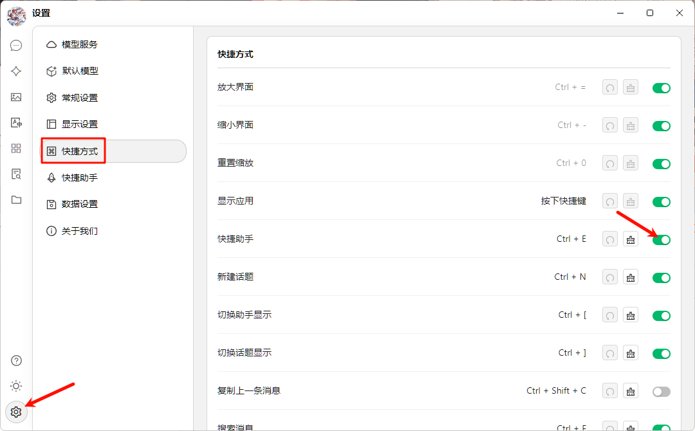


Ce document a été traducido del chino por IA y aún no ha sido revisado.


# Assistant Rapide

L'Assistant Rapide est un outil pratique proposé par Cherry Studio qui vous permet d'accéder rapidement aux fonctions d'IA dans n'importe quelle application, pour effectuer des opérations telles que poser des questions instantanées, traduire, résumer ou expliquer du contenu.

### Activation de l'Assistant Rapide

1. **Ouvrir les paramètres :** Accédez à `Paramètres` -> `Raccourcis` -> `Assistant Rapide`.
2. **Activer le commutateur :** Trouvez et activez le bouton correspondant à `Assistant Rapide`.

<figure><figcaption>
Schéma d'activation de l'Assistant Rapide
</figcaption></figure>

3. **Configurer un raccourci (optionnel) :**
   * Raccourci par défaut sur Windows : <kbd>Ctrl</kbd> + <kbd>E</kbd>
   * Raccourci par défaut sur macOS : <kbd>⌘</kbd> + <kbd>E</kbd>
   * Vous pouvez personnaliser ici le raccourci pour éviter les conflits ou l'adapter à vos habitudes.

### Utilisation de l'Assistant Rapide

1. **Invocation :** Dans n'importe quelle application, appuyez sur votre raccourci configuré (ou le raccourci par défaut) pour ouvrir l'Assistant Rapide.
2. **Interaction :** Dans la fenêtre de l'Assistant Rapide, vous pouvez directement effectuer ces opérations :
   * **Question rapide :** Posez n'importe quelle question à l'IA.
   * **Traduction de texte :** Saisissez le texte à traduire.
   * **Résumé de contenu :** Saisissez un texte long pour obtenir un résumé.
   * **Explication :** Saisissez un concept ou terme à expliquer.

<figure><figcaption>
Interface de l'Assistant Rapide
</figcaption></figure>

3. **Fermeture :** Appuyez sur <kbd>ESC</kbd> ou cliquez n'importe où en dehors de la fenêtre pour fermer.


L'Assistant Rapide utilise le [modèle de conversation par défaut global](settings/default-models.md#mo-ren-zhu-shou-mo-xing).


### Astuces et Conseils

* **Conflit de raccourcis :** Si le raccourci par défaut entre en conflit avec d'autres applications, modifiez-le.
* **Découvrir plus de fonctions :** Au-delà des fonctions mentionnées, l'Assistant Rapide peut prendre en charge d'autres opérations comme la génération de code ou la conversion de style. Explorez ses possibilités.
* **Retours et améliorations :** Si vous rencontrez des problèmes ou avez des suggestions, contactez l'équipe Cherry Studio via ces [canaux de feedback](../../../question-contact/suggestions.md).