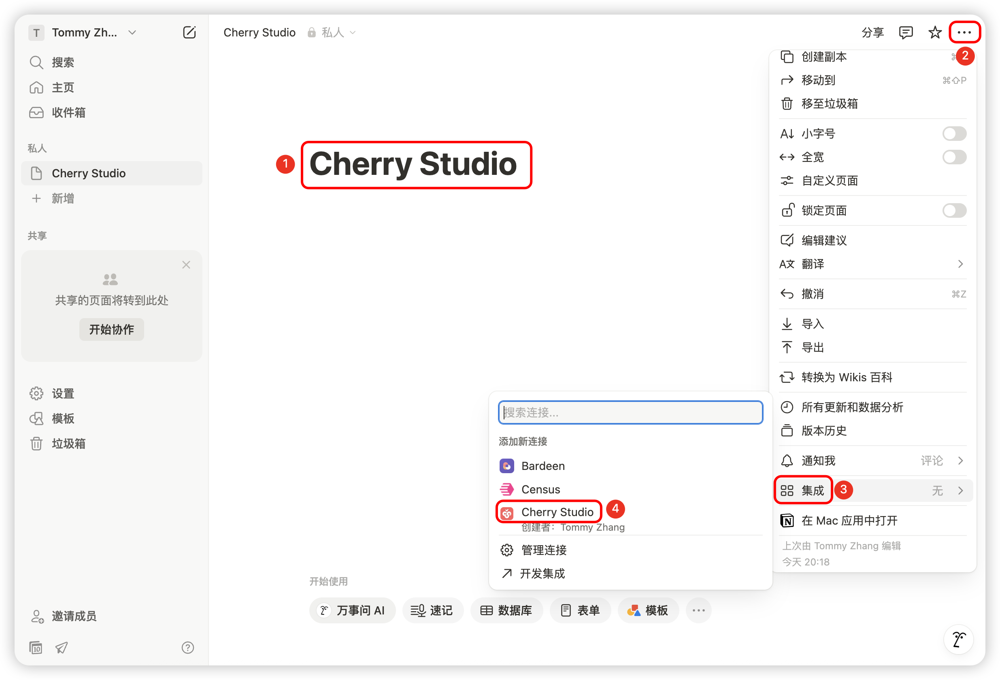

# Tutoriel de configuration Notion


Ce document a été traducido del chino por IA y aún no ha sido revisado.


Cherry Studio prend en charge l'importation de conversations dans les bases de données Notion.

## Étape 1

Ouvrez le site [Notion Integrations](https://www.notion.so/profile/integrations) pour créer une intégration

<figure><figcaption>
Cliquez sur le signe plus pour créer une intégration
</figcaption></figure>

## Étape 2

Créez une intégration

<figure><figcaption>
Remplissez les informations de l'intégration
</figcaption></figure>

Nom : Cherry Studio  
Type : Sélectionnez le premier  
Icône : Vous pouvez enregistrer cette image

<figure><figcaption></figcaption></figure>

## Étape 3

Copiez la clé secrète et collez-la dans les paramètres de Cherry Studio

<figure><figcaption>
Cliquez pour copier la clé secrète
</figcaption></figure>

<figure><figcaption>
Collez la clé secrète dans les paramètres de données
</figcaption></figure>

## Étape 4

Ouvrez le site [Notion](https://www.notion.so/) et créez une nouvelle page. Sélectionnez le type de base de données ci-dessous, nommez-la Cherry Studio, puis connectez comme indiqué

<figure><figcaption>
Créez une nouvelle page et sélectionnez le type de base de données
</figcaption></figure>

<figure><figcaption>
Entrez le nom de la page et sélectionnez "Connect to APP"
</figcaption></figure>

## Étape 5

<figure><figcaption>
Copiez l'ID de la base de données
</figcaption></figure>

Si l'URL de votre base de données Notion ressemble à ceci :

https://www.notion.so/\<long_hash_1>?v=\<long_hash_2>

Alors l'ID de la base de données Notion est la partie `<long_hash_1>`

<figure><figcaption>
Entrez l'ID de la base de données et cliquez sur "Vérifier"
</figcaption></figure>

## Étape 6

Remplissez le `Nom du champ de titre de la page` :  
Si votre interface est en anglais, entrez `Name`  
Si votre interface est en chinois, entrez `名称`

<figure><figcaption>
Remplissez le nom du champ de titre de la page
</figcaption></figure>

## Étape 7

Félicitations, la configuration Notion est terminée ✅ Vous pouvez maintenant exporter le contenu de Cherry Studio vers votre base de données Notion

<figure><figcaption>
Exporter vers Notion
</figcaption></figure>

<figure><figcaption>
Voir le résultat de l'exportation
</figcaption></figure>