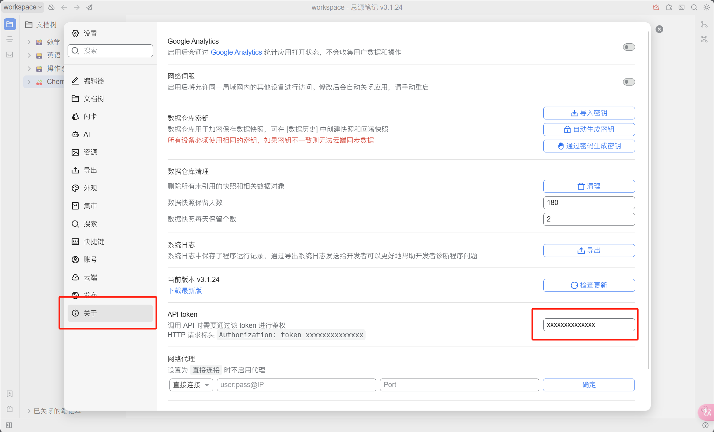


Ce document a été traducido del chino por IA y aún no ha sido revisado.


# Tutoriel de configuration de Syuan Notes

Prend en charge l'exportation de sujets et de messages vers Syuan Notes.

## Étape 1

Ouvrez Syuan Notes et créez un nouveau cahier

<figure><figcaption>
Cliquez sur "Créer un nouveau cahier"
</figcaption></figure>

## Étape 2

Ouvrez les paramètres du cahier et copiez l'`ID du cahier`

<figure><figcaption>
Ouvrir les paramètres du cahier
</figcaption></figure>

<figure><figcaption>
Cliquez sur le bouton Copier l'ID du cahier
</figcaption></figure>

## Étape 3

Collez l'ID du cahier dans les paramètres de Cherry Studio

<figure><figcaption>
Saisissez l'ID du cahier dans les paramètres de données
</figcaption></figure>

## Étape 4

Entrez l'adresse de votre Syuan Notes

* **Local**\
  Généralement `http://127.0.0.1:6806`
* **Auto-hébergé**\
  Votre domaine `http://note.domain.com`

<figure><figcaption>
Saisissez votre adresse Syuan Notes
</figcaption></figure>

## Étape 5

Copiez le `Jetton API` de Syuan Notes

<figure><figcaption>
Copiez le jeton de Syuan Notes
</figcaption></figure>

Saisissez-le dans les paramètres de Cherry Studio et vérifiez

<figure><figcaption>
Remplissez l'ID de la base de données et cliquez sur "Vérifier"
</figcaption></figure>

## Étape 6

Félicitations ! La configuration de Syuan Notes est terminée ✅ Vous pouvez maintenant exporter le contenu de Cherry Studio vers votre Syuan Notes

<figure><figcaption>
Exporter vers Syuan Notes
</figcaption></figure>

<figure><figcaption>
Voir les résultats d'exportation
</figcaption></figure>