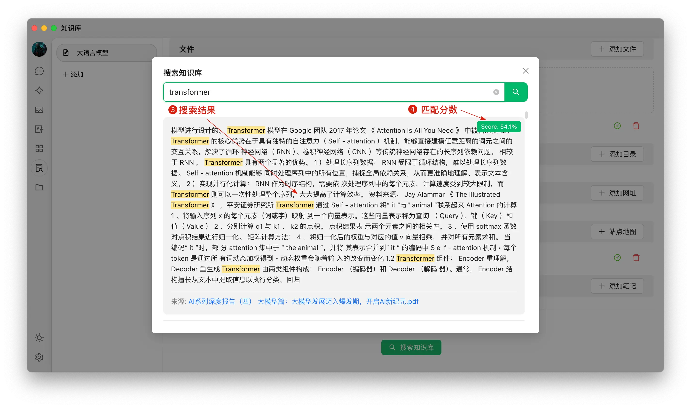

# Tutoriel sur la base de connaissances


Ce document a été traducido del chino por IA y aún no ha sido revisado.


Dans la version 0.9.1, CherryStudio a introduit la fonctionnalité tant attendue de base de connaissances.

Ci-dessous, nous présentons étape par étape les instructions détaillées d'utilisation de CherryStudio.

## Ajouter un modèle d'incorporation

1. Dans le service de gestion des modèles, recherchez un modèle - vous pouvez cliquer sur "Modèle d'incorporation" pour filtrer rapidement ;
2. Trouvez le modèle souhaité et ajoutez-le à Mes modèles.

<figure><figcaption></figcaption></figure>

## Créer une base de connaissances

1. Accès à la base de connaissances : dans la barre d'outils de gauche de CherryStudio, cliquez sur l'icône de la base de connaissances pour accéder à la page de gestion ;
2. Ajouter une base de connaissances : cliquez sur Ajouter pour commencer à créer une base de connaissances ;
3. Nommer : entrez le nom de la base de connaissances et ajoutez un modèle d'incorporation, par exemple bge-m3, pour terminer la création.

<figure><figcaption></figcaption></figure>

<figure><figcaption></figcaption></figure>

## Ajouter des fichiers et vectoriser

1. Ajouter des fichiers : cliquez sur le bouton Ajouter des fichiers pour ouvrir la sélection de fichiers ;
2. Sélectionnez des fichiers : choisissez les formats de fichiers pris en charge (pdf, docx, pptx, xlsx, txt, md, mdx, etc.) et ouvrez ;
3. Vectorisation : le système effectue automatiquement le traitement de vectorisation. Lorsque l'affichage montre Terminé (✓ vert), cela indique que la vectorisation est terminée.

<figure><figcaption></figcaption></figure>

<figure><figcaption></figcaption></figure>

<figure><figcaption></figcaption></figure>

## Ajouter des données de diverses sources

CherryStudio prend en charge plusieurs méthodes d'ajout de données :

1. Dossiers : vous pouvez ajouter un dossier entier - les fichiers pris en charge dans ce dossier seront automatiquement vectorisés ;
2. Liens URL : prend en charge les URL comme [https://docs.siliconflow.cn/introduction](https://docs.siliconflow.cn/introduction) ;
3. Plans de site : prend en charge les plans de site au format XML comme [https://docs.siliconflow.cn/sitemap.xml](https://docs.siliconflow.cn/sitemap.xml) ;
4. Notes en texte brut : prend en charge la saisie de contenu personnalisé en texte brut.


Remarque :

1. Les illustrations dans les documents importés dans la base de connaissances ne sont pas encore prises en charge pour la conversion en vecteurs - elles doivent être converties manuellement en texte ;
2. L'utilisation d'URL comme source pour la base de connaissances ne réussit pas toujours - certains sites ont des mécanismes anti-scraping stricts (ou nécessitent une connexion/autorisation), donc le contenu exact peut ne pas être obtenu. Après création, testez via une recherche ;
3. Généralement, les sites fournissent un sitemap, comme celui de CherryStudio : [sitemap](https://docs.cherry-ai.com/sitemap-pages.xml). Habituellement, ajoutez /sitemap.xml à l'URL racine du site, par exemple `aaa.com/sitemap.xml` ;
4. Si un site ne fournit pas de sitemap ou a des URL complexes, créez vous-même un fichier XML de sitemap. Le fichier doit être accessible via un lien direct public - les liens locaux ne sont pas reconnus.

> 1) Demandez à une IA de générer un fichier sitemap ou un outil de génération de sitemap HTML ;
> 2) Utilisez des liens directs OSS ou de stockage cloud pour générer des liens. Sans outil existant, visitez le site officiel d'[ocoolAI](https://one.ocoolai.com/login), connectez-vous et utilisez l'outil gratuit d'envoi de fichiers dans la barre supérieure pour générer des liens directs.


## Rechercher dans la base de connaissances

Une fois les fichiers vectorisés, vous pouvez effectuer des requêtes :

1. Cliquez sur le bouton Rechercher dans la base de connaissances en bas de page ;
2. Entrez votre requête ;
3. Les résultats de recherche s'affichent ;
4. Le score de correspondance de chaque résultat est indiqué.

<figure><figcaption></figcaption></figure>

<figure><figcaption></figcaption></figure>

## Utiliser la base de connaissances dans les conversations pour générer des réponses

1. Créez un nouveau sujet. Dans la barre d'outils de conversation, cliquez sur Base de connaissances pour afficher la liste des bases existantes et sélectionnez celle à référencer ;
2. Posez votre question - le modèle renvoie une réponse générée à partir des résultats de recherche ;
3. Les sources de données référencées sont jointes sous la réponse pour un accès rapide aux fichiers originaux.

<figure><figcaption></figcaption></figure>

<figure><figcaption></figcaption></figure>