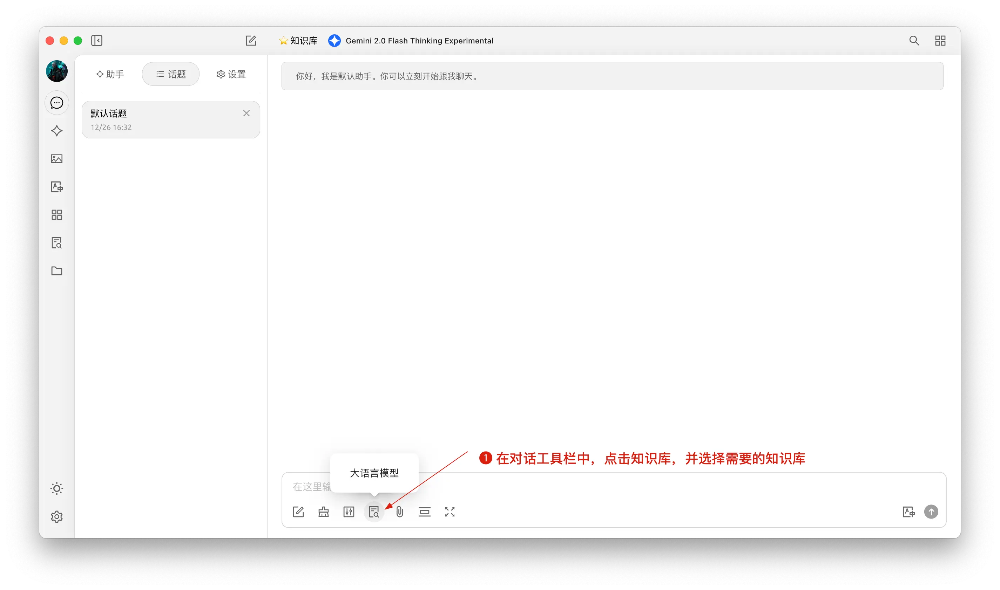
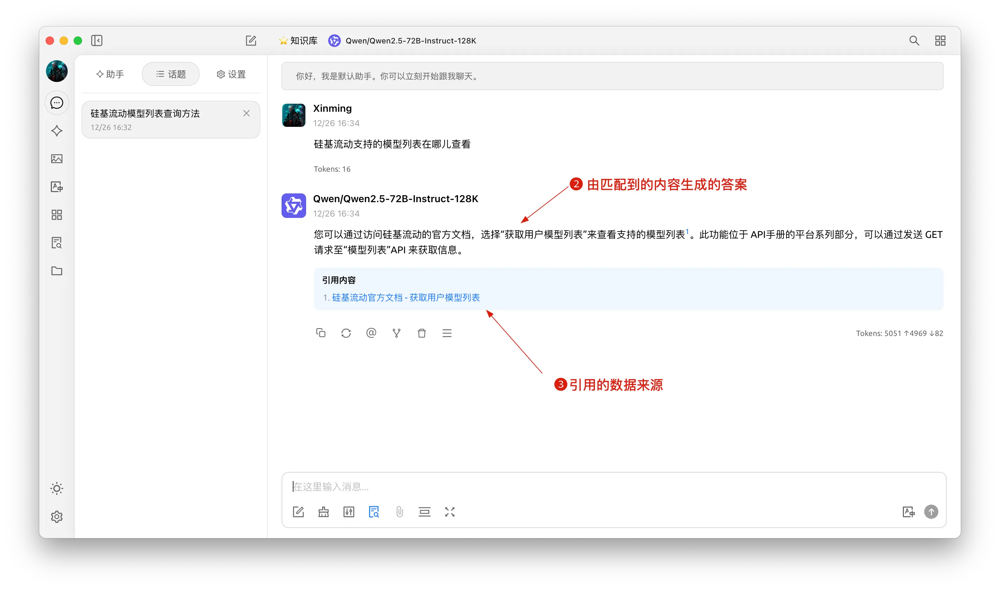


Ce document a été traducido del chino por IA y aún no ha sido revisado.


# Tutoriel de base de connaissances

Dans la version 0.9.1, CherryStudio a introduit la fonctionnalité tant attendue de base de connaissances.

Ci-dessous, nous présenterons les instructions détaillées d'utilisation de CherryStudio étape par étape.

## Ajouter un modèle d'intégration

1. Dans le service de gestion des modèles, recherchez un modèle ; vous pouvez cliquer sur "Modèle d'intégration" pour filtrer rapidement ;
2. Trouvez le modèle nécessaire et ajoutez-le à Mes Modèles.

<figure><figcaption></figcaption></figure>

## Créer une base de connaissances

1. Entrée de la base de connaissances : Dans la barre d'outils gauche de CherryStudio, cliquez sur l'icône de la base de connaissances pour accéder à la page de gestion ;
2. Ajouter une base de connaissances : Cliquez sur Ajouter pour commencer à créer une base de connaissances ;
3. Nommez : Entrez le nom de la base de connaissances et ajoutez un modèle d'intégration, prenez bge-m3 comme exemple, puis vous pourrez terminer la création.

<figure><figcaption></figcaption></figure>

<figure><figcaption></figcaption></figure>

## Ajouter des fichiers et vectorisation

1. Ajouter des fichiers : Cliquez sur le bouton d'ajout de fichiers pour ouvrir la sélection de fichiers ;
2. Sélectionnez les fichiers : Choisissez les formats de fichiers pris en charge, tels que pdf, docx, pptx, xlsx, txt, md, mdx, etc., et ouvrez-les ;
3. Vectorisation : Le système effectuera automatiquement la vectorisation ; lorsque l'affichage montre Terminé (✓ vert), cela signifie que la vectorisation est achevée.

<figure><figcaption></figcaption></figure>

<figure><figcaption></figcaption></figure>

<figure><figcaption></figcaption></figure>

## Ajouter des données provenant de diverses sources

CherryStudio prend en charge plusieurs méthodes d'ajout de données :

1. Répertoire de dossiers : Vous pouvez ajouter un répertoire entier ; les fichiers aux formats pris en charge dans ce répertoire seront automatiquement vectorisés ;
2. Lien URL : Prend en charge les URL, par exemple [https://docs.siliconflow.cn/introduction](https://docs.siliconflow.cn/introduction) ;
3. Plan du site (Sitemap) : Prend en charge les plans de site au format XML, par exemple [https://docs.siliconflow.cn/sitemap.xml](https://docs.siliconflow.cn/sitemap.xml) ;
4. Notes en texte brut : Prend en charge la saisie de contenu personnalisé en texte brut.


Remarque :

1. Les illustrations dans les documents importés dans la base de connaissances ne prennent pas encore en charge la conversion en vecteurs ; elles doivent être converties manuellement en texte.
2. L'utilisation d'URL comme source de base de connaissances n'aboutit pas toujours ; certains sites Web ont des mécanismes anti-extraction stricts (ou nécessitent une connexion, une autorisation, etc.), donc cette méthode ne garantit pas d'obtenir un contenu précis. Après la création, il est recommandé d'effectuer d'abord une recherche pour tester.
3. La plupart des sites Web fournissent un plan de site (sitemap), comme celui de CherryStudio. En général, en ajoutant /sitemap.xml à l'adresse racine du site Web (c'est-à-dire l'URL), vous pouvez obtenir les informations pertinentes. Par exemple, `aaa.com/sitemap.xml`.
4. Si le site Web ne fournit pas de plan de site ou si les URL sont trop disparates, vous pouvez créer vous-même un fichier XML de plan de site. Le fichier doit être accessible publiquement via un lien direct ; les liens de fichiers locaux ne seront pas reconnus.

> 1) Vous pouvez demander à l'IA de générer un fichier de plan de site ou d'écrire un outil générateur HTML de plan de site ;
> 2) Les liens directs peuvent être générés via des liens OSS ou des liens de stockage en cloud. Si vous n'avez pas d'outil existant, vous pouvez vous rendre sur le [site officiel d'ocoolAI](https://one.ocoolai.com/login), vous connecter, et utiliser l'outil gratuit de téléchargement de fichiers dans la barre supérieure du site pour générer un lien direct.


## Rechercher dans la base de connaissances

Une fois les fichiers et autres données vectorisés, vous pouvez effectuer des recherches :

1. Cliquez sur le bouton de recherche de la base de connaissances en bas de la page ;
2. Entrez le contenu de votre requête ;
3. Les résultats de la recherche s'affichent ;
4. Et le score de correspondance de chaque résultat est indiqué.

<figure><figcaption></figcaption></figure>

<figure><figcaption></figcaption></figure>

## Référencer la base de connaissances dans une conversation pour générer des réponses

1. Créez un nouveau sujet ; dans la barre d'outils de conversation, cliquez sur Base de connaissances pour dérouler la liste des bases de connaissances déjà créées et sélectionnez celle que vous souhaitez référencer ;
2. Entrez et envoyez votre question, le modèle retourne alors une réponse générée à partir des résultats de la recherche ;
3. En outre, la source des données référencées est jointe sous la réponse, ce qui permet de consulter rapidement le fichier source.

<figure><figcaption></figcaption></figure>

<figure><figcaption></figcaption></figure>