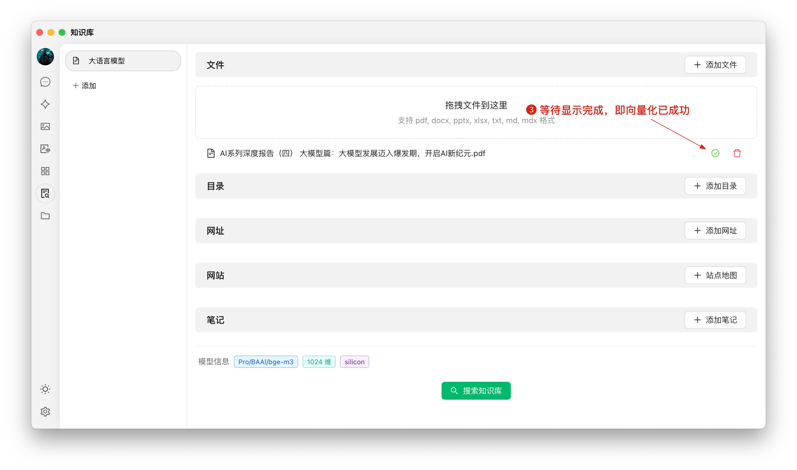


Ce document a été traducido del chino por IA y aún no ha sido revisado.


# Tutoriel de la Base de Connaissances

Dans la version 0.9.1, CherryStudio introduit la fonction tant attendue de Base de Connaissances.

Voici le guide d'utilisation détaillé de CherryStudio, présenté étape par étape.

## Ajouter un modèle d'embedding

1. Recherchez des modèles dans le service de gestion des modèles. Vous pouvez cliquer sur "Modèles d'embedding" pour filtrer rapidement ;
2. Trouvez le modèle nécessaire et ajoutez-le à Mes modèles.

<figure><figcaption></figcaption></figure>

## Créer une base de connaissances

1. Accès : Dans la barre d'outils gauche de CherryStudio, cliquez sur l'icône Base de connaissances pour accéder à la page de gestion ;
2. Ajouter : Cliquez sur Ajouter pour commencer la création ;
3. Nommage : Entrez le nom de la base de connaissances et ajoutez un modèle d'embedding (par exemple bge-m3) pour finaliser la création.

<figure><figcaption></figcaption></figure>
<figure><figcaption></figcaption></figure>

## Ajouter des fichiers et vectorisation

1. Ajout de fichier : Cliquez sur le bouton d'ajout pour ouvrir la sélection de fichiers ;
2. Sélection : Choisissez des formats supportés (pdf, docx, pptx, xlsx, txt, md, mdx, etc.) ;
3. Vectorisation : Le système traite automatiquement les fichiers. Lorsqu'un ✓ vert apparaît, la vectorisation est terminée.

<figure><figcaption></figcaption></figure>
<figure><figcaption></figcaption></figure>
<figure><figcaption></figcaption></figure>

## Ajouter des données de diverses sources

CherryStudio prend en charge plusieurs méthodes d'import :

1. Dossiers : Importer un dossier entier – les formats compatibles seront vectorisés automatiquement ;
2. Liens web : URLs comme [https://docs.siliconflow.cn/introduction](https://docs.siliconflow.cn/introduction) ;
3. Sitemap : Fichiers XML de sitemap, ex : [https://docs.siliconflow.cn/sitemap.xml](https://docs.siliconflow.cn/sitemap.xml) ;
4. Texte brut : Saisie manuelle de contenu personnalisé.


Conseils :

1. Les illustrations dans les documents importés ne peuvent pas être vectorisées automatiquement – convertissez-les manuellement en texte ;
2. L'utilisation d'URLs peut échouer sur certains sites avec mécanismes anti-scraping (ou nécessitant une connexion). Testez toujours par une recherche après création ;
3. Les sitemaps sont généralement disponibles à l'adresse `[domaine]/sitemap.xml` (ex : [sitemap de CherryStudio](https://docs.cherry-ai.com/sitemap-pages.xml)) ;
4. Pour les sites sans sitemap :
> a) Générez un fichier sitemap via une IA ou un outil de création HTML ;  
> b) Utilisez des liens publics directs (OSS, cloud). L'outil gratuit d'[ocoolAI](https://one.ocoolai.com/login) peut générer des liens directs après connexion.


## Rechercher dans la base de connaissances

Après vectorisation, lancez une recherche :

1. Cliquez sur "Rechercher dans la base de connaissances" en bas de page ;
2. Saisissez votre requête ;
3. Consultez les résultats ;
4. Le score de correspondance est affiché pour chaque résultat.

<figure><figcaption></figcaption></figure>
<figure><figcaption></figcaption></figure>

## Utiliser la base de connaissances dans les réponses

1. Dans une nouvelle conversation, cliquez sur l'icône Base de connaissances dans la barre d'outils et sélectionnez une base ;
2. Posez votre question : le modèle répondra en utilisant les données référencées ;
3. Les sources utilisées sont attachées à la réponse pour consultation rapide.

<figure><figcaption></figcaption></figure>
<figure><figcaption></figcaption></figure>