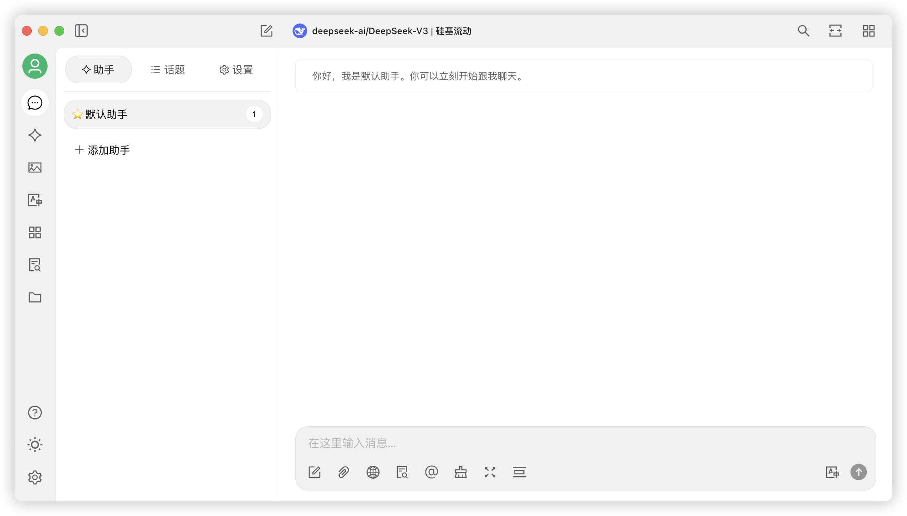


Ce document a été traducido del chino por IA y aún no ha sido revisado.


# macOS

1.  Tout d'abord, allez sur la page de téléchargement du site officiel et cliquez pour télécharger la version Mac, ou cliquez directement ci-dessous :

Veuillez télécharger **la version correspondant à la puce de votre Mac**

Si vous ne savez pas quelle version de puce utiliser pour votre Mac :

* Cliquez sur le menu  dans le coin supérieur gauche de votre Mac
* Dans le menu déroulant, cliquez sur "À propos de ce Mac"
* Dans la fenêtre qui s'affiche, consultez les informations sur le processeur

S'il s'agit d'une puce Intel, téléchargez le paquet d'installation Intel

S'il s'agit d'une puce Apple M\*, téléchargez le paquet d'installation pour puce Apple




2. Une fois le téléchargement terminé, cliquez ici

<figure><figcaption></figcaption></figure>

3. Faites glisser l'icône pour installer

<figure><figcaption></figcaption></figure>

Dans le Launchpad, cherchez l'icône de Cherry Studio et cliquez dessus. Si l'interface principale de Cherry Studio s'ouvre, l'installation a réussi.

<figure><figcaption></figcaption></figure>