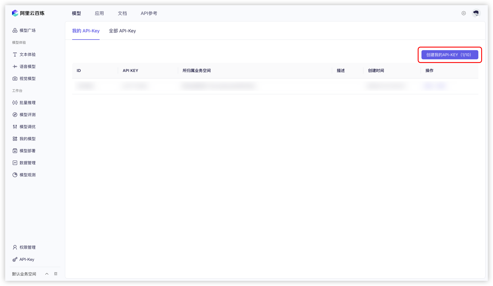


Ce document a été traducido del chino por IA y aún no ha sido revisado.


# Alibaba Cloud Bailian

1. Connectez-vous à [Alibaba Cloud Bailian](https://bailian.console.aliyun.com/?tab=model#/api-key). Si vous n'avez pas de compte Alibaba Cloud, vous devez vous inscrire.

2. Cliquez sur le bouton `创建我的 API-KEY` en haut à droite.
  <figure><figcaption>Création de clé API sur Alibaba Cloud Bailian</figcaption></figure>
  
3. Dans la fenêtre contextuelle, sélectionnez l'espace de travail par défaut (ou personnalisez), et ajoutez une description si vous le souhaitez.
  <figure><figcaption>Fenêtre de création de clé API sur Alibaba Cloud Bailian</figcaption></figure>
  
4. Cliquez sur le bouton `确定` en bas à droite.

5. Une nouvelle ligne apparaîtra dans la liste. Cliquez sur le bouton `查看` à droite.
   <figure><figcaption>Visualisation de clé API sur Alibaba Cloud Bailian</figcaption></figure>
   
6. Cliquez sur le bouton `复制`.
    <figure><figcaption>Copie de clé API sur Alibaba Cloud Bailian</figcaption></figure>

7. Dans Cherry Studio, accédez à `设置` → `模型服务` → `阿里云百炼`, trouvez `API 密钥`, et collez-y la clé copiée.
    <figure><figcaption>Saisie de clé API sur Alibaba Cloud Bailian</figcaption></figure>
    
8. Vous pouvez ajuster les paramètres selon les instructions dans [服务 de modèles](../../cherrystudio/preview/settings/providers.md), puis commencer à utiliser le service.

Si les modèles d'Alibaba Cloud Bailian n'apparaissent pas dans la liste, vérifiez que vous avez ajouté les modèles comme expliqué dans [服务 de modèles](../../cherrystudio/preview/settings/providers.md) et activé ce fournisseur.
