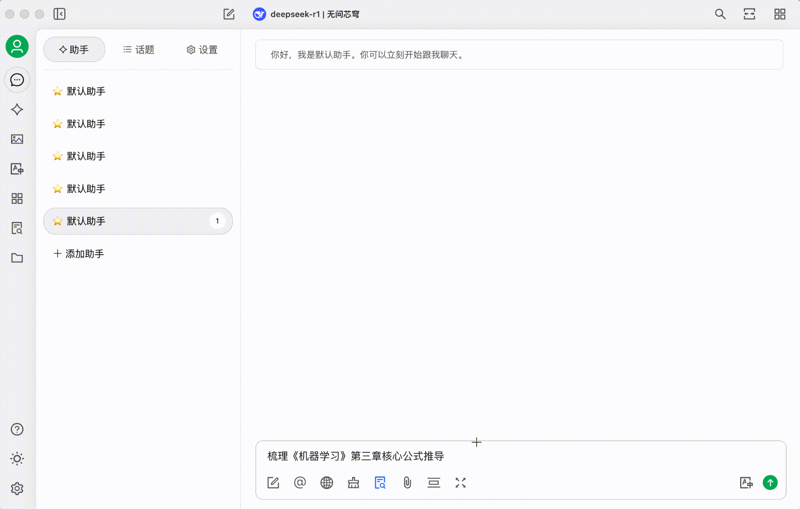


Ce document a été traducido del chino por IA y aún no ha sido revisado.


# Infini-ai

Vous vivez cela : 26 articles pratiques archivés dans WeChat jamais rouverts, 10+ fichiers éparpillés dans votre dossier "Ressources d'apprentissage", cherchant une théorie lue il y a six mois avec seulement quelques mots-clés en mémoire. Quand le flux quotidien d'informations dépasse les capacités de votre cerveau, **90% des connaissances précieuses disparaissent en 72 heures.**\
Désormais, grâce à l'**API de la plateforme de modèles LLM Infini-ai + Cherry Studio**, transformez vos articles WeChat oubliés et contenus fragmentés en une base de connaissances structurée, accessible avec précision.

---

### 1. Construction de votre base de connaissances personnelle

#### 1. Service API Infini-ai : le « cerveau » de votre base, fiable et performant  
Cœur intelligent de votre système, Infini-ai propose des modèles comme **DeepSeek R1 (version complète)** et des API stables. **Gratuit sans restriction après inscription.**\
Supporte les modèles d'embedding populaires (bge, jina) et intègre continuellement **les derniers modèles open-source les plus puissants** (images, vidéos, audio, multimodal).

<figure><figcaption></figcaption></figure>

#### 2. Cherry Studio : construisez sans coder  
Outil intuitif contre **1-2 mois de développement RAG classique**. Ses atouts :  
✅ **Zéro code**  
✅ Import en 1 clic (Markdown/PDF/web)  
✅ Traitement de fichiers 40MB en 1 minute  
✅ Sources variées : dossiers locaux, articles WeChat, notes de cours.

---

### 2. 3 étapes pour créer votre assistant cognitif

#### Étape 1 : Prérequis  
1. Téléchargez Cherry Studio [https://cherry-ai.com/](https://cherry-ai.com/)  
2. Créez un compte Infini-ai [https://cloud.infini-ai.com/genstudio/model?cherrystudio](https://cloud.infini-ai.com/genstudio/model?cherrystudio)  

<figure><figcaption></figcaption></figure>

* Obtenez votre clé API :  
  ➠ Sélectionnez « deepseek-r1 » dans « Place des modèles »  
  ➠ Cliquez sur « Créer » → Copiez le nom du modèle et l'APIKEY  

<figure><figcaption></figcaption></figure>

#### Étape 2 : Configurez Infini-ai dans Cherry Studio  
➠ Paramètres → Service de modèle → Infini-ai  
➠ Collez l'APIKEY → Activez le service  

<figure><figcaption></figcaption></figure>

Choisissez simplement le modèle lors des interactions. Conseil : définissez un **« modèle par défaut »** pour gagner du temps.  

<figure><figcaption></figcaption></figure>

#### Étape 3 : Ajoutez une base de connaissances  
Sélectionnez un modèle d'embedding Infini-ai (bge ou jina) :  

<figure><figcaption></figcaption></figure>

<figure><figcaption></figcaption></figure>

---

### 3. Test en situation réelle

* Après import de ressources :  
  **Prompt :** *« Résumez les démonstrations clés du chapitre 3 d'"Apprentissage Automatique" »*  

<figure><figcaption></figcaption></figure>

**Résultat généré :**  

<figure><figcaption></figcaption></figure>