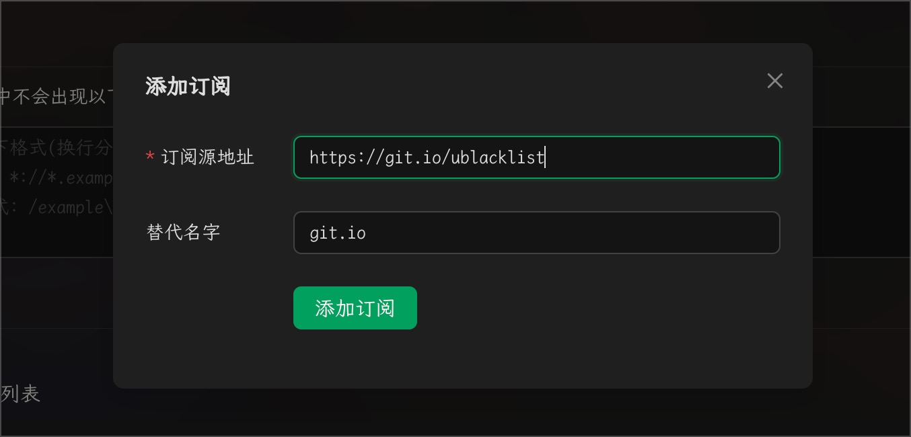


Ce document a été traducido del chino por IA y aún no ha sido revisado.


# Configuration de la liste noire pour la recherche sur le web

Cherry Studio prend en charge deux méthodes de configuration de liste noire : manuelle et par ajout de flux d'abonnement. Les règles de configuration font référence à [ublacklist](https://github.com/iorate/ublacklist).

## Configuration manuelle

Vous pouvez ajouter des règles aux résultats de recherche ou cliquer sur l'icône de la barre d'outils pour bloquer des sites web spécifiques. Les règles peuvent être spécifiées via des [modèles de correspondance](https://developer.mozilla.org/zh-CN/docs/mozilla/add-ons/webextensions/match_patterns) (exemple : `*://*.example.com/*`) ou en utilisant des [expressions régulières](https://developer.mozilla.org/zh-CN/docs/web/javascript/guide/regular_expressions) (exemple : `/example\.(net|org)/`).

## Configuration des flux d'abonnement

Vous pouvez également vous abonner à des ensembles de règles publics. Ce site répertorie quelques abonnements :\
https://iorate.github.io/ublacklist/subscriptions

Voici quelques flux d'abonnement recommandés :

| Nom                                                                                                    | Lien                                                                                                                                    | Type            |
| ------------------------------------------------------------------------------------------------------ | --------------------------------------------------------------------------------------------------------------------------------------- | --------------- |
| [uBlacklist subscription compilation](https://github.com/eallion/uBlacklist-subscription-compilation) | https://git.io/ublacklist                                                                                                               | Chinois         |
| [uBlockOrigin-HUGE-AI-Blocklist](https://github.com/laylavish/uBlockOrigin-HUGE-AI-Blocklist)         | https://raw.githubusercontent.com/laylavish/uBlockOrigin-HUGE-AI-Blocklist/main/list\_uBlacklist.txt                                  | Généré par IA |

<figure><figcaption>
Configuration des flux d'abonnement
</figcaption></figure>