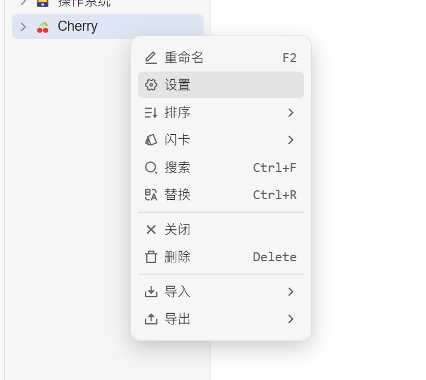


Dieses Dokument wurde von einer KI aus dem Chinesischen übersetzt und ist noch nicht überprüft worden.


# Tutorial zur Konfiguration von SiYuan Notes

Ermöglicht den Export von Themen und Nachrichten in SiYuan Notes.

## Schritt 1

Öffnen Sie SiYuan Notes und erstellen Sie ein Notizbuch

<figure><figcaption>
Klicken Sie auf "Neues Notizbuch"
</figcaption></figure>

## Schritt 2

Öffnen Sie die Notizbucheinstellungen und kopieren Sie die `Notizbuch-ID`

<figure><figcaption>
Notizbucheinstellungen öffnen
</figcaption></figure>

<figure><figcaption>
Klicken Sie auf "Notizbuch-ID kopieren"
</figcaption></figure>

## Schritt 3

Fügen Sie die Notizbuch-ID in die Cherry Studio-Einstellungen ein

<figure><figcaption>
Notizbuch-ID in Dateneinstellungen eintragen
</figcaption></figure>

## Schritt 4

Tragen Sie die SiYuan Notes-Adresse ein

* **Lokal**\
  Normalerweise `http://127.0.0.1:6806`
* **Selbstgehostet**\
  Ihre Domain `http://note.domain.com`

<figure><figcaption>
SiYuan Notes-Adresse eintragen
</figcaption></figure>

## Schritt 5

Kopieren Sie das `API-Token` von SiYuan Notes

<figure><figcaption>
SiYuan-Token kopieren
</figcaption></figure>

Tragen Sie es in die Cherry Studio-Einstellungen ein und prüfen Sie die Verbindung

<figure><figcaption>
Datenbank-ID eintragen und prüfen
</figcaption></figure>

## Schritt 6

Glückwunsch! Die Konfiguration von SiYuan Notes ist abgeschlossen ✅ Jetzt können Sie Cherry Studio-Inhalte in Ihre SiYuan Notes exportieren

<figure><figcaption>
In SiYuan Notes exportieren
</figcaption></figure>

<figure><figcaption>
Exportierte Ergebnisse anzeigen
</figcaption></figure>