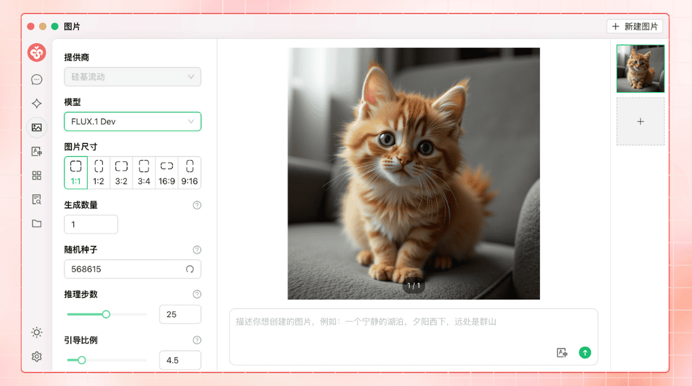


Αυτό το έγγραφο μεταφράστηκε από τα Κινεζικά με AI και δεν έχει ακόμη ελεγχθεί.


# Εισαγωγή στο Έργο

<figure><figcaption></figcaption></figure>

Ακολουθήστε μας στα κοινωνικά δίκτυα: [X (Twitter)](https://x.com/CherryStudioAPP), [Xiaohongshu](https://www.xiaohongshu.com/user/profile/662b6853000000000b031d9a), [Weibo](https://weibo.com/u/7975656228), [Bilibili](https://space.bilibili.com/3546657515898892), [Douyin](https://www.douyin.com/user/MS4wLjABAAAAmw9A54m5J0hHVMQY5eGrVJ-EHDoOS0hgJ6M1F9MN2Tn2V163A0xrC4_KVzfmQSxC)

Ελάτε στην κοινότητά μας: [QQ Group (575014769)](https://qm.qq.com/q/lo0D4qVZKi), [Telegram](https://t.me/CherryStudioAI), [Discord](https://discord.gg/wez8HtpxqQ), WeChat Group (κάντε κλικ για προβολή)[^1]

***

Το Cherry Studio είναι μια παντοδύναμη πλατφόρμα βοηθού Τεχνητής Νοημοσύνης που συνδυάζει συνομιλία πολλαπλών μοντέλων, διαχείριση βάσης γνώσεων, ζωγραφική ΤΝ, μετάφραση και άλλες λειτουργίες.  
Με τον εξαιρετικά προσαρμόσιμο σχεδιασμό του, την ισχυρή επεκτασιμότητα και τη φιλική προς τον χρήστη εμπειρία, το Cherry Studio αποτελεί την ιδανική επιλογή για επαγγελματίες και λάτρεις της ΤΝ. Είτε είστε αρχάριος είτε προγραμματιστής, θα βρείτε στο Cherry Studio τις κατάλληλες λειτουργίες ΤΝ για να ενισχύσετε την παραγωγικότητα και τη δημιουργικότητά σας.

***

### **Πυρηνικές Λειτουργίες και Χαρακτηριστικά**

#### **1. Βασικές Λειτουργίες Συνομιλίας**

* **Πολλαπλές Απαντήσεις σε Μία Ερώτηση**: Υποστηρίζει ταυτόχρονη δημιουργία απαντήσεων από πολλαπλά μοντέλα για την ίδια ερώτηση, διευκολύνοντας τη σύγκριση απόδοσης διαφορετικών μοντέλων (αναλυτικά στο [Περιβάλλον Συνομιλίας](cherrystudio/preview/chat.md)).

<figure><figcaption></figcaption></figure>

* **Αυτόματη Ομαδοποίηση**: Το ιστορικό συνομιλιών κάθε βοηθού ομαδοποιείται αυτόματα για εύκολη πρόσβαση.
* **Εξαγωγή Συνομιλιών**: Δυνατότητα εξαγωγής πλήρους ή επιλεκτικών συνομιλιών σε μορφές όπως Markdown, Word κ.λπ.
* **Υψηλή Προσαρμογή Παραμέτρων**: Εκτός από βασικές ρυθμίσεις, υποστηρίζει προσαρμοσμένες παραμέτρους για εξατομικευμένες ανάγκες.

<figure><figcaption></figcaption></figure>

* **Αγορά Βοηθών**: Προ-ενσωματωμένοι χίλιοι βοηθοί βιομηχανιών (μετάφραση, προγραμματισμός, γραφή) με δυνατότητα δημιουργίας προσαρμοσμένων βοηθών.

<figure><figcaption></figcaption></figure>

* **Πολλαπλές Μορφές Απεικόνισης**: Υποστηρίζει απόδοση Markdown, μαθηματικών τύπων, προεπισκόπηση HTML κ.λπ.

<figure><figcaption></figcaption></figure>

#### **2. Ολοκληρωμένες Λειτουργίες**

* **Ζωγραφική ΤΝ**: Ειδικό πάνελ δημιουργίας εικόνων με φυσική γλώσσα.

<figure><figcaption></figcaption></figure>

* **Εφαρμογίδια ΤΝ**: Δωρεάν διαδικτυακά εργαλεία ΤΝ χωρίς εναλλαγή προγραμμάτων περιήγησης.
* **Λειτουργίες Μετάφρασης**: Ειδικό πάνελ μετάφρασης, μετάφραση συνομιλιών/εντολών.
* **Διαχείριση Αρχείων**: Ενοποιημένη οργάνωση αρχείων συνομιλιών, ζωγραφικής και βάσεων γνώσεων.

<figure><figcaption></figcaption></figure>

* **Καθολική Αναζήτηση**: Γρήγορη εύρεση ιστορικού και περιεχομένου βάσεων γνώσεων.

<figure><figcaption></figcaption></figure>

#### **3. Ενοποιημένη Διαχείριση Παρόχων**

* **Συγκέντρωση Μοντέλων**: Ενοποιημένη πρόσβαση σε μοντέλα από OpenAI, Gemini, Anthropic, Azure κ.λπ.
* **Αυτόματη Ανάκτηση Μοντέλων**: Λίστα μοντέλων με ένα κλικ, χωρίς χειροκίνητη ρύθμιση.
* **Περιστροφική Χρήση Κλειδιών**: Πολλαπλά API κλειδιά για αποφυγή περιορισμών ρυθμού.
* **Αυτόματη Αντιστοίχιση Εικονιδίων**: Εξατομικευμένα εικονίδια για κάθε μοντέλο.
* **Προσαρμόσιμοι Πάροχοι**: Υποστήριξη προσαρμοσμένων παρόχων συμβατών με OpenAI/Gemini/Anthropic.

<figure><figcaption></figcaption></figure>

#### **4. Υψηλή Προσαρμογή Διεπαφής**

* **Προσαρμοσμένο CSS**: Καθολική προσαρμογή στυλ διεπαφής.
* **Προσαρμοσμένη Διάταξη Συνομιλιών**: Λίστα ή φυσαλίδες με προσαρμοσμένα στυλ μηνυμάτων (π.χ. στυλ αποσπασμάτων κώδικα).
* **Προσαρμοσμένα Εικονίδια**: Εξατομίκευση εικονιδίων εφαρμογής και βοηθών.
* **Προσαρμοσμένο Πλευρικό Μενού**: Απόκρυψη/διαχείριση λειτουργιών για βελτιστοποίηση εμπειρίας.

<figure><figcaption></figcaption></figure>

#### **5. Τοπικό Σύστημα Βάσεων Γνώσεων**

* **Πολλαπλές Μορφές**: Υποστήριξη PDF, DOCX, PPTX, XLSX, TXT, MD κ.λπ.
* **Πολλαπλές Πηγές**: Τοπικά αρχεία, ιστότοποι, χάρτες ιστότοπων, χειροκίνητη εισαγωγή.
* **Εξαγωγή Βάσεων Γνώσεων**: Διαμοιρασμός επεξεργασμένων βάσεων γνώσεων.
* **Έλεγχος Αναζήτησης**: Άμεση δοκιμή αποτελεσμάτων ευρετηρίασης και τμηματοποίησης.

<figure><figcaption></figcaption></figure>

#### **6. Ειδικές Λειτουργίες Εστίασης**

* **Γρήγορη Ερώτηση-Απάντηση**: Άμεση πρόσβαση σε βοηθό από οποιοδήποτε περιβάλλον (π.χ. WeChat, browser).
* **Γρήγορη Μετάφραση**: Άμεση μετάφραση λέξεων/κειμένου σε άλλα περιβάλλοντα.
* **Σύνοψη Περιεχομένου**: Συνοπτική ανάλυση μακρών κειμένων.
* **Αυτόματη Επεξήγηση**: Επεξηγήσεις χωρίς πολύπλοκες εντολές.

<figure><figcaption></figcaption></figure>

#### **7. Εξασφάλιση Δεδομένων**

* **Στρατηγικές Αντιγράφων Ασφαλείας**: Τοπικά αντίγραφα ασφαλείας, WebDAV, προγραμματισμένα αντίγραφα.
* **Ασφάλεια Δεδομένων**: Πλήρης τοπική λειτουργία με τοπικά μεγάλα μοντέλα για αποφυγή διαρροών.

***

### **Πλεονεκτήματα Έργου**

1. **Φιλικό για αρχάριους**: Χαμηλό τεχνικό φράγμα εισόδου για άμεση χρήση.
2. **Πλήρης Τεκμηρίωση**: Λεπτομερείς οδηγοί χρήσης και αντιμετώπισης προβλημάτων.
3. **Συνεχής Εκσυγχρονισμός**: Ενεργή ανταπόκριση σε σχόλια χρηστών για βελτιστοποίηση.
4. **Ανοιχτό Κώδικα και Επεκτασιμότητα**: Δυνατότητα προσαρμογής και επέκτασης μέσω ανοιχτού κώδικα.

***

### **Σενάρια Χρήσης**

* **Διαχείριση και αναζήτηση γνώσης**: Δημιουργία/ερώτηση εξειδικευμένων βάσεων γνώσεων (έρευνα, εκπαίδευση).
* **Συνομιλία και δημιουργία περιεχομένου**: Πολυμερείς συνομιλίες για άμεση παραγωγή πληροφοριών/περιεχομένου.
* **Μετάφραση και αυτοματοποίηση γραφείου**: Ενσωματωμένος μεταφραστής και λειτουργίες επεξεργασίας αρχείων.
* **Ζωγραφική και σχεδιασμός με ΤΝ**: Δημιουργία εικόνων με φυσική γλώσσα για δημιουργικές ανάγκες.

### Star History

## Ακολουθήστε μας στα κοινωνικά δίκτυα

<table data-view="cards"><thead><tr><th></th><th data-hidden data-card-cover data-type="files"></th><th data-hidden data-card-target data-type="content-ref"></th></tr></thead><tbody><tr><td><a href="https://www.xiaohongshu.com/user/profile/662b6853000000000b031d9a?xsec_token=YB_1nKvlH4r5hPYVVbbsNHF8Y6n6AKlm5-DaggPCtd2DQ%3D&#x26;xsec_source=app_share&#x26;xhsshare=CopyLink&#x26;appuid=662b6853000000000b031d9a&#x26;apptime=1738627324&#x26;share_id=ace5db41b5954fab8d98a2a7865a62bc&#x26;share_channel=copy_link">Xiaohongshu</a></td><td><a href=".gitbook/assets/1.png">1.png</a></td><td><a href="https://www.xiaohongshu.com/user/profile/662b6853000000000b031d9a?xsec_token=YB_1nKvlH4r5hPYVVbbsNHF8Y6n6AKlm5-DaggPCtd2DQ%3D&#x26;xsec_source=app_share&#x26;xhsshare=CopyLink&#x26;appuid=662b6853000000000b031d9a&#x26;apptime=1738627324&#x26;share_id=ace5db41b5954fab8d98a2a7865a62bc&#x26;share_channel=copy_link">https://www.xiaohongshu.com/user/profile/662b6853000000000b031d9a?xsec_token=YB_1nKvlH4r5hPYVVbbsNHF8Y6n6AKlm5-DaggPCtd2DQ%3D&#x26;xsec_source=app_share&#x26;xhsshare=CopyLink&#x26;appuid=662b6853000000000b031d9a&#x26;apptime=1738627324&#x26;share_id=ace5db41b5954fab8d98a2a7865a62bc&#x26;share_channel=copy_link</a></td></tr><tr><td><a href="https://b23.tv/hIfGgDW">Bilibili</a></td><td><a href=".gitbook/assets/3.png">3.png</a></td><td><a href="https://b23.tv/hIfGgDW">https://b23.tv/hIfGgDW</a></td></tr><tr><td><a href="https://weibo.com/u/7975656228">Weibo</a></td><td><a href=".gitbook/assets/2.png">2.png</a></td><td><a href="https://weibo.com/u/7975656228">https://weibo.com/u/7975656228</a></td></tr><tr><td><a href="https://v.douyin.com/ifTpX4X7">Douyin</a></td><td><a href=".gitbook/assets/4.png">4.png</a></td><td><a href="https://v.douyin.com/ifTpX4X7">https://v.douyin.com/ifTpX4X7</a></td></tr><tr><td><a href="https://x.com/CherryStudioAPP?t=DYR0ulaLur-bO4Us3bG79A&#x26;s=05">X (Twitter)</a></td><td><a href=".gitbook/assets/5.png">5.png</a></td><td><a href="https://x.com/CherryStudioAPP?t=DYR0ulaLur-bO4Us3bG79A&#x26;s=05">https://x.com/CherryStudioAPP?t=DYR0ulaLur-bO4Us3bG79A&#x26;s=05</a></td></tr></tbody></table>

[^1]: 