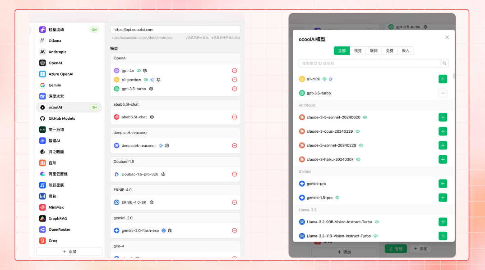

# Εισαγωγή Έργου


Αυτό το έγγραφο μεταφράστηκε από τα Κινεζικά με AI και δεν έχει ακόμη ελεγχθεί.


<figure><figcaption></figcaption></figure>

Ακολουθήστε τους λογαριασμούς μας στα μέσα κοινωνικής δικτύωσης: [Twitter (X)](https://x.com/CherryStudioHQ)、[Xiaohongshu](https://www.xiaohongshu.com/user/profile/662b6853000000000b031d9a)、[Weibo](https://weibo.com/u/7975656228)、[Bilibili](https://space.bilibili.com/3546657515898892)、[Douyin](https://www.douyin.com/user/MS4wLjABAAAAmw9A54m5J0hHVMQY5eGrVJ-EHDoOS0hgJ6M1F9MN2Tn2V163A0xrC4_KVzfmQSxC)

Ελάτε στην κοινότητά μας: [Ομάδα QQ (575014769)](https://qm.qq.com/q/lo0D4qVZKi)、[Telegram](https://t.me/CherryStudioAI)、[Discord](https://discord.gg/wez8HtpxqQ)、[Ομάδα WeChat（κάντε κλικ για προβολή）](https://www.cherry-ai.com/#Community)

***

Το Cherry Studio είναι μια παντοδύναμη πλατφόρμα βοηθού ΤΝ με ολοκληρωμένες λειτουργίες όπως συνομιλίες πολλαπλών μοντέλων, διαχείριση βάσεων γνώσης, ζωγραφική ΤΝ, μετάφραση κ.ά. \
Ο ιδιαίτερα προσαρμοσμένος σχεδιασμός, οι ισχυρές δυνατότητες επέκτασης και η φιλική προς τον χρήστη εμπειρία του Cherry Studio το καθιστούν ιδανική επιλογή για επαγγελματίες και λάτρεις της ΤΝ. Ανεξάρτητα από το αν είστε αρχάριος ή προγραμματιστής, θα βρείτε λειτουργίες ΤΝ στο Cherry Studio που ανταποκρίνονται στις ανάγκες σας, ενισχύοντας την παραγωγικότητα και τη δημιουργικότητά σας.

***

### **Βασικές Δυνατότητες και Χαρακτηριστικά**

#### **1. Βασικές δυνατότητες συνομιλίας**

* **Μια ερώτηση, πολλές απαντήσεις**: Υποστηρίζει ταυτόχρονη δημιουργία απαντήσεων από πολλαπλά μοντέλα για την ίδια ερώτηση, διευκολύνοντας τη σύγκριση απόδοσης μοντέλων (δείτε [διεπαφή συνομιλίας](cherrystudio/preview/chat.md)).

<figure><figcaption></figcaption></figure>

* **Αυτόματη ομαδοποίηση**: Το ιστορικό συνομιλιών κάθε βοηθού ομαδοποιείται αυτόματα για εύκολη πρόσβαση.
* **Εξαγωγή συνομιλιών**: Εξαγωγή πλήρων ή επιλεγμένων συνομιλιών σε μορφές όπως Markdown, Word κ.ά.
* **Ύψηλος βαθμός προσαρμογής παραμέτρων**: Παραμετροποίηση πέρα από βασικές ρυθμίσεις, με δυνατότητα προσαρμοσμένων παραμέτρων.

<figure><figcaption></figcaption></figure>

* **Αγορά βοηθών**: Προεγκατεστημένοι χιλιάδες βοηθοί για ειδικούς τομείς (μετάφραση, προγραμματισμός, συγγραφή) με δυνατότητα προσαρμοσμένων δημιουργιών.

<figure><figcaption></figcaption></figure>

* **Πολλαπλή απόδοση μορφών**: Υποστήριξη Markdown, μαθηματικών τύπων, HTML preview κ.ά. για βελτιωμένη απεικόνιση περιεχομένου.

<figure><figcaption></figcaption></figure>

#### **2. Ολοκληρωμένες ιδιαίτερες δυνατότητες**

* **ΤΝ ζωγραφική**: Εξειδικευμένο πάνελ δημιουργίας εικόνων από φυσική γλώσσα.

<figure><figcaption></figcaption></figure>

* **Μικροεφαρμογές ΤΝ**: Ολοκληρωμένα δωρεάν εργαλεία ΤΝ χωρίς εναλλαγή προγραμμάτων περιήγησης.
* **Μετάφραση**: Εξειδικευμένα πάνελ μεταφράσεων, μεταφράσεις συνομιλιών, μεταφράσεις εντολών.
* **Διαχείριση αρχείων**: Ενοποιημένη ταξινόμηση αρχείων συνομιλιών, ζωγραφικής και βάσεων γνώσης.

<figure><figcaption></figcaption></figure>

* **Καθολική αναζήτηση**: Γρήγορη εύρεση ιστορικού και περιεχομένου βάσεων γνώσης.

<figure><figcaption></figcaption></figure>

#### **3. Ενοποιημένη διαχείριση πολλαπλών παρόχων**

* **Συγκεντρωτική υποστήριξη μοντέλων**: Ενοποιημένη πρόσβαση σε μοντέλα από OpenAl, Gemini, Anthropic, Azure κ.ά.
* **Αυτόματη λήψη μοντέλων**: Λίστα μοντέλων με ένα κλικ.
* **Πολλαπλή εναλλαγή κλειδιών API**: Εναλλαγή πολλαπλών κλειδιών για αποφυγή περιορισμών ρυθμού.
* **Ακριβή αντιστοίχιση εικόνων προφίλ**: Αυτόματη αντιστοίχιση μοναδικής εικόνας προφίλ σε κάθε μοντέλο.
* **Προσαρμοσμένοι πάροχοι**: Υποστήριξη προσαρμοσμένων παρόχων με συμβατότητα OpenAI, Gemini, Anthropic.

<figure><figcaption></figcaption></figure>

#### **4. Ύψηλη προσαρμογή διεπαφής**

* **Προσαρμοσμένο CSS**: Καθολική προσαρμογή στυλ.
* **Προσαρμοσμένη διάταξη συνομιλιών**: Λίστα ή φυσαλίδες με προσαρμοσμένα στυλ μηνυμάτων.
* **Προσαρμοσμένες εικόνες προφίλ**: Εικόνες για λογισμικό και βοηθούς.
* **Προσαρμογή πλευρικού μενού**: Απόκρυψη ή αλλαγή σειράς λειτουργιών.

<figure><figcaption></figcaption></figure>

#### **5. Τοπικό σύστημα βάσεων γνώσης**

* **Πολλαπλές υποστηριζόμενες μορφές**: PDF, DOCX, PPTX, XLSX, TXT, MD κ.ά.
* **Πολλαπλές πηγές δεδομένων**: Τοπικά αρχεία, ιστότοποι, site maps ή χειροκίνητη εισαγωγή περιεχομένου.
* **Εξαγωγή βάσεων γνώσης**: Διαμοιρασμός επεξεργασμένων βάσεων γνώσης.
* **Έλεγχος αναζήτησης**: Άμεση δοκιμή αποτελεσμάτων επεξεργασίας και κατατμήσεων.

<figure><figcaption></figcaption></figure>

#### **6. Εξειδικευμένες δυνατότητες εστίασης**

* **Γρήγορη ερώτηση-απάντηση**: Άμεση πρόσβαση σε βοηθό από οποιοδήποτε περιβάλλον.
* **Γρήγορη μετάφραση**: Άμεση μετάφραση κειμένου/λέξεων σε οποιοδήποτε περιβάλλον.
* **Σύνοψη περιεχομένου**: Σύνοψη μεγάλων κειμένων για αποδοτική εξαγωγή πληροφοριών.
* **Επεξήγηση**: Άμεση κατανόηση ζητημάτων χωρίς σύνθετες εντολές.

<figure><figcaption></figcaption></figure>

#### **7. Εξασφάλιση δεδομένων**

* **Πολλαπλά σχέδια αντιγράφων ασφαλείας**: Τοπικά αντίγραφα, WebDAV και προγραμματισμένα αντίγραφα.
* **Ασφάλεια δεδομένων**: Πλήρης τοπική λειτουργία με τοπικά μεγάλα μοντέλα για αποφυγή διαρροών.

***

### **Πλεονεκτήματα Έργου**

1. **Φιλικό για αρχάριους**: Εξασφαλίζει εύκολη εκμάθηση για όλους, με επίκεντρο την εργασία/δημιουργία.
2. **Ολοκληρωμένη τεκμηρίωση**: Λεπτομερείς οδηγοί χρήσης και αντιμετώπισης προβλημάτων.
3. **Συνεχής ενημέρωση**: Ενεργή απόκριση σε σχόλια χρηστών και βελτιστοποίηση λειτουργιών.
4. **Ανοιχτού κώδικα και επεκτασιμότητα**: Προσαρμογή μέσω ανοιχτού κώδικα για εξατομικευμένες ανάγκες.

***

### **Σενάρια εφαρμογής**

* **Διαχείριση και αναζήτηση γνώσης**: Ταχεία δημιουργία και εύρεση εξειδικευμένης βάσης γνώσης για έρευνα/εκπαίδευση.
* **Συνομιλίες πολλαπλών μοντέλων και δημιουργικότητα**: Πληροφορίες και παραγωγή περιεχομένου με πολλαπλά μοντέλα.
* **Μετάφραση και αυτοματοποίηση γραφείου**: Ενσωματωμένοι βοηθοί μεταφράσεων και επεξεργασίας εγγράφων.
* **ΤΝ ζωγραφική και σχεδιασμός**: Δημιουργία εικόνων από φυσική γλώσσα για δημιουργικές ανάγκες.

### Star History

## Ακολουθήστε τους λογαριασμούς μας στα μέσα κοινωνικής δικτύωσης

<table data-view="cards"><thead><tr><th></th><th data-hidden data-card-cover data-type="files"></th><th data-hidden data-card-target data-type="content-ref"></th></tr></thead><tbody><tr><td><a href="https://www.xiaohongshu.com/user/profile/662b6853000000000b031d9a?xsec_token=YB_1nKvlH4r5hPYVVbbsNHF8Y6n6AKlm5-DaggPCtd2DQ%3D&#x26;xsec_source=app_share&#x26;xhsshare=CopyLink&#x26;appuid=662b6853000000000b031d9a&#x26;apptime=1738627324&#x26;share_id=ace5db41b5954fab8d98a2a7865a62bc&#x26;share_channel=copy_link">Xiaohongshu</a></td><td><a href=".gitbook/assets/1.png">1.png</a></td><td><a href="https://www.xiaohongshu.com/user/profile/662b6853000000000b031d9a?xsec_token=YB_1nKvlH4r5hPYVVbbsNHF8Y6n6AKlm5-DaggPCtd2DQ%3D&#x26;xsec_source=app_share&#x26;xhsshare=CopyLink&#x26;appuid=662b6853000000000b031d9a&#x26;apptime=1738627324&#x26;share_id=ace5db41b5954fab8d98a2a7865a62bc&#x26;share_channel=copy_link">https://www.xiaohongshu.com/user/profile/662b6853000000000b031d9a?xsec_token=YB_1nKvlH4r5hPYVVbbsNHF8Y6n6AKlm5-DaggPCtd2DQ%3D&#x26;xsec_source=app_share&#x26;xhsshare=CopyLink&#x26;appuid=662b6853000000000b031d9a&#x26;apptime=1738627324&#x26;share_id=ace5db41b5954fab8d98a2a7865a62bc&#x26;share_channel=copy_link</a></td></tr><tr><td><a href="https://b23.tv/hIfGgDW">Bilibili</a></td><td><a href=".gitbook/assets/3.png">3.png</a></td><td><a href="https://b23.tv/hIfGgDW">https://b23.tv/hIfGgDW</a></td></tr><tr><td><a href="https://weibo.com/u/7975656228">Weibo</a></td><td><a href=".gitbook/assets/2.png">2.png</a></td><td><a href="https://weibo.com/u/7975656228">https://weibo.com/u/7975656228</a></td></tr><tr><td><a href="https://v.douyin.com/ifTpX4X7">Douyin</a></td><td><a href=".gitbook/assets/4.png">4.png</a></td><td><a href="https://v.douyin.com/ifTpX4X7">https://v.douyin.com/ifTpX4X7</a></td></tr><tr><td><a href="https://x.com/CherryStudioAPP?t=DYR0ulaLur-bO4Us3bG79A&#x26;s=05">Twitter (X)</a></td><td><a href=".gitbook/assets/5.png">5.png</a></td><td><a href="https://x.com/CherryStudioAPP?t=DYR0ulaLur-bO4Us3bG79A&#x26;s=05">https://x.com/CherryStudioHQ?t=DYR0ulaLur-bO4Us3bG79A&#x26;s=05</a></td></tr></tbody></table>