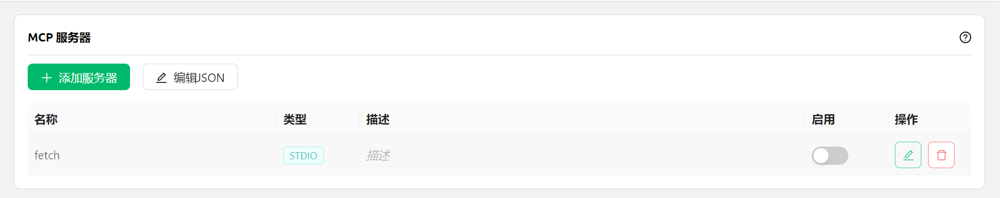

# Ρύθμιση και χρήση του MCP


Αυτό το έγγραφο μεταφράστηκε από τα Κινεζικά με AI και δεν έχει ακόμη ελεγχθεί.


<figure><figcaption></figcaption></figure>

1. Ανοίξτε τις ρυθμίσεις του Cherry Studio.
2. Βρείτε την επιλογή `MCP 服务器` (Διακομιστής MCP).
3. Κάντε κλικ στο `添加服务器` (Προσθήκη διακομιστή).
4. Συμπληρώστε τις παραμέτρους του MCP Server ([αναφορά](https://github.com/modelcontextprotocol/servers/tree/main/src/fetch)). Πιθανά πεδία:
   * Όνομα: Προσαρμοσμένο όνομα, π.χ. `fetch-server`
   * Τύπος: Επιλέξτε `STDIO`
   * Εντολή: Συμπληρώστε `uvx`
   * Παράμετροι: Συμπληρώστε `mcp-server-fetch`
   * (Άλλες παράμετροι μπορεί να υπάρχουν ανάλογα με το διακομιστή)
5. Κάντε κλικ στο `保存` (Αποθήκευση).


Μετά την παραπάνω ρύθμιση, το Cherry Studio θα κατεβάσει αυτόματα τον απαιτούμενο διακομιστή MCP - `fetch server`. Μετά την ολοκλήρωση της λήψης, είμαστε έτοιμοι για χρήση! Σημείωση: Αν η ρύθμιση του mcp-server-fetch αποτύχει, δοκιμάστε να επανεκκινήσετε τον υπολογιστή.


### Ενεργοποίηση υπηρεσίας MCP στο πλαίσιο συνομιλίας

<figure><figcaption></figcaption></figure>

* Μετά την επιτυχή προσθήκη διακομιστή MCP στις ρυθμίσεις `MCP 服务器`

<figure><figcaption></figcaption></figure>

### **Επίδειξη αποτελεσμάτων χρήσης**

<figure><figcaption></figcaption></figure>

Όπως φαίνεται, με την ενσωμάτωση της λειτουργίας `fetch` του MCP, το Cherry Studio κατανοάσει καλύτερα τις προθέσεις χρηστών, ανακτώντας σχετικές πληροφορίες από το διαδίκτυο για ακριβέστερες και περισσότερο ολοκληρωμένες απαντήσεις.