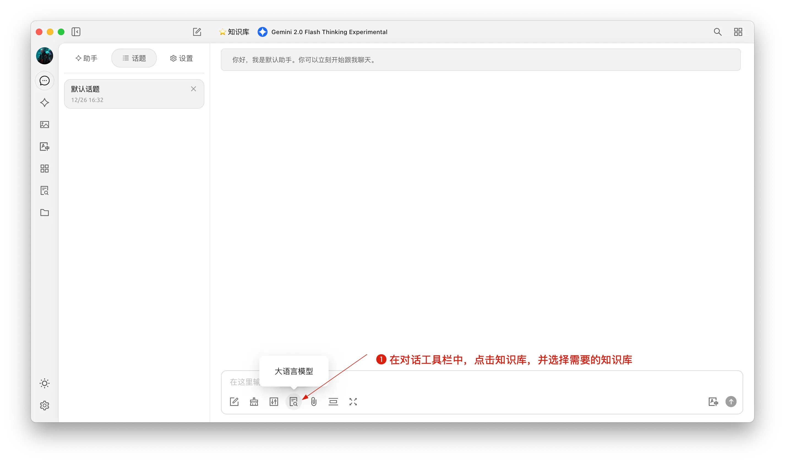


Αυτό το έγγραφο μεταφράστηκε από τα Κινεζικά με AI και δεν έχει ακόμη ελεγχθεί.


# Knowledge Base Tutorial

Στην έκδοση 0.9.1, το CherryStudio εισήγαγε την πολυπόθητη δυνατότητα βάσης γνώσεων.

Παρακάτω παρουσιάζουμε λεπτομερείς οδηγίες χρήσης του CherryStudio βήμα προς βήμα.

## Προσθήκη Ενσωματωμένου Μοντέλου

1. Στην υπηρεσία διαχείρισης μοντέλων, αναζητήστε μοντέλα· μπορείτε να κάνετε κλικ στο "Ενσωματωμένα Μοντέλα" για γρήγορο φιλτράρισμα.
2. Βρείτε το επιθυμητό μοντέλο και προσθέστε το στα Μοντέλα μου.

<figure><figcaption></figcaption></figure>

## Δημιουργία Βάσης Γνώσεων

1. **Είσοδος βάσης γνώσεων:** Στην αριστερή γραμμή εργαλείων του CherryStudio, κάντε κλικ στο εικονίδιο βάσης γνώσεων για να μεταβείτε στη σελίδα διαχείρισης.
2. **Προσθήκη βάσης γνώσεων:** Κάντε κλικ στην Προσθήκη για να ξεκινήσετε τη δημιουργία.
3. **Ονομασία:** Εισάγετε όνομα για τη βάση γνώσεων και προσθέστε ενσωματωμένο μοντέλο (π.χ. bge-m3) για να ολοκληρωθεί η δημιουργία.

<figure><figcaption></figcaption></figure>
<figure><figcaption></figcaption></figure>

## Προσθήκη Αρχείων και Διάνυσμα

1. **Προσθήκη αρχείου:** Κάντε κλικ στο κουμπί Προσθήκη Αρχείων.
2. **Επιλογή αρχείου:** Επιλέξτε υποστηριζόμενες μορφές όπως pdf, docx, pptx, xlsx, txt, md, mdx και ανοίξτε.
3. **Διάνυσμα:** Το σύστημα θα εκτελέσει αυτόματα την διανυσματοποίηση. Η ολοκλήρωση υποδεικνύεται με πράσινο ✓.

<figure><figcaption></figcaption></figure>
<figure><figcaption></figcaption></figure>
<figure><figcaption></figcaption></figure>

## Προσθήκη Δεδομένων από Πολλαπλές Πηγές

Το CherryStudio υποστηρίζει πολλούς τρόπους προσθήκης δεδομένων:

1. **Κατάλογος φακέλων:** Προσθήκη ολόκληρου καταλόγου· τα αρχεία υποστηριζόμενων μορφών θα διανυσματοποιηθούν αυτόματα.
2. **URL ιστοτόπου:** Υποστηρίζει συνδέσμους όπως [https://docs.siliconflow.cn/introduction](https://docs.siliconflow.cn/introduction).
3. **Χάρτης ιστοτόπου (sitemap):** Υποστηρίζει xml sitemap όπως [https://docs.siliconflow.cn/sitemap.xml](https://docs.siliconflow.cn/sitemap.xml).
4. **Σημειώσεις απλού κειμένου:** Εισαγωγή προσαρμοσμένου περιεχομένου σε απλό κείμενο.


Συμβουλές:

1. Οι εικόνες σε έγγραφα που εισάγονται στη βάση γνώσεων δεν μετατρέπονται αυτόματα σε διάνυσμα· απαιτείται χειροκίνητη μετατροπή σε κείμενο.
2. Η χρήση URL ως πηγή δεν εγγυάται επιτυχία λόγω πιθανών περιορισμών ιστοτόπων (anti-scraping, απαιτήσεις σύνδεσης). Προτείνεται δοκιμαστική αναζήτηση μετά τη δημιουργία.
3. Οι περισσότεροι ιστότοποι παρέχουν sitemap, π.χ. το [sitemap](https://docs.cherry-ai.com/sitemap-pages.xml) του CherryStudio. Προσθέστε `/sitemap.xml` στη ριζική διεύθυνση (π.χ. `aaa.com/sitemap.xml`).
4. Για ιστότοπους χωρίς sitemap, δημιουργήστε προσαρμοσμένο xml αρχείο. Χρησιμοποιείστε δημόσιους απευθείας συνδέσμους (όχι τοπικούς).

> 1) Ζητήστε από ΤΝ τη δημιουργία sitemap ή εργαλείου δημιουργίας HTML sitemap.
> 2) Για απευθείας συνδέσμους χρησιμοποιήστε OSS ή χώρους αποθήκευσης αρχείων. Εναλλακτικά, χρησιμοποιήστε το [δωρεάν εργαλείο μεταφόρτωσης](https://one.ocoolai.com/login) του ocoolAI (απαιτεί σύνδεση).


## Αναζήτηση στη Βάση Γνώσεων

Μετά την ολοκλήρωση της διανυσματοποίησης, πραγματοποιήστε αναζήτηση:

1. Κάντε κλικ στο κουμπί "Αναζήτηση στη Βάση Γνώσεων".
2. Εισαγάγετε το ερώτημα.
3. Προβάλλονται αποτελέσματα αναζήτησης.
4. Εμφανίζεται το σκορ αντιστοίχισης για κάθε αποτέλεσμα.

<figure><figcaption></figcaption></figure>
<figure><figcaption></figcaption></figure>

## Χρήση Βάσης Γνώσεων σε Συνομιλίες

1. Δημιουργήστε νέα συνομιλία· στην γραμμή εργαλείων, κάντε κλικ στην επιλογή "Βάση Γνώσεων" και επιλέξτε την επιθυμητή.
2. Στείλτε ερώτηση· το μοντέλο θα δημιουργήσει απάντηση με βάση την ανάκτηση.
3. Οι πηγές δεδομένων θα εμφανιστούν κάτω από την απάντηση για άμεση πρόσβαση.

<figure><figcaption></figcaption></figure>
<figure><figcaption></figcaption></figure>