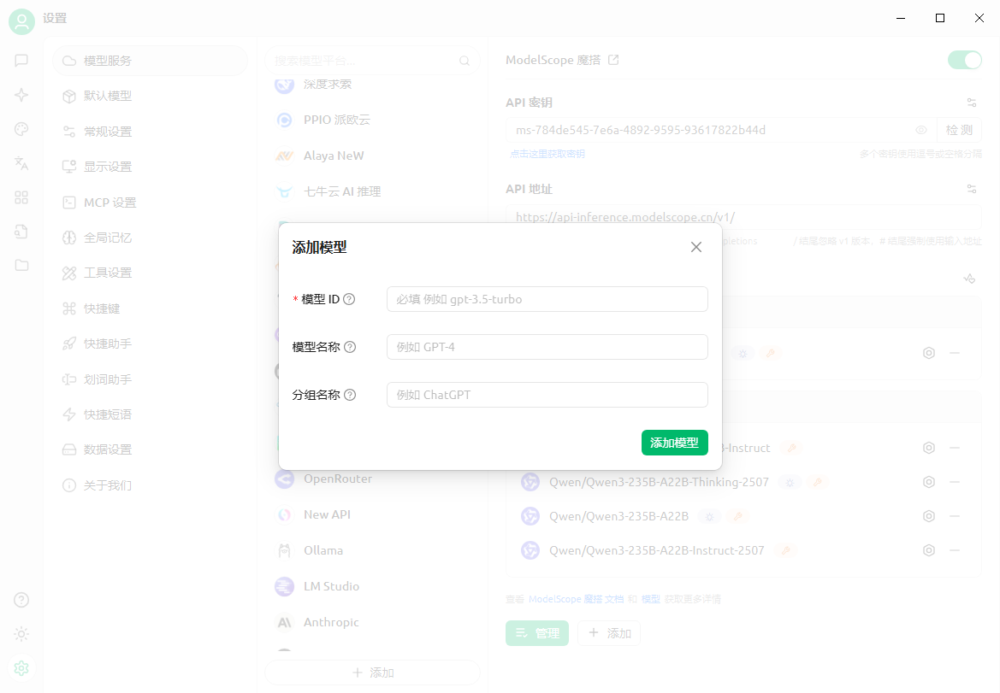

# Οδηγός Ενσωμάτωσης για την Πλατφόρμα ModelScope（魔搭）


Αυτό το έγγραφο μεταφράστηκε από τα Κινεζικά με AI και δεν έχει ακόμη ελεγχθεί.


## Τι είναι το ModelScope;
> Το ModelScope είναι μια πλατφόρμα διαμοιρασμού νέας γενιάς ανοιχτού προτύπου υπηρεσίας (MaaS) που στοχεύει να παρέχει στους προγραμματιστές γενικής AI μια **ευέλικτη, εύχρηστη και χαμηλού κόστους** ολοκληρωμένη λύση υπηρεσιών μοντέλων, κάνοντας την εφαρμογή των μοντέλων πιο απλή!
>
> Μέσω της **υπηρεσίας εξαγωγής συμπερασμάτων API**, η πλατφόρμα καθιστά τα ανοιχτά μοντέλα πρότυπα με καλά ορισμένες κλήσεις API. Οι προγραμματιστές μπορούν να ενσωματώσουν τις δυνατότητες των μοντέλων σε διάφορες εφαρμογές AI με ελαφρότητα και ταχύτητα, υποστηρίζοντας καινοτόμες χρήσεις όπως κλήσεις εργαλείων και ανάπτυξη πρωτοτύπων.

### Βασικά Πλεονεκτήματα
- ✅ **Δωρεάν όριο χρήσης**: **2000 δωρεάν κλήσεις API ανά ημέρα** ([Κανόνες χρέωσης](##Κανόνεςχρέωσηςκαιορίων))
- ✅ **Πλούσια βιβλιοθήκη μοντέλων**: Καλύπτει πάνω από 1000 ανοιχτά μοντέλα στα πεδία NLP, CV, ομιλίας και multimodal
- ✅ **Αμέσως χρήσιμη**: Χωρίς ανάπτυξη, γρήγορη επίκληση μέσω RESTful API

---

## Διαδικασία Ενσωμάτωσης στο Cherry Studio
### Βήμα 1: Λήψη διακριτικού API για το ModelScope
1. **Σύνδεση στην πλατφόρμα**
   - Επίσκεψη στον [επίσημο ιστότοπο ModelScope](https://modelscope.cn) → Κάντε κλικ στην **σύνδεση** πάνω δεξιά → Επιλέξτε μεθόδους πιστοποίησης
   
2. **Δημιουργία διακριτικού πρόσβασης**
   - Μετάβαση σε **[Ρυθμίσεις λογαριασμού → Διακριτικά πρόσβασης](https://modelscope.cn/my/myaccesstoken)**
   - Κάντε κλικ στο **`Νέο διακριτικό`** → Συμπληρώστε περιγραφή → **Αντιγράψτε το δημιουργηθέν διακριτικό** (*βλ. παράδειγμα παρακάτω*)
   
   > 🔑 **Σημαντική σημείωση**: Η διαρροή του διακριτικού μπορεί να επηρεάσει την ασφάλεια του λογαριασμού!

### Βήμα 2: Ρύθμιση του Cherry Studio
- Ανοίξτε το **Cherry Studio** → **Ρυθμίσεις → Υπηρεσίες μοντέλων → ModelScope**
- Στο πεδίο `Κλειδί API` επικολλήστε το αντιγραμμένο διακριτικό
  
- Κάντε κλικ στο **`Αποθήκευση`** για να ολοκληρώσετε την εξουσιοδότηση

### Βήμα 3: Κλήση του API μοντέλου
1. **Εύρεση μοντέλων με υποστήριξη API**
   - Επισκεφθείτε την [βιβλιοθήκη μοντέλων ModelScope](https://modelscope.cn/models)
   - Φίλτρα: **Επιλέξτε το `API-Inference`** (ή αναζητήστε το εικονίδιο `API` στις κάρτες μοντέλων)
   
   > Το εύρος μοντέλων που καλύπτει το API-Inference βασίζεται κυρίως στη δημοτικότητα του μοντέλου στην κοινότητα (λαμβάνοντας υπόψη δεδομένα όπως "μου αρέσει", λήψεις). Επομένως, η λίστα των υποστηριζόμενων μοντέλων επαναπροσδιορίζεται συνεχώς με την έκδοση νέων ισχυρότερων μοντέλων.
2. **Λήψη αναγνωριστικού μοντέλου**
   - Μετάβαση στη σελίδα λεπτομερειών του μοντέλου → Αντιγράψτε το **Αναγνωριστικό μοντέλου** (μορφή π.χ. `damo/nlp_structbert_sentiment-classification_chinese-base`)
   
3. **Συμπλήρωση στο Cherry Studio**
   - Στο πεδίο `Αναγνωριστικό μοντέλου` της σελίδας ρύθμισης, εισάγετε το αναγνωριστικό → Επιλέξτε τύπο εργασίας → Ολοκληρώστε τη ρύθμιση
   

---

## Κανόνες Χρέωσης και Ορίων
### Σημαντικές παρατηρήσεις
- 🎫 **Δωρεάν όριο**: **2000 κλήσεις API ανά χρήστη ημερησίως** (*σύμφωνα με τους τρέχοντες κανόνες της πλατφόρμας*)
- 🔁 **Επαναφορά ορίου**: Αυτόματη επαναφορά κάθε μέρα στις **UTC+8 00:00**  
  **Δεν υποστηρίζεται η συσσώρευση ή αναβάθμιση ορίων για διαδοχικές ημέρες**
- 💡 **Αντιμετώπιση υπέρβασης ορίου**:
  - Σε περίπτωση υπέρβασης ορίου η API επιστρέφει **λάθος 429**
  - Λύσεις: Χρήση εφεδρικού λογαριασμού / άλλης πλατφόρμας / βελτιστοποίηση συχνότητας κλήσεων

### Έλεγχος υπολειπόμενου ορίου
- Σύνδεση στο ModelScope → Κάντε κλικ στο **`όνομα χρήστη`** πάνω δεξιά → **`Κατάσταση χρήσης API`**
  

> ⚠️ Προσοχή: Το όριο των 2000 δωρεάν κλήσεων ημερησίως αφορά την API εξαγωγής συμπερασμάτων (API-Inference). Για μεγαλύτερες ανάγκες κλήσεων, εξετάστε τη χρήση υπηρεσιών όπως το Bailian της Alibaba Cloud.