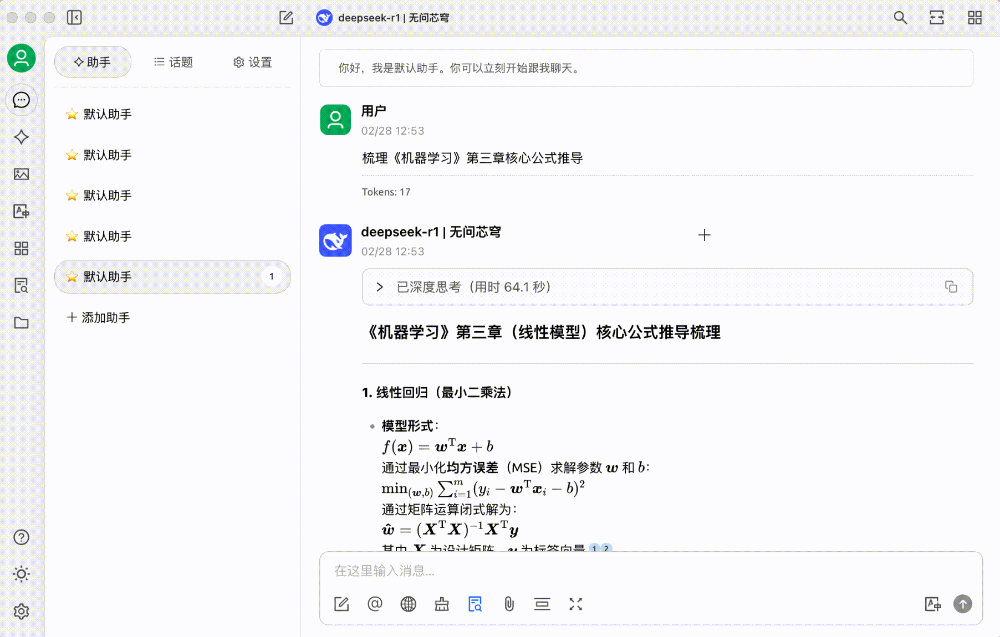


Αυτό το έγγραφο μεταφράστηκε από τα Κινεζικά με AI και δεν έχει ακόμη ελεγχθεί.


# INFINI

Αντιμετωπίζετε το εξής πρόβλημα: έχετε βιβλιογραφήσει 26 αξιόλογα άρθρα στο WeChat που δεν ξανανοιξατε ποτέ, ο υπολογιστής σας γεμίζει από άσχετα αρχεία σε φακέλους "Υλικό μελέτης", προσπαθείτε να θυμηθείτε μια θεωρία που διαβάσατε πριν έξι μήνες αλλά θυμάστε μόνο μερικές λέξεις-κλειδιά. Όταν η ημερήσια πληροφορία ξεπερνά την ικανότητα επεξεργασίας του εγκεφάλου σας, το 90% των πολύτιμων γνώσεων χάνονται σε 72 ώρες.\
Μέσω του API της πλατφόρμας μοντέλων INFINI + το Cherry Studio, μπορείτε να δημιουργήσετε προσωπικό γνωστικό αποθετήριο: μετατρέψτε βιβλιογραφημένα άρθρα WeChat και σπασματικό εκπαιδευτικό υλικό σε δομημένη γνώση για ακριβή ανάκτηση.

### Α. Δημιουργία Προσωπικού Γνωστικού Αποθετηρίου

#### 1. API υπηρεσία INFINI: Το "γνωστικό κέντρο" του αποθετηρίου - αξιόπιστη και απλή στη χρήση

Ως "γνωστικό κέντρο", η πλατφόρμα μοντέλων INFINI προσφέρει μοντέλα όπως το DeepSeek R1 full version και σταθερές API υπηρεσίες. **Προσωρινά, η χρήση είναι ανοικτή και δωρεάν μετά την εγγραφή.** Υποστηρίζει δημοφιλή embedding μοντέλα bge και jina για την κατασκευή του γνωστικού αποθετηρίου. **Η πλατφόρμα ενημερώνεται συνεχώς με τα πιο σταθερά και ισχυρά ανοιχτού κώδικα μοντέλα,** συμπεριλαμβανομένων εικόνων, βίντεο, ήχου και πολλαπλών διαφορετικών τροπολογιών.

<figure><figcaption></figcaption></figure>

#### 2. Cherry Studio: Γνωστικό αποθετήριο χωρίς κώδικα

Το Cherry Studio είναι ένα εύκολο στη χρήση εργαλείο τεχνητής νοημοσύνης. Σε αντίθεση με την ανάπτυξη RAG αποθετηρίων που απαιτεί 1-2 μήνες ανάπτυξης, αυτό το εργαλείο επιτρέπει **λειτουργίες χωρίς κώδικα**. Μπορείτε να εισαγάγετε άμεσα πολλές μορφές όπως Markdown/PDF/ιστοσελίδες και να ολοκληρώσετε την ανάλυση 40MB αρχείου σε 1 λεπτό. Επιπλέον, μπορείτε να προσθέσετε φακέλους από τον υπολογιστή σας, βιβλιογραφημένους συνδέσμους άρθρων στο WeChat και σημειώσεις μαθημάτων.

### Β. 3 βήματα για να δημιουργήσετε τον προσωπικό σας γνωστικό διαχειριστή

#### Βήμα 1: Βασικές προετοιμασίες

1. Επισκεφτείτε τον επίσημο ιστότοπο του Cherry Studio για να κατεβάσετε την κατάλληλη έκδοση (https://cherry-ai.com/)
2. Δημιουργία λογαριασμού: Συνδεθείτε στην πλατφόρμα μοντέλων INFINI (https://cloud.infini-ai.com/genstudio/model?cherrystudio)

<figure><figcaption></figcaption></figure>

* Λήψη κλειδιού API: Στην "Πλατεία Μοντέλων", επιλέξτε το deepseek-r1, κάντε κλικ στο "Δημιουργία" για να λάβετε το API KEY και αντιγράψτε το όνομα του μοντέλου

<figure><figcaption></figcaption></figure>

#### Βήμα 2: Ανοίξτε τις ρυθμίσεις του CherryStudio, επιλέξτε το INFINI στις υπηρεσίες μοντέλων, εισαγάγετε το κλειδί API και ενεργοποιήστε την υπηρεσία μοντέλου INFINI

<figure><figcaption></figcaption></figure>

Αφού ολοκληρώσετε τα παραπάνω βήματα, απλά επιλέξτε το απαιτούμενο μοντέλο τεχνητής νοημοσύνης για να χρησιμοποιήσετε τις υπηρεσίες API του INFINI στο CherryStudio.\
Για ευκολία χρήσης, μπορείτε να ορίσετε και ένα «Προεπιλεγμένο μοντέλο» 

<figure><figcaption></figcaption></figure>

#### Βήμα 3: Προσθήκη γνωστικού αποθετηρίου

Επιλέξτε ένα από τα embedding μοντέλα bge σειράς ή jina σειράς από την πλατφόρμα INFINI

<figure><figcaption></figcaption></figure>

<figure><figcaption></figcaption></figure>

### Γ. Δοκιμή σε πραγματικό σενάριο χρήσης

* Μετά την εισαγωγή εκπαιδευτικού υλικού, πληκτρολογήστε "Σύνοψη βασικών μαθηματικών εξαγωγών στο κεφάλαιο 3 της "Μηχανικής Μάθησης""

<figure><figcaption></figcaption></figure>

**Συνημμένο: Αποτέλεσμα δημιουργίας**

<figure><figcaption></figcaption></figure>