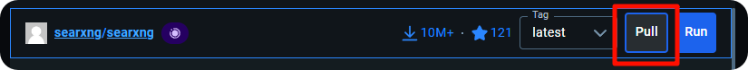
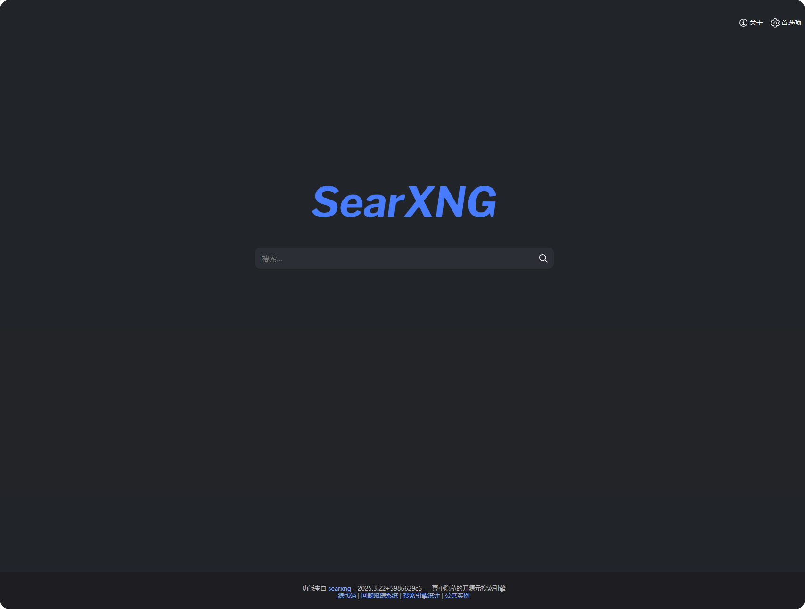
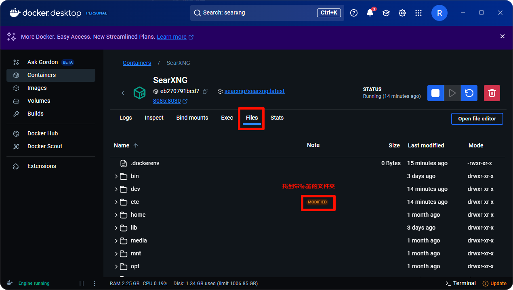
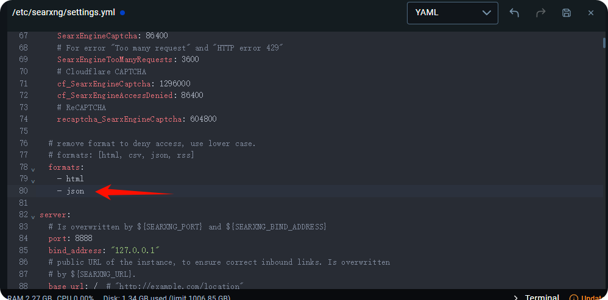
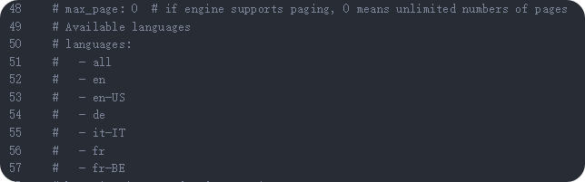

# Τοπική Ανάπτυξη και Ρύθμιση του SearXNG



Αυτό το έγγραφο μεταφράστηκε από τα Κινεζικά με AI και δεν έχει ακόμη ελεγχθεί.



Το CherryStudio υποστηρίζει αναζήτηση στο διαδίκτυο μέσω του SearXNG, το οποίο είναι ένα έργο ανοικτού κώδικα που μπορεί να αναπτυχθεί τοπικά ή σε διακομιστή, επομένως διαφέρει ελαφρώς από άλλες μεθόδους ρύθμισης που απαιτούν API παρόχους.

**Σύνδεσμος έργου SearXNG**: [SearXNG](https://github.com/searxng/searxng)

## Πλεονεκτήματα του SearXNG

* Ανοικτού κώδικα και δωρεάν, χωρίς ανάγκη για API
* Σχετικά υψηλότερη ιδιωτικότητα
* Υψηλός βαθμός προσαρμογής

## Τοπική Ανάπτυξη

### 1. Άμεση ανάπτυξη με Docker

Δεδομένου ότι το SearXNG δεν απαιτεί πολύπλοκα περιβαλλοντικά στήσιμα, μπορείτε να αποφύγετε τη χρήση του docker compose. Ο πιο γρήγορος τρόπος είναι η χρήση Docker για να τραβήξετε την εικόνα και να την αναπτύξετε.

#### 1. Λήψη και εγκατάσταση του [docker](https://www.docker.com/)

<figure><figcaption></figcaption></figure>

Επιλέξτε μια διαδρομή αποθήκευσης εικόνων:

<figure><figcaption></figcaption></figure>

#### 2. Αναζήτηση και λήψη εικόνας SearXNG

Εισαγάγετε **searxng** στη γραμμή αναζήτησης:

<figure><figcaption></figcaption></figure>

Λήψη εικόνας:

<figure><figcaption></figcaption></figure>

<figure><figcaption></figcaption></figure>

#### 3. Εκτέλεση εικόνας

Μετά την επιτυχή λήψη, μεταβείτε στη σελίδα **images**:

<figure><figcaption></figcaption></figure>

Επιλέξτε την εικόνα και κάντε κλικ στο Run:

<figure><figcaption></figcaption></figure>

Ανοίξτε τις ρυθμίσεις για ρύθμιση:

<figure><figcaption></figcaption></figure>

Χρησιμοποιώντας τη θύρα `8085` ως παράδειγμα:

<figure><figcaption></figcaption></figure>

Μετά την επιτυχή εκτέλεση, κάντε κλικ στον σύνδεσμο για να ανοίξετε το frontend του SearXNG:

<figure><figcaption></figcaption></figure>

Η εμφάνιση αυτής της σελίδας επιβεβαιώνει την επιτυχή ανάπτυξη:

<figure><figcaption></figcaption></figure>

## Ανάπτυξη σε Διακομιστή

Δεδομένου ότι η εγκατάσταση του Docker στα Windows μπορεί να είναι πολύπλοκη, οι χρήστες μπορούν να αναπτύξουν το SearXNG σε διακομιστή. Ωστόσο, το SearXNG δεν υποστηρίζει αυθεντικοποίηση, γεγονός που μπορεί να οδηγήσει σε κατάχρηση της εγκατάστασής σας.

Για το λόγο αυτό, το Cherry Studio υποστηρίζει ρύθμιση [Βασικής Ελέγχου Ταυτότητας HTTP (RFC7617)](https://developer.mozilla.org/zh-CN/docs/Web/HTTP/Guides/Authentication). Εάν εκθέτετε το SearXNG στο δημόσιο διαδίκτυο, **είναι υποχρεωτικό** να ρυθμίσετε βασική ελέγχου ταυτότητας HTTP μέσω λογισμικού όπως το Nginx. Ακολουθεί μια σύντομη εκμάθηση:

### Ανάπτυξη SearXNG

Παρόμοια με πριν, χρησιμοποιώντας Docker. Υποθέτοντας ότι έχετε εγκαταστήσει το Docker CE σύμφωνα με τις [επίσημες οδηγίες](https://docs.docker.com/engine/install):

```bash
sudo apt update
sudo apt install git -y

# Λήψη επίσημου αποθετηρίου
cd /opt
git clone https://github.com/searxng/searxng-docker.git
cd /opt/searxng-docker

# Εάν ο διακομιστής σας έχει μικρό εύρος ζώνης, ορίστε false
export IMAGE_PROXY=true

# Τροποποίηση αρχείου ρυθμίσεων
cat <<EOF > /opt/searxng-docker/searxng/settings.yml
# δείτε https://docs.searxng.org/admin/settings/settings.html#settings-use-default-settings
use_default_settings: true
server:
  # base_url ορίζεται στη μεταβλητή περιβάλλοντος SEARXNG_BASE_URL, δείτε .env και docker-compose.yml
  secret_key: $(openssl rand -hex 32)
  limiter: false  # μπορεί να απενεργοποιηθεί για ιδιωτική εγκατάσταση
  image_proxy: $IMAGE_PROXY
ui:
  static_use_hash: true
redis:
  url: redis://redis:6379/0
search:
  formats:
    - html
    - json
EOF
```

Για αλλαγές θύρας ή χρήση υπάρχοντος Nginx, επεξεργαστείτε το αρχείο `docker-compose.yaml`:

```yaml
version: "3.7"

services:
# Εάν δεν χρειάζεται Caddy και θέλετε να χρησιμοποιήσετε υπάρχον Nginx, αφαιρέστε το παρακάτω
  caddy:
    container_name: caddy
    image: docker.io/library/caddy:2-alpine
    network_mode: host
    restart: unless-stopped
    volumes:
      - ./Caddyfile:/etc/caddy/Caddyfile:ro
      - caddy-data:/data:rw
      - caddy-config:/config:rw
    environment:
      - SEARXNG_HOSTNAME=${SEARXNG_HOSTNAME:-http://localhost}
      - SEARXNG_TLS=${LETSENCRYPT_EMAIL:-internal}
    cap_drop:
      - ALL
    cap_add:
      - NET_BIND_SERVICE
    logging:
      driver: "json-file"
      options:
        max-size: "1m"
        max-file: "1"
# Εάν δεν χρειάζεται Caddy και θέλετε να χρησιμοποιήσετε υπάρχον Nginx, αφαιρέστε το παραπάνω
  redis:
    container_name: redis
    image: docker.io/valkey/valkey:8-alpine
    command: valkey-server --save 30 1 --loglevel warning
    restart: unless-stopped
    networks:
      - searxng
    volumes:
      - valkey-data2:/data
    cap_drop:
      - ALL
    cap_add:
      - SETGID
      - SETUID
      - DAC_OVERRIDE
    logging:
      driver: "json-file"
      options:
        max-size: "1m"
        max-file: "1"

  searxng:
    container_name: searxng
    image: docker.io/searxng/searxng:latest
    restart: unless-stopped
    networks:
      - searxng
    # Προεπιλεγμένη θύρα 8080, για αλλαγή σε 8000: "127.0.0.1:8000:8080"
    ports:
      - "127.0.0.1:8080:8080"
    volumes:
      - ./searxng:/etc/searxng:rw
    environment:
      - SEARXNG_BASE_URL=https://${SEARXNG_HOSTNAME:-localhost}/
      - UWSGI_WORKERS=${SEARXNG_UWSGI_WORKERS:-4}
      - UWSGI_THREADS=${SEARXNG_UWSGI_THREADS:-4}
    cap_drop:
      - ALL
    cap_add:
      - CHOWN
      - SETGID
      - SETUID
    logging:
      driver: "json-file"
      options:
        max-size: "1m"
        max-file: "1"

networks:
  searxng:

volumes:
# Εάν δεν χρειάζεται Caddy και θέλετε να χρησιμοποιήσετε υπάρχον Nginx, αφαιρέστε το παρακάτω
  caddy-data:
  caddy-config:
# Εάν δεν χρειάζεται Caddy και θέλετε να χρησιμοποιήσετε υπάρχον Nginx, αφαιρέστε το παραπάνω
  valkey-data2:
```

Εκτελέστε `docker compose up -d`. Για αρχεία καταγραφής:`docker compose logs -f searxng`.

### Ανάπτυξη Αντιπροσωπευτικού διακομιστή Nginx και Βασικής Ελέγχου Ταυτότητας HTTP

Για πίνακες διαχείρισης όπως τον BaoTa ή 1Panel, δείτε την τεκμηρίωσή τους. Τροποποιήστε το αρχείο ρυθμίσεων Nginx σύμφωνα με το παρακάτω παράδειγμα:

```conf
server
{
    listen 443 ssl;

    # Όνομα διακομιστή
    server_name search.example.com;

    # index index.html;
    # root /data/www/default;

    # Για SSL
    ssl_certificate    /path/to/your/cert/fullchain.pem;
    ssl_certificate_key    /path/to/your/cert/privkey.pem;

    # HSTS
    # add_header Strict-Transport-Security "max-age=31536000; includeSubDomains; preload";

    location / {
        # Προσθήκη αυθεντικοποίησης
        auth_basic "Εισαγάγετε όνομα χρήστη και κωδικό πρόσβασης";
        auth_basic_user_file /etc/nginx/conf.d/search.htpasswd;

        proxy_http_version 1.1;
        proxy_set_header Connection "";
        proxy_redirect off;
        proxy_set_header Host $host;
        proxy_set_header X-Forwarded-For $proxy_protocol_addr;
        proxy_pass http://127.0.0.1:8000;
        client_max_body_size 0;
    }

    # access_log  ...;
    # error_log  ...;
}
```

Δημιουργία αρχείου κωδικών:

```bash
echo "example_name:$(openssl passwd -5 'example_password')" > /etc/nginx/conf.d/search.htpasswd
```

Επανεκκινήστε τον Nginx.

<figure><figcaption></figcaption></figure>

## Σχετικές Ρυθμίσεις στο Cherry Studio

Μετά την επιτυχή ανάπτυξη του SearXNG, προχωρήστε στις ρυθμίσεις στο CherryStudio.

Στη σελίδα ρυθμίσεων δικτυακής αναζήτησης, επιλέξτε Searxng:

<figure><figcaption></figcaption></figure>

Η εισαγωγή τοπικού συνδέσμου μπορεί να αποτύχει αρχικά:

<figure><figcaption></figcaption></figure>

Αυτό συμβαίνει επειδή απαιτείται τροποποίηση του αρχείου ρυθμίσεων για JSON.

Στο Docker, μεταβείτε στην καρτέλα Files και εντοπίστε το φάκελο με ετικέτες:

<figure><figcaption></figcaption></figure>

Συνεχίστε να αναπτύσσετε μέχρι να βρείτε τον επόμενο φάκελο:

<figure><figcaption></figcaption></figure>

Ανοίξτε το αρχείο **settings.yml**:

<figure><figcaption></figcaption></figure>

Κάντε κλικ για επεξεργασία:

<figure><figcaption></figcaption></figure>

Στη γραμμή 78, προσθέστε JSON ως τύπο:

<figure><figcaption></figcaption></figure>

Αποθηκεύστε και επανεκκινήστε την εικόνα:

<figure><figcaption></figcaption></figure>

<figure><figcaption></figcaption></figure>

Επαναλάβετε την επαλήθευση στο Cherry Studio:

<figure><figcaption></figcaption></figure>

Χρησιμοποιήστε:
- Τοπική διεύθυνση: http://localhost:θύρα
- Docker διεύθυνση: http://host.docker.internal:θύρα

Για αναπτύξεις διακομιστή με βασική ελέγχου ταυτότητας HTTP, η επαλήθευση θα επιστρέψει σφάλμα 401:

<figure><figcaption></figcaption></figure>

Ρυθμίστε τα διαπιστευτήρια στο πελάτη:

<figure><figcaption></figcaption></figure>

### Άλλες Ρυθμίσεις

Για προσαρμογή μηχανών αναζήτησης, απαιτείται χειροκίνητη ρύθμιση:

<figure><figcaption></figcaption></figure>

Για μεγάλα μοντέλα, ρυθμίστε στο αρχείο ρυθμίσεων:

<figure><figcaption></figcaption></figure>

<figure><figcaption></figcaption></figure>

Αναφορά ρυθμίσεων γλώσσας:

<figure><figcaption></figcaption></figure>

## Συχνές Αιτίες Αποτυχίας Επαλήθευσης

### Μη προσθήκη JSON στη μορφή επιστροφής

Προσθέστε JSON στο αρχείο ρυθμίσεων:

<figure><figcaption></figcaption></figure>

### Μη σωστή ρύθμιση μηχανών αναζήτησης

Προσθέστε την ακόλουθη ρύθμιση για αναγκαστική χρήση της baidu:

```
use_default_settings:
  engines:
    keep_only:
      - baidu
engines:
  - name: baidu
    engine: baidu 
    categories: 
      - web
      - general
    disabled: false
```

### Υπερβολική τα