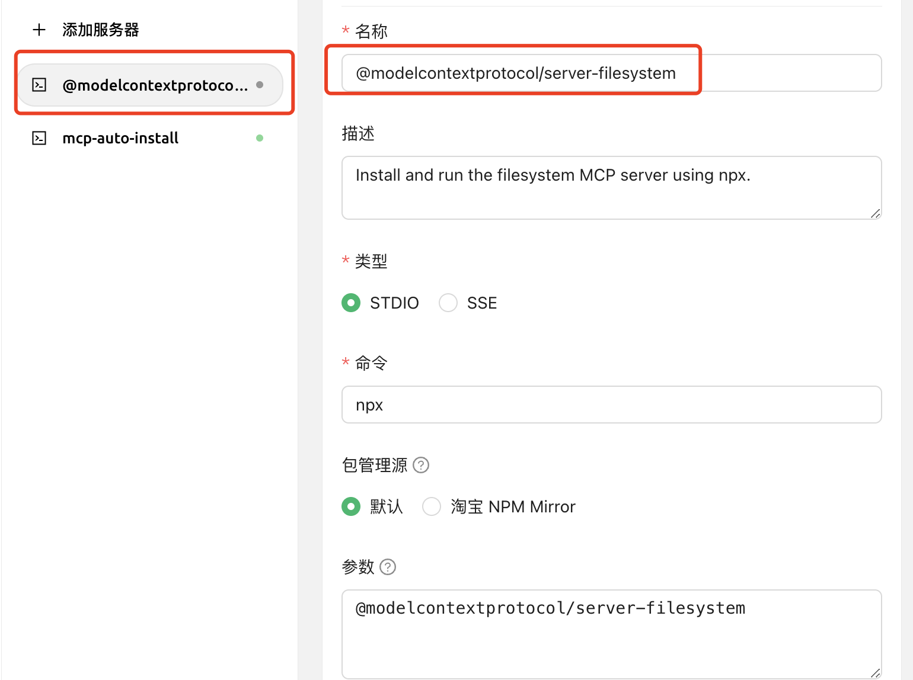


यह दस्तावेज़ AI द्वारा चीनी से अनुवादित किया गया है और अभी तक इसकी समीक्षा नहीं की गई है।


# MCP का स्वचालित इंस्टालेशन

> स्वचालित रूप से MCP इंस्टॉल करने के लिए Cherry Studio को v1.1.18 या उच्चतर संस्करण में अपग्रेड करना आवश्यक है।

## सुविधा परिचय

मैन्युअल इंस्टालेशन के अतिरिक्त, Cherry Studio में अंतर्निहित `@mcpmarket/mcp-auto-install` टूल भी है। यह MCP सर्वर इंस्टॉल करने का एक अधिक सुविधाजनक तरीका है। आपको केवल MCP सेवा को सपोर्ट करने वाले बड़े मॉडल संवाद में संबंधित निर्देश दर्ज करना होगा।


**परीक्षण चरण सूचना:**

* `@mcpmarket/mcp-auto-install` अभी भी परीक्षण चरण में है
* प्रभाव बड़े मॉडल की "बुद्धिमत्ता" पर निर्भर करता है - कुछ स्वचालित रूप से जोड़े जाते हैं, जबकि कुछ को अभी भी **MCP सेटिंग्स में मैन्युअल रूप से पैरामीटर बदलने की आवश्यकता होती है**
* वर्तमान में खोज स्रोत @modelcontextprotocol से है, जिसे स्वयं कॉन्फ़िगर किया जा सकता है (नीचे स्पष्टीकरण)


## उपयोग निर्देश

उदाहरण के लिए, आप इनपुट कर सकते हैं:

```
मुझे एक filesystem MCP सर्वर इंस्टॉल करने में मदद करें
```

<figure><figcaption><p>MCP सर्वर इंस्टॉल करने के लिए निर्देश दर्ज करें</p></figcaption></figure>

<figure><figcaption><p>MCP सर्वर कॉन्फ़िगरेशन इंटरफ़ेस</p></figcaption></figure>

सिस्टम स्वचालित रूप से आपकी आवश्यकता को पहचान लेगा और `@mcpmarket/mcp-auto-install` के माध्यम से इंस्टॉलेशन पूरा करेगा। यह टूल विभिन्न प्रकार के MCP सर्वरों का समर्थन करता है, जिनमें शामिल हैं:

* filesystem (फ़ाइल सिस्टम)
* fetch (नेटवर्क अनुरोध)
* sqlite (डेटाबेस)
* इत्यादि...

> MCP_PACKAGE_SCOPES चर MCP सेवा खोज स्रोत को कस्टमाइज़ कर सकता है। डिफ़ॉल्ट मान है: `@modelcontextprotocol`, जिसे कस्टम कॉन्फ़िगर किया जा सकता है।

## `@mcpmarket/mcp-auto-install` लाइब्रेरी परिचय


**डिफ़ॉल्ट कॉन्फ़िगरेशन संदर्भ:**

```json
// `axun-uUpaWEdMEMU8C61K` सेवा ID है, कस्टम करने योग्य
"axun-uUpaWEdMEMU8C61K": {
  "name": "mcp-auto-install",
  "description": "स्वचालित रूप से MCP सेवाएँ इंस्टॉल करें (बीटा संस्करण)",
  "isActive": false,
  "registryUrl": "https://registry.npmmirror.com",
  "command": "npx",
  "args": [
    "-y",
    "@mcpmarket/mcp-auto-install",
    "connect",
    "--json"
  ],
  "env": {
    "MCP_REGISTRY_PATH": "विवरण के लिए देखें https://www.npmjs.com/package/@mcpmarket/mcp-auto-install"
  },
  "disabledTools": []
}
```

`@mcpmarket/mcp-auto-install` एक ओपन-सोर्स npm पैकेज है। आप [npm आधिकारिक रिपॉजिटरी](https://www.npmjs.com/package/@mcpmarket/mcp-auto-install) पर इसका विवरण और उपयोग दस्तावेज़ीकरण देख सकते हैं। `@mcpmarket` Cherry Studio का आधिकारिक MCP सेवा संग्रह है।
