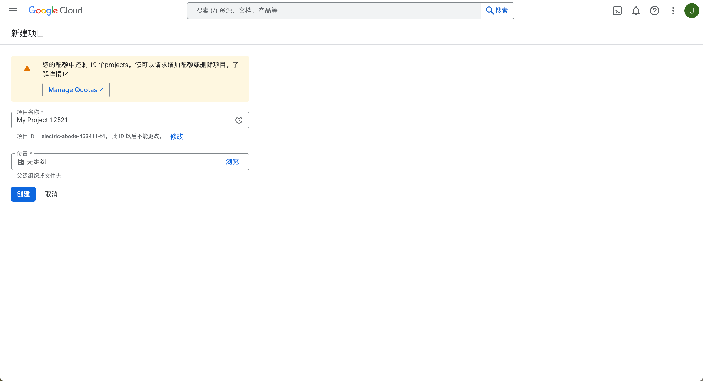


यह दस्तावेज़ AI द्वारा चीनी से अनुवादित किया गया है और अभी तक इसकी समीक्षा नहीं की गई है।


# ModelScope MCP सर्वर जोड़ें

> ModelScope MCP सर्वर का उपयोग करने के लिए Cherry Studio को v1.2.9 या उच्चतर संस्करण में अपग्रेड करना आवश्यक है।

v1.2.9 संस्करण में, Cherry Studio ने ModelScope मोडा के साथ आधिकारिक साझेदारी की है जिससे MCP सर्वर जोड़ने के चरण काफी सरल हो गए हैं। यह कॉन्फ़िगरेशन में गलतियों से बचाता है और ModelScope समुदाय में बड़ी संख्या में MCP सर्वर खोजने में सहायक होता है। आइए Cherry Studio में ModelScope के MCP सर्वरों को सिंक करने के चरण देखें।

## चरण-दर-चरण प्रक्रिया

### सिंक्रनाइज़ेशन प्वाइंट:

सेटिंग्स में MCP सर्वर सेटिंग्स पर क्लिक करें और 'सर्वर सिंक करें' चुनें

<figure><figcaption></figcaption></figure>

### MCP सेवाएँ खोजें:

ModelScope चुनें और MCP सेवाएँ ब्राउज़ करें

<figure><figcaption></figcaption></figure>

### MCP सर्वर विवरण देखें

ModelScope में रजिस्टर/लॉग इन करें और MCP सेवा विवरण देखें;

<figure><figcaption></figcaption></figure>

### सर्वर कनेक्ट करें

MCP सेवा विवरण में 'कनेक्ट सेवा' चुनें;

<figure><figcaption></figcaption></figure>

### API टोकन प्राप्त करें और पेस्ट करें

Cherry Studio में "API प्राप्त करें" पर क्लिक करके ModelScope वेबसाइट पर जाएँ, API टोकन कॉपी करें और Cherry Studio में पेस्ट करें।

<figure><figcaption></figcaption></figure>

<figure><figcaption></figcaption></figure>

<figure><figcaption></figcaption></figure>

### सफल सिंक्रनाइज़ेशन

Cherry Studio के MCP सर्वर सूची में ModelScope से कनेक्टेड MCP सेवाएँ दिखाई देंगी जिन्हें चैट में उपयोग किया जा सकता है।

<figure><figcaption></figcaption></figure>

### इंक्रीमेंटल अपडेट

भविष्य में ModelScope वेबसाइट पर जोड़े गए नए MCP सर्वर्स को 'सर्वर सिंक करें' पर क्लिक करके सीधे जोड़ा जा सकता है।

<figure><figcaption></figcaption></figure>

इन चरणों के माध्यम से, आपने Cherry Studio में ModelScope के MCP सर्वरों को आसानी से सिंक करना सीख लिया है। यह प्रक्रिया मैन्युअल कॉन्फ़िगरेशन की जटिलताओं और संभावित त्रुटियों से बचाती है, साथ ही ModelScope समुदाय द्वारा प्रदान की गई विशाल MCP सर्वर संसाधनों तक पहुँच प्रदान करती है।

इन शक्तिशाली MCP सेवाओं का अन्वेषण और उपयोग प्रारंभ करें, और अपने Cherry Studio अनुभव में अधिक सुविधा और संभावनाएँ जोड़ें!