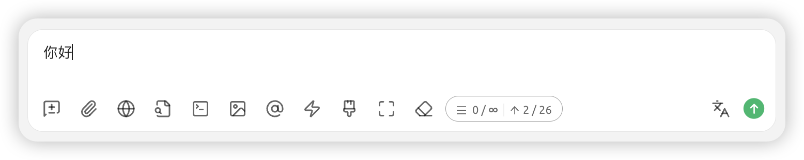


यह दस्तावेज़ AI द्वारा चीनी से अनुवादित किया गया है और अभी तक इसकी समीक्षा नहीं की गई है।


# बातचीत इंटरफ़ेस

## सहायक और विषय

### सहायक

`सहायक` चयनित मॉडल को आपकी अपेक्षाओं के अनुरूप बनाने के लिए व्यक्तिगतकरण सेटिंग्स (जैसे पूर्वनिर्धारित संकेत और पैरामीटर) को लागू करने का एक तरीका है।

`सिस्टम डिफ़ॉल्ट सहायक` में एक सामान्य पैरामीटर सेट पूर्वनिर्धारित है (कोई संकेत नहीं)। आप इसे सीधे उपयोग कर सकते हैं या आवश्यक पूर्वनिर्धारित सेटिंग्स के लिए [एजेंट्स पेज](agents.md) पर जा सकते हैं।

### विषय

`सहायक` `विषय` का पैरेंट सेट है। एक सहायक के तहत कई विषय (बातचीत) बनाए जा सकते हैं। सभी `विषय` मॉडल सेटिंग्स जैसे पैरामीटर और संकेत (prompt) को साझा करते हैं।

<figure><figcaption></figcaption></figure>

<figure><figcaption></figcaption></figure>

## चैट बॉक्स में बटन

<figure><figcaption></figcaption></figure>

 `नया विषय` वर्तमान सहायक में एक नया विषय बनाता है।

 `छवि या दस्तावेज़ अपलोड करें` छवि अपलोड करने के लिए मॉडल समर्थन की आवश्यकता होती है। दस्तावेज़ अपलोड स्वचालित रूप से पाठ में पार्स हो जाते हैं और मॉडल को संदर्भ के रूप में प्रदान किए जाते हैं।

 `वेब खोज` इंटरनेट खोज सम्बंधित जानकारी सेटिंग में कॉन्फ़िगर की जानी चाहिए। परिणाम एलएलएम को संदर्भ के रूप में वापस किए जाते हैं। विवरण के लिए देखें [इंटरनेट मोड](../../websearch/)।

 `नॉलेज बेस` नॉलेज बेस सक्रिय करें। विवरण के लिए देखें [नॉलेज बेस ट्यूटोरियल](../../knowledge-base/knowledge-base.md)।

 `एमसीपी सर्वर` एमसीपी सर्वर फ़ंक्शन सक्रिय करें। विवरण के लिए देखें [एमसीपी उपयोग गाइड](../../advanced-basic/mcp/)।

 `छवि उत्पन्न करें` डिफ़ॉल्ट रूप से प्रदर्शित नहीं होता। छवि उत्पन्न करने वाले मॉडल (जैसे जेमिनी) के लिए मैन्युअल रूप से बटन सक्रिय करना आवश्यक है।


तकनीकी कारणों से, छवि उत्पन्न करने के लिए आपको मैन्युअल रूप से बटन सक्रिय करना होगा। यह बटन इस फ़ंक्शन के अनुकूलन के बाद हटा दिया जाएगा।


 `मॉडल चुनें` आगे की बातचीत के लिए संदर्भ बनाए रखते हुए निर्दिष्ट मॉडल पर स्विच करता है।

 `शॉर्टकट वाक्यांश` सेटिंग में पहले पूर्वनिर्धारित वाक्यांश जोड़ना आवश्यक है। यहां सीधे इनपुट करने के लिए कॉल किया जाता है, चर समर्थित हैं।

 `संदेश साफ़ करें` इस विषय के सभी सामग्री हटा देता है।

 `विस्तारित करें` लंबे टेक्स्ट इनपुट के लिए चैट बॉक्स का आकार बढ़ाता है।

 `संदर्भ साफ़ करें` सामग्री हटाए बिना मॉडल को उपलब्ध संदर्भ सीमित करता है, जिससे मॉडल पिछले संवाद "भूल जाता है"।

 `अनुमानित टोकन संख्या` अनुमानित टोकन संख्या प्रदर्शित करता है। चार डेटा क्रमशः हैं: `वर्तमान संदर्भ संख्या`, `अधिकतम संदर्भ संख्या` (∞ अर्थात असीमित), `वर्तमान इनपुट बॉक्स संदेश शब्द संख्या`, `अनुमानित टोकन संख्या`.


यह फ़ंक्शन केवल अनुमानित टोकन संख्या के लिए है। वास्तविक टोकन संख्या प्रत्येक मॉडल के लिए भिन्न होती है। कृपया मॉडल प्रदाता के डेटा को अंतिम मानें।


 `अनुवाद करें` वर्तमान इनपुट बॉक्स सामग्री को अंग्रेजी में अनुवाद करता है।

## बातचीत सेटिंग्स

<figure><figcaption></figcaption></figure>

### मॉडल सेटिंग्स

मॉडल सेटिंग्स सहायक सेटिंग्स में `मॉडल सेटिंग्स` पैरामीटर के साथ सिंक्रनाइज़ होती हैं। विवरण के लिए देखें [सहायक सेटिंग्स](chat.md#bian-ji-zhu-shou).


बातचीत सेटिंग्स में, केवल यह मॉडल सेटिंग वर्तमान सहायक पर लागू होती है। अन्य सेटिंग्स वैश्विक रूप से लागू होती हैं। उदाहरण के लिए: यदि संदेश शैली बबल के रूप में सेट की जाती है, तो किसी भी सहायक के किसी भी विषय में यह बबल शैली होगी।


### संदेश सेटिंग्स

#### <mark style="color:blue;">**`संदेश विभाजक रेखा`**</mark>:

संदेश मुख्य भाग और कार्रवाई पट्टी को अलग करने के लिए विभाजक रेखा का उपयोग करें।



<figure><figcaption></figcaption></figure>



<figure><figcaption></figcaption></figure>



#### <mark style="color:blue;">**`सेरिफ़ फ़ॉन्ट का उपयोग करें`**</mark>:

फ़ॉन्ट शैली स्विच करें। आप [कस्टम सीएसएस](../../personalization-settings/) के माध्यम से भी फ़ॉन्ट बदल सकते हैं।

#### <mark style="color:blue;">**`कोड ब्लॉक में लाइन नंबर दिखाएं`**</mark>:

मॉडल आउटपुट कोड स्निपेट में कोड ब्लॉक लाइन नंबर प्रदर्शित करें।



<figure><figcaption></figcaption></figure>



<figure><figcaption></figcaption></figure>



#### <mark style="color:blue;">**`कोड ब्लॉक को संकुचित करने योग्य`**</mark>:

सक्षम होने पर, जब कोड स्निपेट लंबा होता है तो कोड ब्लॉक स्वचालित रूप से संकुचित हो जाता है।

#### <mark style="color:blue;">**`कोड ब्लॉक में लाइन रैप सक्षम करें`**</mark>:

सक्षम होने पर, जब कोड स्निपेट की एक पंक्ति लंबी होती है (विंडो से अधिक), तो स्वचालित रूप से लाइन रैप हो जाती है।

#### <mark style="color:blue;">**`चिंतन सामग्री स्वचालित रूप से संकुचित करें`**</mark>:

सक्षम होने पर, सोच-विचार का समर्थन करने वाले मॉडल सोच प्रक्रिया पूरी होने पर इसे स्वचालित रूप से संकुचित कर देते हैं।

#### <mark style="color:blue;">**`संदेश शैली`**</mark>:

बातचीत इंटरफ़ेस को बबल शैली या सूची शैली में स्विच करें।

#### <mark style="color:blue;">**`कोड शैली`**</mark>:

कोड स्निपेट की प्रदर्शन शैली बदलें।

#### <mark style="color:blue;">**`गणित सूत्र इंजन`**</mark>:

* KaTeX रेंडरिंग तेज़ है क्योंकि यह प्रदर्शन के लिए अनुकूलित है;
* MathJax रेंडरिंग धीमी है लेकिन अधिक सुविधाएँ प्रदान करता है, जिसमें अधिक गणितीय प्रतीक और कमांड शामिल हैं।

#### <mark style="color:blue;">**`संदेश फ़ॉन्ट आकार`**</mark>:

बातचीत इंटरफ़ेस के फ़ॉन्ट आकार को समायोजित करें।

### इनपुट सेटिंग्स

#### <mark style="color:blue;">**`अनुमानित टोकन संख्या दिखाएं`**</mark>:

इनपुट टेक्स्ट के अनुमानित टोकन उपभोग को इनपुट बॉक्स में प्रदर्शित करें (वास्तविक संदर्भ उपभोग नहीं, केवल संदर्भ हेतु)।

#### <mark style="color:blue;">**`लंबे टेक्स्ट को फ़ाइल के रूप में चिपकाएं`**</mark>:

जब अन्य स्रोतों से लंबा टेक्स्ट इनपुट बॉक्स में चिपकाया जाता है, तो यह स्वचालित रूप से फ़ाइल शैली में प्रदर्शित होता है, जिससे बाद के इनपुट में व्यवधान कम होता है।

#### <mark style="color:blue;">**`इनपुट संदेशों में मार्कडाउन रेंडर करें`**</mark>:

अक्षम होने पर केवल मॉडल के जवाब संदेशों को रेंडर करता है, भेजे गए संदेशों को नहीं।



<figure><figcaption></figcaption></figure>



<figure><figcaption></figcaption></figure>



#### <mark style="color:blue;">**`तेजी से स्पेस बार तीन बार दबाकर अनुवाद करें`**</mark>:

इनपुट बॉक्स में संदेश टाइप करने के बाद, तेजी से स्पेस बार तीन बार दबाने से इनपुट सामग्री अंग्रेजी में अनुवादित हो जाती है।


ध्यान दें: यह क्रिया मूल पाठ को ओवरराइट कर देगी।


#### <mark style="color:blue;">**`लक्ष्य भाषा`**</mark>:

इनपुट बॉक्स अनुवाद बटन और स्पेस बार तीन बार दबाकर अनुवाद के लिए लक्ष्य भाषा सेट करें।

## सहायक सेटिंग्स

सहायक इंटरफ़ेस में वांछित <mark style="background-color:yellow;">सहायक नाम</mark> चुनें → <mark style="background-color:yellow;">राइट-क्लिक मेन्यू</mark> में संबंधित सेटिंग चुनें

### सहायक संपादित करें


सहायक सेटिंग्स इस सहायक के सभी विषयों पर लागू होती हैं।


<figure><figcaption></figcaption></figure>

#### संकेत सेटिंग्स

#### <mark style="color:blue;">**`नाम`**</mark>:

आसानी से पहचाने जाने योग्य कस्टम सहायक नाम।

#### <mark style="color:blue;">**`संकेत`**</mark>:

अर्थात prompt, आप एजेंट पेज पर संकेत लेखन तकनीकों का संदर्भ लेकर सामग्री संपादित कर सकते हैं।

#### मॉडल सेटिंग्स

#### <mark style="color:blue;">**`डिफ़ॉल्ट मॉडल`**</mark>:

इस सहायक के लिए एक डिफ़ॉल्ट मॉडल सेट किया जा सकता है। एजेंट पेज से जोड़ने या सहायक को कॉपी करते समय प्र