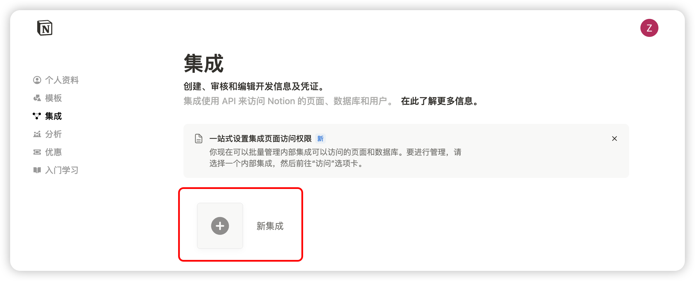


यह दस्तावेज़ AI द्वारा चीनी से अनुवादित किया गया है और अभी तक इसकी समीक्षा नहीं की गई है।


# Notion कॉन्फ़िगरेशन गाइड

Cherry Studio Notion डेटाबेस में चर्चाएं आयात करने का समर्थन करता है।

## पहला चरण

वेबसाइट [Notion Integrations](https://www.notion.so/profile/integrations) खोलकर एक एप्लिकेशन बनाएँ

<figure><figcaption>
प्लस आइकन पर क्लिक करके एप्लिकेशन बनाएँ
</figcaption></figure>

## दूसरा चरण

एप्लिकेशन बनाएँ

<figure><figcaption>
एप्लिकेशन जानकारी भरें
</figcaption></figure>

नाम: Cherry Studio  
प्रकार: पहला विकल्प चुनें  
आइकन: इस छवि को सहेज सकते हैं  
<figure><figcaption></figcaption></figure>

## तीसरा चरण

कुंजी को कॉपी करके Cherry Studio की सेटिंग्स में पेस्ट करें

<figure><figcaption>
कुंजी कॉपी करने के लिए क्लिक करें
</figcaption></figure>

<figure><figcaption>
डेटा सेटिंग्स में कुंजी भरें
</figcaption></figure>

## चौथा चरण

[Notion](https://www.notion.so/) वेबसाइट पर एक नया पेज बनाएँ, नीचे डेटाबेस प्रकार चुनें, नाम में Cherry Studio लिखें, और चित्रानुसार कनेक्ट करें

<figure><figcaption>
नया पेज बनाकर डेटाबेस प्रकार चुनें
</figcaption></figure>

<figure><figcaption>
पेज का नाम लिखें और APP से कनेक्ट चुनें
</figcaption></figure>

## पाँचवा चरण

<figure><figcaption>
डेटाबेस ID कॉपी करें
</figcaption></figure>

अगर आपके Notion डेटाबेस का URL इस प्रकार है:  
https://www.notion.so/\<long\_hash\_1>?v=\<long\_hash\_2>  
तो Notion डेटाबेस ID होगी `<\long_hash\_1>` वाला भाग

<figure><figcaption>
डेटाबेस ID भरें और जाँच पर क्लिक करें
</figcaption></figure>

## छठा चरण

`पेज शीर्षक फ़ील्ड नाम` भरें:  
- अंग्रेजी वेबसाइट होने पर `Name` लिखें  
- हिंदी/चीनी वेबसाइट होने पर `名称` लिखें

<figure><figcaption>
पेज शीर्षक फ़ील्ड नाम भरें
</figcaption></figure>

## सातवाँ चरण

बधाई हो! ✅ Notion कॉन्फ़िगरेशन पूरा हो गया है। अब Cherry Studio सामग्री को अपने Notion डेटाबेस में निर्यात कर सकते हैं

<figure><figcaption>
Notion में निर्यात करें
</figcaption></figure>

<figure><figcaption>
निर्यात परिणाम देखें
</figcaption></figure>