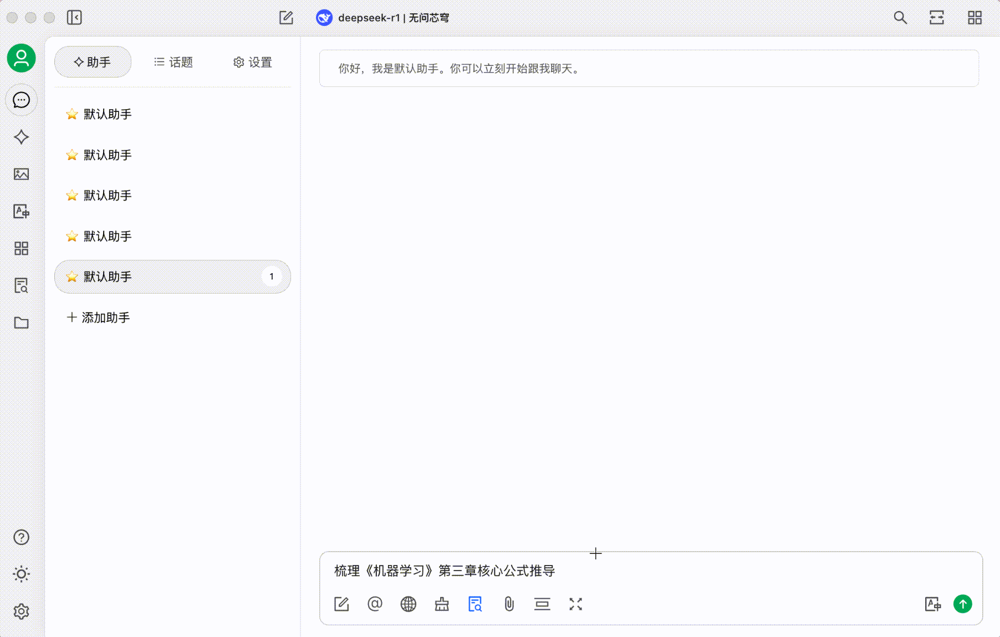


यह दस्तावेज़ AI द्वारा चीनी से अनुवादित किया गया है और अभी तक इसकी समीक्षा नहीं की गई है।


# इन्फिनी-एआई (Infini-AI)

क्या आप ऐसा अनुभव कर रहे हैं: वीचैट पर 26 ज्ञानवर्धक लेख सेव किए पर फिर कभी नहीं खोले, कंप्यूटर में "अध्ययन सामग्री" फ़ोल्डर में बिखरी 10+ फाइलें पड़ी हैं, छह महीने पहले पढ़े किसी सिद्धांत को ढूँढ़ना चाहते हैं पर सिर्फ़ कुछ अंश याद हैं। जब दैनिक जानकारी मस्तिष्क की क्षमता से अधिक हो जाती है, तो 90% मूल्यवान ज्ञान 72 घंटों में भुला दिया जाता है।\
अब, इन्फिनी-एआई मॉडल सर्विस प्लेटफ़ॉर्म API + चेरी स्टूडियो से व्यक्तिगत ज्ञानकोष बनाकर, आप सेव किए गए वीचैट लेखों और खंडित पाठ्यक्रम सामग्री को संरचित ज्ञान में बदल सकते हैं, जिसे सटीकता से उपयोग कर सकते हैं।

### १. व्यक्तिगत ज्ञानकोष निर्माण

#### 1. इन्फिनी-एआई API सेवा: ज्ञानकोष का "मस्तिष्क", उपयोग में आसान, विश्वसनीय

ज्ञानकोष के "मस्तिष्क" के रूप में, इन्फिनी-एआई बड़े मॉडल प्लेटफ़ॉर्म DeepSeek R1 फुल वर्जन जैसे मॉडल प्रदान करता है, स्थिर API सेवाएँ देता है—**वर्तमान में रजिस्ट्रेशन के बाद बिना किसी शर्त मुफ्त उपलब्ध।** ज्ञानकोष निर्माण हेतु मुख्य एम्बेडिंग मॉडल BGE, Jina का समर्थन करता है। **प्लेटफ़ॉर्म लगातार नवीनतम व सबसे स्थिर ओपन-सोर्स मॉडल सेवाएँ भी जोड़ रहा है**, जिनमें चित्र, वीडियो, ऑडियो जैसे बहुमोडल संसाधन शामिल हैं।

<figure><figcaption></figcaption></figure>

#### 2. चेरी स्टूडियो: बिना कोड ज्ञानकोष बनाएँ

चेरी स्टूडियो एक सरल उपयोग वाला AI टूल है। RAG ज्ञानकोष विकास में १-२ महीने लगते हैं, पर इसका फ़ायदा है **बिना कोड काम करना**,&#x53EF; Markdown/PDF/वेबपेज जैसे कई फॉर्मेट को एक क्लिक में इंपोर्ट करता है, 40MB फाइल १ मिनट में पार्स होती है। साथ ही कंप्यूटर के लोकल फ़ोल्डर्स, वीचैट सेव लेखों के लिंक और कोर्स नोट्स भी जोड़ सकते हैं।

### २. 3 चरणों में अपना निजी ज्ञान सहायक बनाएँ

#### चरण १: मूल तैयारी

1. चेरी स्टूडियो की साइट से उपयुक्त वर्जन डाउनलोड करें (https://cherry-ai.com/)
2. अकाउंट बनाएँ: इन्फिनी-एआई मॉडल सर्विस प्लेटफ़ॉर्म पर लॉग इन करें (https://cloud.infini-ai.com/genstudio/model?cherrystudio)

<figure><figcaption></figcaption></figure>

* API कुंजी प्राप्त करें: **「मॉडल मार्केटप्लेस」** से deepseek-r1 चुनें, **「बनाएँ」** पर क्लिक कर APIKEY लें, मॉडल नाम कॉपी करें

<figure><figcaption></figcaption></figure>

#### चरण २: चेरीस्टूडियो सेटिंग खोलें, मॉडल सेवा में इन्फिनी-एआई चुनें, API कुंजी भरें व मॉडल सेवा सक्रिय करें

<figure><figcaption></figcaption></figure>

उपरोक्त चरण पूरे होने पर, उपयोग के समय इच्छित मॉडल चुनकर, चेरीस्टूडियो में इन्फिनी-एआई की API सेवाएँ उपयोग कर सकते हैं।\
सुविधा के लिए, यहाँ **「डिफ़ॉल्ट मॉडल」** भी सेट कर सकते हैं।

<figure><figcaption></figcaption></figure>

चरण ३: ज्ञानकोष जोड़ें

इन्फिनी-एआई मॉडल सर्विस प्लेटफ़ॉर्म के एम्बेडिंग मॉडल BGE सीरीज या Jina सीरीज में से कोई भी वर्जन चुनें

<figure><figcaption></figcaption></figure>

<figure><figcaption></figcaption></figure>

### ३. वास्तविक उपयोगकर्ता परीक्षण

* अध्ययन सामग्री इंपोर्ट करने के बाद, **"《मशीन लर्निंग》 तीसरे अध्याय के मूल सूत्र व्युत्पत्ति सारांशित करें"** दर्ज करें

<figure><figcaption></figcaption></figure>

**परिणाम चित्र संलग्न**

<figure><figcaption></figcaption></figure>