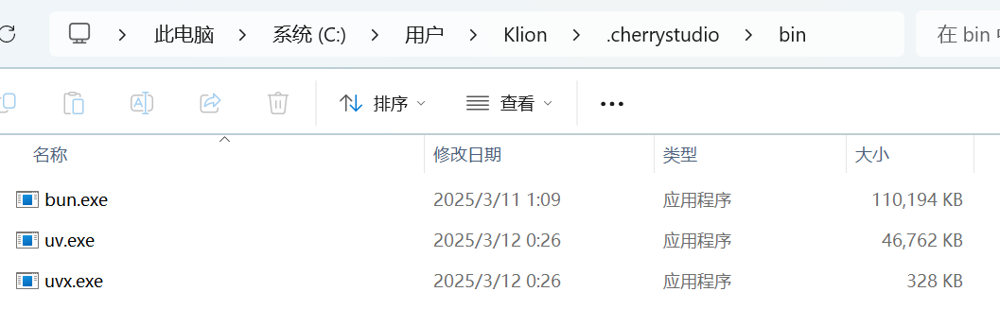


Dokumen ini diterjemahkan dari bahasa Mandarin oleh AI dan belum ditinjau.


# Instalasi Lingkungan MCP

**MCP (Model Context Protocol)** adalah protokol sumber terbuka yang bertujuan menyediakan informasi konteks ke model bahasa besar (LLM) secara terstandarisasi. Penjelasan lebih lanjut tentang MCP lihat [#shen-me-shi-mcpmodel-context-protocol](../../question-contact/knowledge.md#shen-me-shi-mcpmodel-context-protocol "mention")

## Menggunakan MCP di Cherry Studio

Berikut contoh penggunaan fitur `fetch` untuk mendemonstrasikan penerapan MCP di Cherry Studio. Detail dapat ditemukan di [dokumentasi](https://github.com/modelcontextprotocol/servers/tree/main/src/fetch).

### **Persiapan: Instal uv dan bun**


Cherry Studio saat ini hanya menggunakan [uv](https://github.com/astral-sh/uv) dan [bun](https://github.com/oven-sh/bun) bawaan, **tidak menggunakan** uv dan bun yang sudah terinstal di sistem.


Di `Settings - MCP Server`, klik tombol `Install` untuk mengunduh dan menginstal otomatis. Karena mengunduh langsung dari GitHub, kecepatan mungkin lambat dan berpotensi gagal. Keberhasilan instalasi ditentukan oleh ada/tidaknya file di folder berikut.

<figure><figcaption></figcaption></figure>

**Direktori instalasi executable:**

Windows: `C:\Users\Username\.cherrystudio\bin`

macOS/Linux: `~/.cherrystudio/bin`

<figure><figcaption>
Direktori bin
</figcaption></figure>

**Jika instalasi gagal:**

Anda dapat membuat symlink dari perintah sistem ke direktori ini (buat direktori manual jika belum ada). Atau unduh manual executable dari:

Bun: [https://github.com/oven-sh/bun/releases](https://github.com/oven-sh/bun/releases)\
UV: [https://github.com/astral-sh/uv/releases](https://github.com/astral-sh/uv/releases)