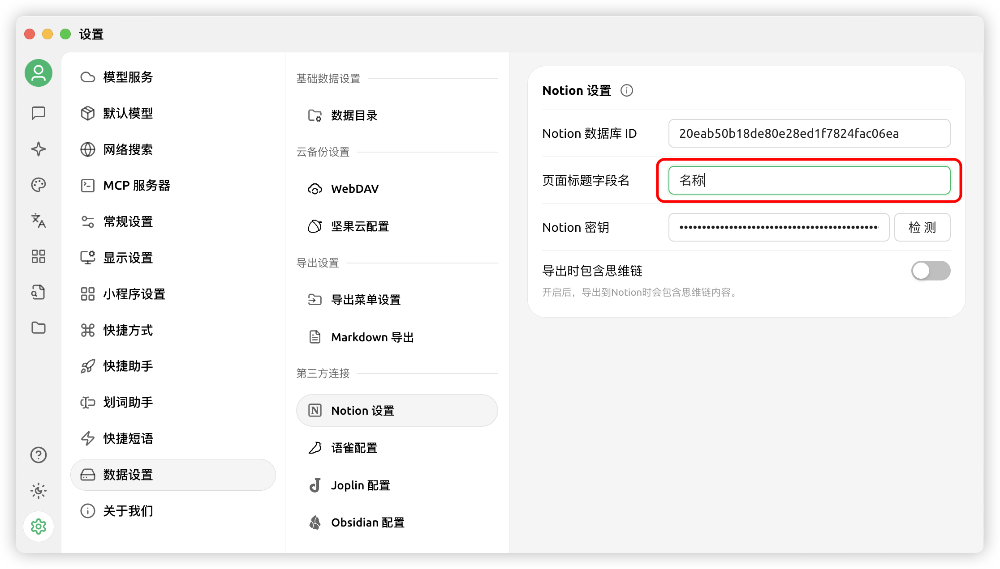
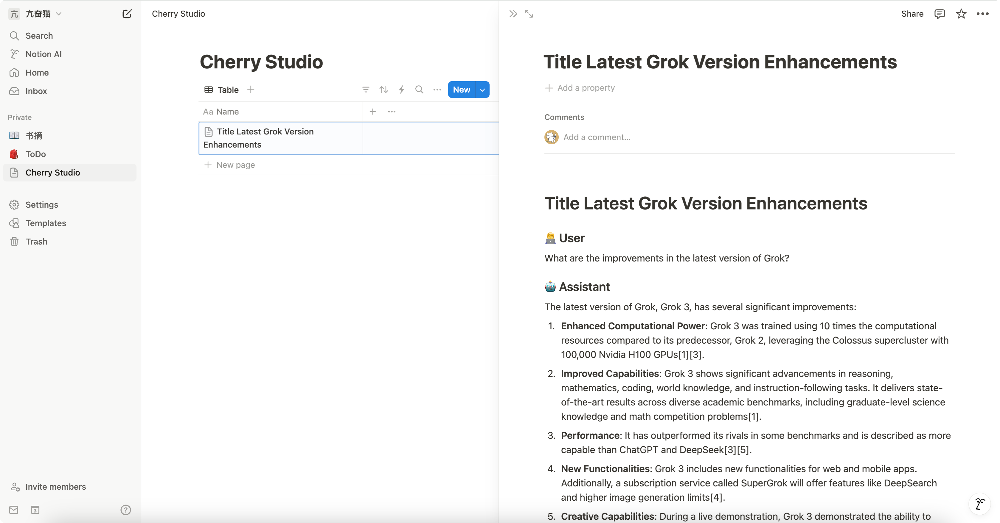


Dokumen ini diterjemahkan dari bahasa Mandarin oleh AI dan belum ditinjau.


# Tutorial Konfigurasi Notion

Cherry Studio mendukung pengimporan topik ke dalam basis data Notion.

## Langkah Pertama

Buka situs web [Notion Integrations](https://www.notion.so/profile/integrations) dan buat aplikasi

<figure><figcaption>
Klik ikon plus untuk membuat aplikasi
</figcaption></figure>

## Langkah Kedua

Buat sebuah aplikasi

<figure><figcaption>
Isi informasi aplikasi
</figcaption></figure>

Nama: Cherry Studio

Tipe: Pilih yang pertama

Ikon: Anda bisa menyimpan gambar ini

<figure><figcaption></figcaption></figure>

## Langkah Ketiga

Salin secret key dan tempelkan di pengaturan Cherry Studio

<figure><figcaption>
Klik untuk menyalin secret key
</figcaption></figure>

<figure><figcaption>
Tempelkan secret key di bagian pengaturan data
</figcaption></figure>

## Langkah Keempat

Buka situs web [Notion](https://www.notion.so/) dan buat halaman baru, pilih tipe basis data di bagian bawah, isi nama Cherry Studio, lalu hubungkan sesuai ilustrasi

<figure><figcaption>
Buat halaman baru dan pilih tipe basis data
</figcaption></figure>

<figure><figcaption>
Isi nama halaman dan pilih Connect to APP
</figcaption></figure>

## Langkah Kelima

<figure><figcaption>
Salin database ID
</figcaption></figure>

Jika URL basis data Notion Anda seperti ini:

https://www.notion.so/\<long\_hash\_1>?v=\<long\_hash\_2>

Maka database ID Notion adalah bagian `<long_hash_1>`

<figure><figcaption>
Isi database ID dan klik periksa
</figcaption></figure>

## Langkah Keenam

Isi `页面标题字段名` (Nama Kolom Judul Halaman):

Jika antarmuka web Anda berbahasa Inggris, isi dengan `Name`
Jika antarmuka web Anda berbahasa Tionghoa, isi dengan `名称`

<figure><figcaption>
Isi nama kolom judul halaman
</figcaption></figure>

## Langkah Ketujuh

Selamat! Konfigurasi Notion Anda telah selesai ✅ Sekarang Anda bisa mengekspor konten Cherry Studio ke basis data Notion Anda

<figure><figcaption>
Ekspor ke Notion
</figcaption></figure>

<figure><figcaption>
Lihat hasil ekspor
</figcaption></figure>