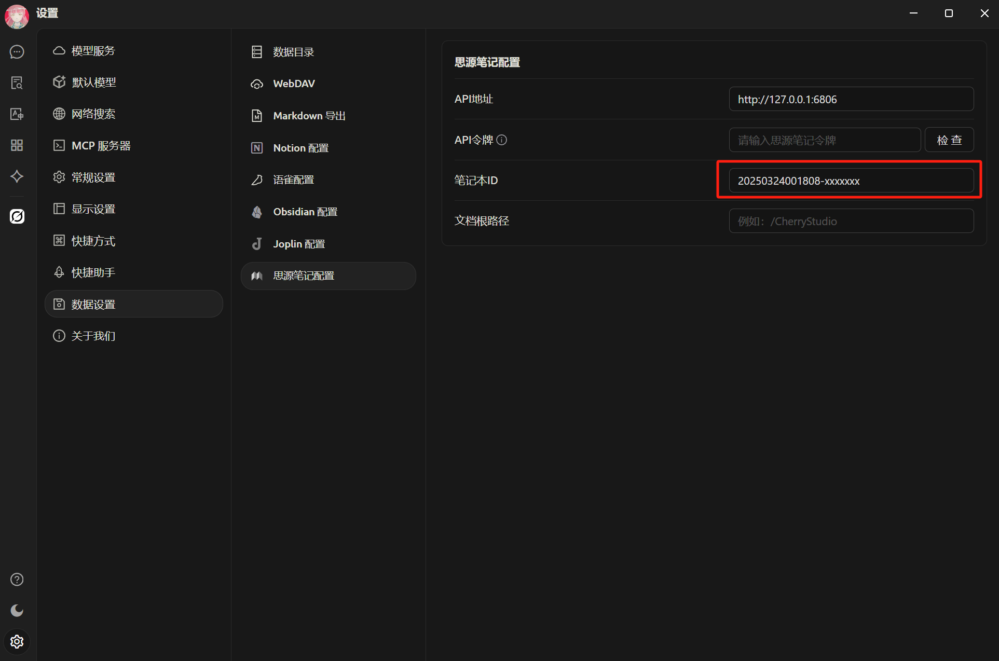


Dokumen ini diterjemahkan dari bahasa Mandarin oleh AI dan belum ditinjau.


# Tutorial Konfigurasi Catatan Siyuan

Mendukung ekspor topik dan pesan ke Catatan Siyuan.

## Langkah Pertama

Buka Catatan Siyuan, buat sebuah buku catatan baru

<figure><figcaption>
Klik buat buku catatan baru
</figcaption></figure>

## Langkah Kedua

Buka buku catatan, akses pengaturan, dan salin `ID Buku Catatan`

<figure><figcaption>
Buka pengaturan buku catatan
</figcaption></figure>

<figure><figcaption>
Klik tombol salin ID buku catatan
</figcaption></figure>

## Langkah Ketiga

Salin ID buku catatan dan isi di pengaturan Cherry Studio

<figure><figcaption>
Isi ID buku catatan di pengaturan data
</figcaption></figure>

## Langkah Keempat

Isi alamat Catatan Siyuan

* **Lokal**\
  Biasanya `http://127.0.0.1:6806`
* **Self-hosted**\
  Gunakan domain Anda `http://note.domain.com`

<figure><figcaption>
Masukkan alamat Catatan Siyuan Anda
</figcaption></figure>

## Langkah Kelima

Salin `Token API` Catatan Siyuan

<figure><figcaption>
Salin token Catatan Siyuan
</figcaption></figure>

Isi di pengaturan Cherry Studio dan verifikasi

<figure><figcaption>
Isi ID basis data dan klik verifikasi
</figcaption></figure>

## Langkah Keenam

Selamat! Konfigurasi Catatan Siyuan telah selesai ✅ Sekarang Anda bisa mengekspor konten Cherry Studio ke Catatan Siyuan Anda

<figure><figcaption>
Ekspor ke Catatan Siyuan
</figcaption></figure>

<figure><figcaption>
Lihat hasil ekspor
</figcaption></figure>