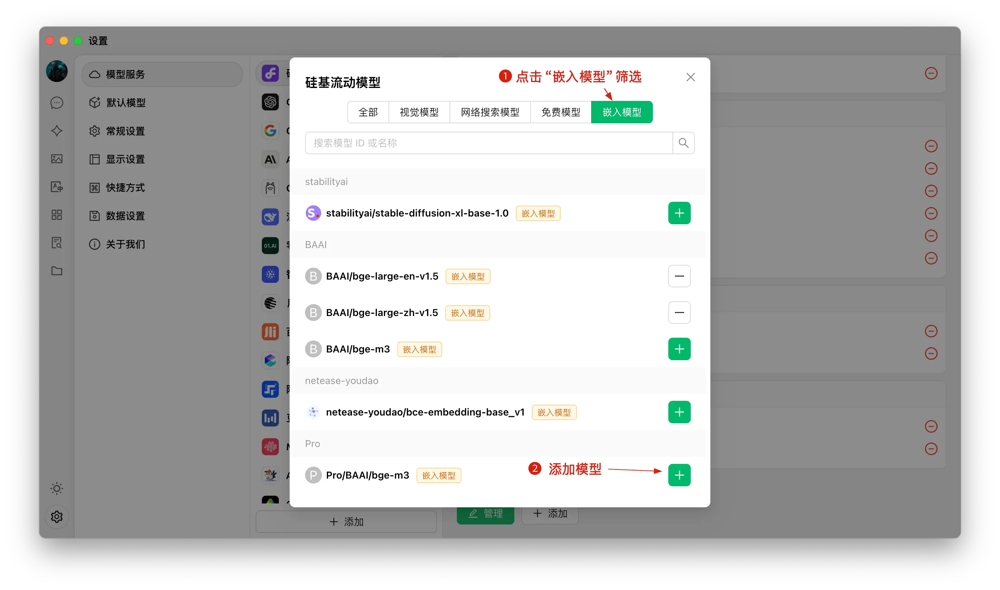


Dokumen ini diterjemahkan dari bahasa Mandarin oleh AI dan belum ditinjau.


# Tutorial Basis Pengetahuan

Dalam versi 0.9.1, CherryStudio menghadirkan fitur basis pengetahuan yang telah lama ditunggu-tunggu.

Berikut kami sajikan petunjuk penggunaan CherryStudio secara detail langkah demi langkah.

## Menambahkan Model Embedding

1. Cari model di layanan manajemen model, Anda dapat mengklik "Model Embedding" untuk penyaringan cepat;
2. Temukan model yang diperlukan, lalu tambahkan ke model saya.

<figure><figcaption></figcaption></figure>

## Membuat Basis Pengetahuan

1. Pintu masuk basis pengetahuan: Di panel alat kiri CherryStudio, klik ikon basis pengetahuan untuk masuk ke halaman manajemen;
2. Tambahkan basis pengetahuan: Klik tambah dan mulai membuat basis pengetahuan;
3. Penamaan: Masukkan nama basis pengetahuan dan tambahkan model embedding, contohnya bge-m3, lalu selesaikan pembuatan.

<figure><figcaption></figcaption></figure>

<figure><figcaption></figcaption></figure>

## Menambahkan File dan Melakukan Vektorisasi

1. Tambahkan file: Klik tombol tambah file untuk membuka pemilihan file;
2. Pilih file: Pilih format file yang didukung seperti pdf, docx, pptx, xlsx, txt, md, mdx, lalu buka;
3. Vektorisasi: Sistem akan melakukan proses vektorisasi secara otomatis. Saat muncul tanda selesai (✓ hijau), artinya vektorisasi telah selesai.

<figure><figcaption></figcaption></figure>

<figure><figcaption></figcaption></figure>

<figure><figcaption></figcaption></figure>

## Menambahkan Data dari Berbagai Sumber

CherryStudio mendukung berbagai cara penambahan data:

1. Direktori folder: Dapat menambahkan seluruh direktori folder, file format yang didukung di dalamnya akan di-vektorisasi secara otomatis;
2. Tautan URL: Mendukung url seperti [https://docs.siliconflow.cn/introduction](https://docs.siliconflow.cn/introduction);
3. Peta situs: Mendukung peta situs format xml seperti [https://docs.siliconflow.cn/sitemap.xml](https://docs.siliconflow.cn/sitemap.xml);
4. Catatan teks biasa: Mendukung input konten kustom berbentuk teks biasa.


Tips:

1. Ilustrasi dalam dokumen yang diimpor ke basis pengetahuan saat ini tidak mendukung konversi ke vektor, harus dikonversi ke teks secara manual;
2. Penggunaan URL sebagai sumber basis pengetahuan tidak selalu berhasil. Beberapa situs memiliki mekanisme anti-crawling yang ketat (atau memerlukan login, otorisasi, dll.), sehingga metode ini mungkin tidak mendapatkan konten yang akurat. Disarankan untuk melakukan pencarian uji setelah membuatnya.
3. Situs web umumnya menyediakan sitemap, seperti [sitemap CherryStudio](https://docs.cherry-ai.com/sitemap-pages.xml). Biasanya, informasi terkait dapat diperoleh dengan menambahkan /sitemap.xml di akhir alamat situs (URL), misalnya `aaa.com/sitemap.xml`.
4. Jika situs tidak menyediakan sitemap atau URL-nya rumit, Anda dapat membuat file xml sitemap sendiri. File sementara harus menggunakan tautan langsung yang dapat diakses publik, tautan file lokal tidak akan dikenali.

> 1) Meminta AI untuk membuat file sitemap atau membuat alat generator HTML sitemap;
> 2) Tautan langsung dapat menggunakan OSS direct link atau tautan cloud storage. Jika tidak ada alat yang tersedia, kunjungi situs web [ocoolAI](https://one.ocoolai.com/login), lalu gunakan alat unggah file gratis di bilah atas situs setelah login untuk membuat tautan langsung.


## Mencari Basis Pengetahuan

Setelah vektorisasi file dan materi selesai, Anda dapat melakukan kueri:

1. Klik tombol cari basis pengetahuan di bagian bawah halaman;
2. Masukkan konten yang ingin dicari;
3. Hasil pencarian akan ditampilkan;
4. Skor kecocokan hasil tersebut akan ditampilkan.

<figure><figcaption></figcaption></figure>

<figure><figcaption></figcaption></figure>

## Membuat Tanggapan dengan Referensi Basis Pengetahuan dalam Percakapan

1. Buat topik baru, di bilah alat percakapan, klik basis pengetahuan, daftar basis pengetahuan yang telah dibuat akan muncul, pilih basis pengetahuan yang perlu direferensikan;
2. Masukkan dan kirim pertanyaan, model akan mengembalikan jawaban yang dihasilkan dari hasil pencarian;
3. Sumber data referensi akan terlampir di bawah jawaban, memungkinkan peninjauan cepat dokumen asli.

<figure><figcaption></figcaption></figure>

<figure><figcaption></figcaption></figure>