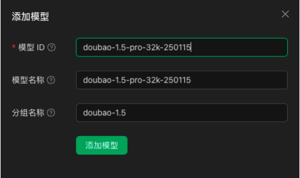


Dokumen ini diterjemahkan dari bahasa Mandarin oleh AI dan belum ditinjau.


# ByteDance (Doubao)

*   Masuk ke [Mesin Vulkanik](https://console.volcengine.com/)
*   Klik langsung [di sini](https://console.volcengine.com/ark/region:ark+cn-beijing/openManagement?LLM=%7B%7D)

<figure><figcaption></figcaption></figure>

### Mendapatkan Kunci API

*   Klik [Manajemen Kunci API](https://console.volcengine.com/ark/region:ark+cn-beijing/apiKey) di bilah samping bawah
*   Buat Kunci API

<figure><figcaption></figcaption></figure>

*   Setelah berhasil dibuat, klik ikon mata di sebelah Kunci API untuk menampilkan dan menyalin

<figure><figcaption></figcaption></figure>

*   Tempelkan Kunci API yang disalin ke CherryStudio, lalu nyalakan sakelar penyedia layanan

<figure><figcaption></figcaption></figure>

### Mengaktifkan dan Menambahkan Model

*   Di [Manajemen Aktivasi](https://console.volcengine.com/ark/region:ark+cn-beijing/openManagement?LLM=%7B%7D\&OpenTokenDrawer=false) (bagian bawah bilah samping Konsol Ark), aktifkan model yang dibutuhkan seperti seri Doubao dan DeepSeek sesuai kebutuhan

<figure><figcaption></figcaption></figure>

*   Di [Dokumen Daftar Model](https://www.volcengine.com/docs/82379/1330310#%E6%96%87%E6%9C%AC%E7%94%9F%E6%88%90), temukan ID Model yang sesuai dengan model yang Anda butuhkan

<figure><figcaption></figcaption></figure>

*   Buka pengaturan [Layanan Model](../../cherrystudio/preview/settings/providers.md) Cherry Studio, temukan Mesin Vulkanik
*   Klik "Tambah", lalu tempelkan ID Model ke kolom teks ID Model

<figure><figcaption></figcaption></figure>

*   Tambahkan model satu per satu mengikuti alur ini

### Alamat API

Ada dua cara penulisan alamat API:
*   Versi default klien: `https://ark.cn-beijing.volces.com/api/v3/`
*   Alternatif: `https://ark.cn-beijing.volces.com/api/v3/chat/completions#`


Kedua format memiliki fungsi yang sama. Biarkan menggunakan default tanpa modifikasi.

Untuk perbedaan akhiran `/` dan `#`, lihat bagian **Alamat API** di pengaturan penyedia layanan: [Kunjungi Dokumen](../../cherrystudio/preview/settings/providers.md#api-di-zhi)


<figure><figcaption>
Contoh cURL dalam Dokumen Resmi
</figcaption></figure>