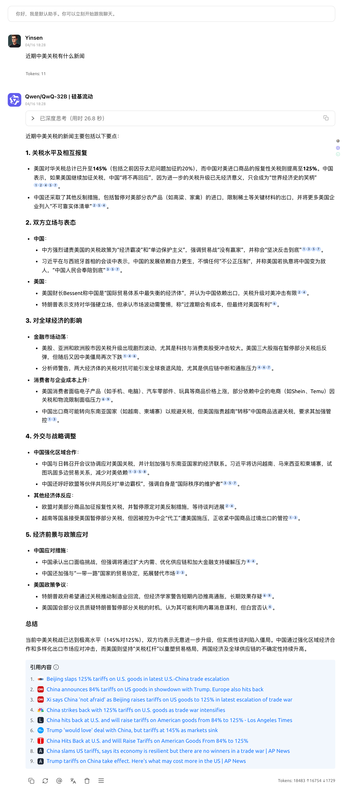


Dokumen ini diterjemahkan dari bahasa Mandarin oleh AI dan belum ditinjau.


# Mode Online Gratis

Cherry Studio dilengkapi dengan kemampuan pencarian web yang kuat, memungkinkan Anda untuk memperoleh informasi internet terkini secara real-time selama percakapan. Berikut langkah-langkah untuk mengaktifkan dan menggunakan fitur ini:

***

### Langkah-langkah Aktivasi

1. **Buka Menu Pengaturan**
   * Luncurkan aplikasi Cherry Studio.
   *   Di antarmuka utama, temukan dan ketuk ikon **Pengaturan (Settings)** atau opsi menu; terletak di sudut kiri bawah.\

       <figure><figcaption></figcaption></figure>
2. **Akses Konfigurasi Pencarian Web**
   *   Pada menu pengaturan, temukan dan pilih setelan **Pencarian Web**.\

       <figure><figcaption></figcaption></figure>
3. **Pilih Mesin Pencari Anda**
   * Di halaman setelan "Pencarian Web", temukan opsi **Penyedia Layanan Pencarian**.
   * Ketuk opsi ini, lalu pilih mesin pencari yang diinginkan dari daftar:
     * **Bing**: Mesin pencari dari Microsoft, umumnya dapat diakses secara global.
     * **Baidu**: Mesin pencari populer di Tiongkok Daratan dengan cakupan konten luas.
     * **Google**: Mesin pencari terkemuka global dengan informasi internasional luas.
   *   **⚠️ Catatan Penting**: Jika memilih **Google**, pastikan koneksi internet Anda dapat **mengakses layanan Google dengan lancar**. Jika mengalami masalah koneksi, coba beralih ke penyedia lain atau periksa setelan proxy Anda.\

       <figure><figcaption></figcaption></figure>
4. **Aktifkan Mode Pengayaan Pencarian**
   * Temukan opsi **Mode Pengayaan Pencarian**.
   *    Pastikan sakelar (Toggle) atau kotak centang (Checkbox) dalam posisi **Diaktifkan**. Mode ini mengoptimalkan kueri pencarian untuk hasil yang lebih relevan dan mendalam.\

       <figure><figcaption></figcaption></figure>
5. **Aktifkan Pencarian Web di Antarmuka Percakapan**
   * Setelah konfigurasi, kembali ke **antarmuka percakapan** utama.
   * Pada **bilah alat kotak input** pesan Anda.
   * Temukan ikon **Pencarian Web** 🌐 di bilah alat.
   *   **Ketuk ikon** ini untuk mengaktifkan fitur. Ikon akan **menyala terang** saat aktif, menandakan pesan akan memicu pencarian web.\

       <figure><figcaption></figcaption></figure>
6. **Mulai Mencari!**
   * Pastikan ikon pencarian web **aktif**, lalu ketik **kata kunci, pertanyaan, atau instruksi** di kotak input.
   *   Kirim pesan seperti biasa. Cherry Studio akan otomatis mencari menggunakan mesin pencari pilihan Anda dan mengintegrasikan hasilnya ke dalam balasan.\

       <figure><figcaption></figcaption></figure>

***

### ✨ Catatan Penting dan Tips

* **Jumlah Hasil Pencarian**:
  * Secara bawaan, Cherry Studio biasanya menampilkan ringkasan **6 hasil** pencarian sebagai keseimbangan kecepatan dan informasi.
  *   Jika tersedia opsi, Anda bisa **menambah jumlah hasil**. Ini memberi informasi web lebih kaya dan komprehensif.\

      <figure><figcaption></figcaption></figure>
* **Kinerja dan Batasan**:
  * Meminta lebih banyak hasil akan **meningkatkan waktu pemrosesan** sehingga **memperlambat respons**.
  * Konten web berlebihan mungkin **melebihi batas konteks model**, berpotensi menyebabkan **kehilangan informasi, respons tidak lengkap, atau error**.
* **Saran**:
  * Untuk pemula, pertahankan setelan bawaan.
  * Jika informasi kurang, sesuaikan jumlah hasil sesuai kebutuhan dan toleransi waktu tunggu (jika bisa dikonfigurasi).
  * Jika tak butuh informasi real-time, **ketuk lagi ikon pencarian web** untuk **menonaktifkannya**, menghindari pencarian tidak perlu dan penundaan.

***

Anda sekarang menguasai cara menggunakan pencarian web di Cherry Studio. Manfaatkan fitur ini untuk mendapatkan berita terbaru, memverifikasi informasi, atau mengeksplorasi hal-hal baru!