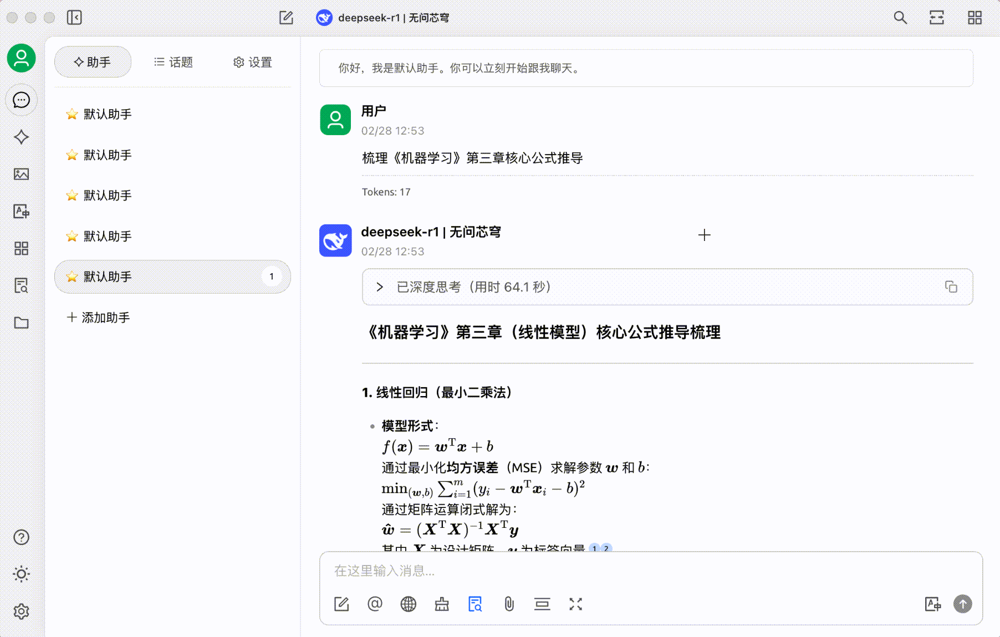


Questo documento è stato tradotto dal cinese tramite IA e non è ancora stato revisionato.


# InfinityAI

Hai mai sperimentato questo? Hai 26 articoli utili salvati su WeChat che non hai più aperto, file sparsi in più di 10 cartelle "Materiali di studio" sul tuo computer, e cerchi disperatamente una teoria letta sei mesi fa ricordando solo poche parole chiave. Quando la quantità giornaliera di informazioni supera la capacità elaborativa del cervello, il 90% delle conoscenze preziose viene dimenticato entro 72 ore.\
Ora, utilizzando le API della piattaforma InfinityAI + Cherry Studio per creare una tua base di conoscenza personale, puoi trasformare gli articoli WeChat dimenticati e i contenuti frammentati dei corsi in conoscenze strutturate, consentendo un recupero preciso delle informazioni.

### 1. Creazione della base di conoscenza personale

#### 1. Servizio API InfinityAI: il "centro pensante" della base di conoscenza, affidabile e stabile

Come "centro pensante" della tua base di conoscenza, la piattaforma InfinityAI offre versioni complete di modelli come DeepSeek R1 con servizi API stabili. **Attualmente, dopo la registrazione, l'uso è gratuito senza restrizioni.** Supporta modelli di embedding mainstream come bge e jina per costruire la base di conoscenza. **La piattaforma aggiorna costantemente servizi basati sugli ultimi e più potenti modelli open-source**, includendo contenuti multimodali come immagini, video e audio.

<figure><figcaption></figcaption></figure>

#### 2. Cherry Studio: crea la base di conoscenza senza codice

Cherry Studio è uno strumento AI intuitivo. Rispetto ai tradizionali sviluppi RAG che richiedono 1-2 mesi di implementazione, il vantaggio di questo strumento è il supporto per **operazioni senza codice**. Puoi importare con un clic documenti in formati come Markdown/PDF/pagine web, analizzare file da 40MB in 1 minuto, e aggiungere cartelle locali dal tuo computer, articoli dai preferiti WeChat o appunti di corsi.

### 2. 3 passi per creare il tuo assistente conoscitivo personalizzato

#### Step 1: Preparazione di base

1. Visita il sito ufficiale di Cherry Studio e scarica la versione compatibile (https://cherry-ai.com/)
2. Registra un account: accedi alla piattaforma InfinityAI (https://cloud.infini-ai.com/genstudio/model?cherrystudio)

<figure><figcaption></figcaption></figure>

* Ottieni la chiave API: nella sezione "Model Hub" scegli deepseek-r1, clicca su crea per ottenere l'APIKEY e copia il nome del modello

<figure><figcaption></figcaption></figure>

#### Step 2: Apri le impostazioni di CherryStudio, seleziona InfinityAI nei servizi modello, inserisci la chiave API e attiva il servizio

<figure><figcaption></figcaption></figure>

Completati questi passaggi, durante l'interazione basterà selezionare il modello desiderato per utilizzare i servizi API di InfinityAI in CherryStudio.\
Per comodità, puoi impostare anche il "modello predefinito".

<figure><figcaption></figcaption></figure>

#### Step 3: Aggiungi la base di conoscenza

Seleziona uno qualsiasi dei modelli di embedding bge o jina dalla piattaforma InfinityAI

<figure><figcaption></figcaption></figure>

<figure><figcaption></figcaption></figure>

### 3. Test reale con un caso d'uso utente

* Dopo aver importato materiali di studio, inserisci: "Organizza le derivazioni delle formule principali del Capitolo 3 di 'Machine Learning'"

<figure><figcaption></figcaption></figure>

**Risultato generato allegato**

<figure><figcaption></figcaption></figure>