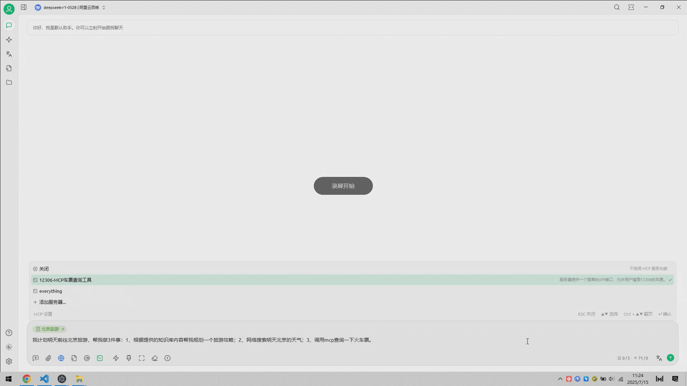

# プロジェクト概要


このドキュメントはAIによって中国語から翻訳されており、まだレビューされていません。


<figure><figcaption></figcaption></figure>

私たちのソーシャルアカウントをフォローしてください：[Twitter(X)](https://x.com/CherryStudioHQ)、[小红书](https://www.xiaohongshu.com/user/profile/662b6853000000000b031d9a)、[微博](https://weibo.com/u/7975656228)、[哔哩哔哩](https://space.bilibili.com/3546657515898892)、[抖音](https://www.douyin.com/user/MS4wLjABAAAAmw9A54m5J0hHVMQY5eGrVJ-EHDoOS0hgJ6M1F9MN2Tn2V163A0xrC4_KVzfmQSxC)

コミュニティに参加する：[QQグループ(575014769)](https://qm.qq.com/q/lo0D4qVZKi)、[Telegram](https://t.me/CherryStudioAI)、[Discord](https://discord.gg/wez8HtpxqQ)、[微信群（クリックして表示）](https://www.cherry-ai.com/#Community)

***

Cherry Studioは、マルチモデル対話、ナレッジベース管理、AI絵画、翻訳などの機能を統合したオールインワンAIアシスタントプラットフォームです。\
高度なカスタマイズ設計、強力な拡張性、ユーザーフレンドリーな体験により、プロフェッショナルユーザーやAI愛好家に最適な選択肢となっています。初心者から開発者まで、あらゆるユーザーが自身のニーズに合わせたAI機能を見つけ、作業効率と創造性を向上させることができます。

<figure><figcaption></figcaption></figure>

<figure><figcaption></figcaption></figure>

***

### **コア機能と特徴**

#### **1. 基本対話機能**

* **一問多答**: 同一質問に対して複数モデルが同時に回答生成し、モデル比較を容易にします（詳細は[対話インターフェース](cherrystudio/preview/chat.md)参照）。
* **自動グループ化**: 各アシスタントの対話履歴を自動的にグループ管理。
* **対話エクスポート**: 完全または部分的な対話をMarkdown、Wordなど複数形式でエクスポート可能。
* **高度なパラメータカスタマイズ**: 基本パラメータ調整に加え、カスタムパラメータ入力が可能。
* **アシスタントマーケット**: 翻訳、プログラミング、執筆など業界特化型アシスタントを多数内蔵、カスタムアシスタントも作成可能。
* **多形式レンダリング**: Markdownレンダリング、数式レンダリング、HTMLリアルタイムプレビューなどをサポート。

#### **2. 多彩な機能統合**

* **AI絵画**: 自然言語記述による高品質画像生成パネルを提供。
* **AIミニアプリ**: Web版AIツールを直接利用可能、ブラウザ切り替え不要。
* **翻訳機能**: 専用翻訳パネル、対話翻訳、プロンプト翻訳など多様な翻訳シーンを対応。
* **ファイル管理**: 対話、絵画、ナレッジベースのファイルを統一管理。
* **グローバル検索**: 履歴とナレッジベースの高速検索を実現。

#### **3. マルチサービスプロバイダ統合管理**

* **サービスプロバイダ統合**: OpenAI、Gemini、Anthropic、Azureなど主要モデルの一元呼び出し。
* **モデル自動取得**: ワンクリックで完全なモデルリストを取得。
* **マルチキーーローーテーション**: 複数APIキーのローテーション使用でレート制限回避。
* **正確なアバター設定**: 各モデルに専用アイコンを自動マッチング。
* **カスタムプロバイダ**: OpenAI、Gemini、Anthropicなど互換規格のサードパーティプロバイダをサポート。

#### **4. 高度なUIカスタマイズ**

* **カスタムCSS**: グローバルスタイルのカスタマイズ対応。
* **対話レイアウト**: リスト/バブルレイアウト選択可能、メッセージスタイルもカスタマイズ可（コードスニペットスタイルなど）。
* **カスタムアバター**: ソフトウェア/アシスタントごとのアイコン設定。
* **サイドバーメニュー**: 機能の表示/非表示や順序変更が可能。

#### **5. ローカルナレッジベースシステム**

* **多様なフォーマット**: PDF、DOCX、PPTX、XLSX、TXT、MDなど幅広いファイル形式をサポート。
* **多彩なデータソース**: ローカルファイル、URL、サイトマップ、手動入力コンコンテンンツがソース可能。
* **ナレッジベースエクスポート**: 処理済みナレッジベースの共有機能。
* **検証機能**: インインポート後、リアルタイムで処理結果やセグメント効果を確認可能。

#### **6. 特化機能**

* **クイックQ&A**: 任意の場面（WeChat、ブラウザ等）から高速回答取得。
* **クイック翻訳**: 他アプリケーションのテキストを即時翻訳。
* **要約機能**: 長文コンコンテンンツを瞬時に要約。
* **説明機能**: 複雑なプロンプト不要で問題を説明。

#### **7. データ保証**

* **多様なバックアップ**: ローカルバックアップ、WebDAVバックアップ、定期バックアップをサポート。
* **データセキュリティ**: ローカル環境での完全利用が可能、ローカルLLM連携で情報漏洩リスクを回避。

***

### **プロジェクトの強み**

1. **初心者フレンドリー**: 技術的ハードルを低減し、初心者でも即戦力化。
2. **充実したドキュメント**: 詳細なマニュアルとFAQを提供。
3. **継続的イテレーション**: ユーザーフィードバックに基づく機能改善。
4. **オープンソース＆拡張性**: ソースコードカスタマイズによる個別ニーズ対応。

***

### **適用シーン**

* **ナレッジ管理＆検索**: ローカルナレッジベースで研究/教育向け知識体系を構築。
* **マルチモデル対話＆創作**: 複数モデル同時対話による情報収集/コンテンツ生成。
* **翻訳＆業務自動化**: 多言語コミュニケーションや文書処理を支援。
* **AI絵画＆デザイン**: 自然言語記述による画像生成でクリエイティブワークを支援。

### Star History

## ソーシャルアカウントをフォロー

<table data-view="cards"><thead><tr><th></th><th data-hidden data-card-cover data-type="files"></th><th data-hidden data-card-target data-type="content-ref"></th></tr></thead><tbody><tr><td><a href="https://www.xiaohongshu.com/user/profile/662b6853000000000b031d9a?xsec_token=YB_1nKvlH4r5hPYVVbbsNHF8Y6n6AKlm5-DaggPCtd2DQ%3D&#x26;xsec_source=app_share&#x26;xhsshare=CopyLink&#x26;appuid=662b6853000000000b031d9a&#x26;apptime=1738627324&#x26;share_id=ace5db41b5954fab8d98a2a7865a62bc&#x26;share_channel=copy_link">小红书</a></td><td><a href=".gitbook/assets/1.png">1.png</a></td><td><a href="https://www.xiaohongshu.com/user/profile/662b6853000000000b031d9a?xsec_token=YB_1nKvlH4r5hPYVVbbsNHF8Y6n6AKlm5-DaggPCtd2DQ%3D&#x26;xsec_source=app_share&#x26;xhsshare=CopyLink&#x26;appuid=662b6853000000000b031d9a&#x26;apptime=1738627324&#x26;share_id=ace5db41b5954fab8d98a2a7865a62bc&#x26;share_channel=copy_link">https://www.xiaohongshu.com/user/profile/662b6853000000000b031d9a?xsec_token=YB_1nKvlH4r5hPYVVbbsNHF8Y6n6AKlm5-DaggPCtd2DQ%3D&#x26;xsec_source=app_share&#x26;xhsshare=CopyLink&#x26;appuid=662b6853000000000b031d9a&#x26;apptime=1738627324&#x26;share_id=ace5db41b5954fab8d98a2a7865a62bc&#x26;share_channel=copy_link</a></td></tr><tr><td><a href="https://b23.tv/hIfGgDW">哔哩哔哩</a></td><td><a href=".gitbook/assets/3.png">3.png</a></td><td><a href="https://b23.tv/hIfGgDW">https://b23.tv/hIfGgDW</a></td></tr><tr><td><a href="https://weibo.com/u/7975656228">微博</a></td><td><a href=".gitbook/assets/2.png">2.png</a></td><td><a href="https://weibo.com/u/7975656228">https://weibo.com/u/7975656228</a></td></tr><tr><td><a href="https://v.douyin.com/ifTpX4X7">抖音</a></td><td><a href=".gitbook/assets/4.png">4.png</a></td><td><a href="https://v.douyin.com/ifTpX4X7">https://v.douyin.com/ifTpX4X7</a></td></tr><tr><td><a href="https://x.com/CherryStudioHQ?t=DYR0ulaLur-bO4Us3bG79A&#x26;s=05">Twitter(X)</a></td><td><a href=".gitbook/assets/5.png">5.png</a></td><td><a href="https://x.com/CherryStudioHQ?t=DYR0ulaLur-bO4Us3bG79A&#x26;s=05">https://x.com/CherryStudioHQ?t=DYR0ulaLur-bO4Us3bG79A&#x26;s=05</a></td></tr></tbody></table>