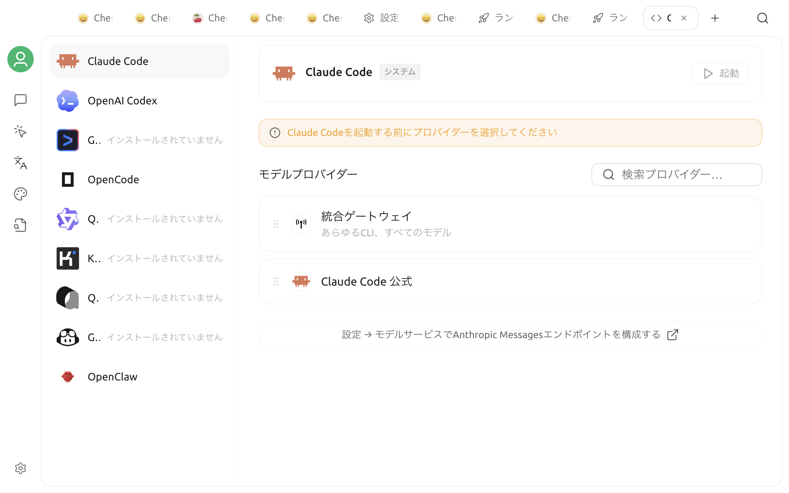
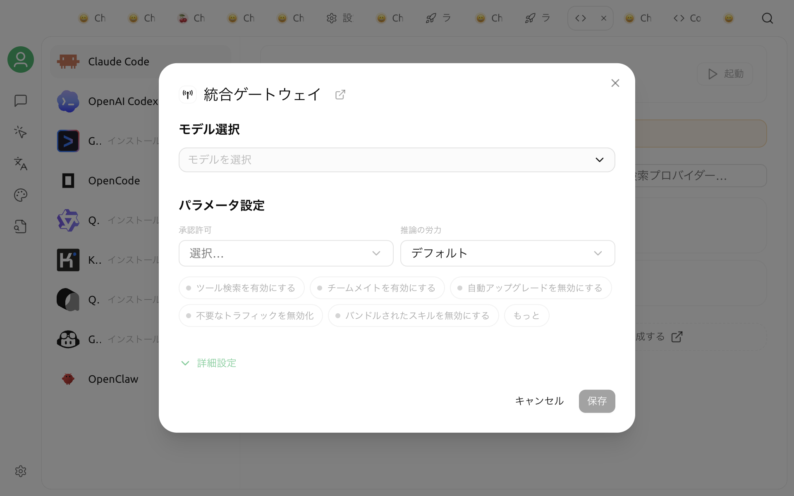

# コードツール

コードツールでは、Cherry Studio から AI コーディング CLI を設定して起動できます。設定済みのモデルサービスを再利用し、プロジェクトのディレクトリとターミナルを指定して、独立したターミナルウィンドウで CLI を使用できます。

## 使用前の準備

* コードツールを使用するには **Bun** が必要です。未インストールと表示された場合は、案内にある **Bun をインストール** をクリックしてください。
* Kimi CLI を使用する場合は **uv** も必要です。**設定 → MCP 設定 → 環境依存関係** からインストールできます。
* GitHub Copilot CLI を除き、使用可能なモデルサービスと API Key をあらかじめ Cherry Studio に設定してください。


AI コーディング CLI は、選択した作業ディレクトリ内のファイルを読み取り、変更し、コマンドを実行できます。作業前に Git などで現在の状態を保存し、無関係な機密ファイルを含むディレクトリは選択しないでください。


## コードツールを開く

1. 上部のタブバー右側にある `+` をクリックして、ランチャーを開きます。
2. **Code** をクリックします。
3. コードツールのページで使用する CLI を選択します。

現在、次の CLI に対応しています。

| CLI | モデルの取得元 |
| :--- | :--- |
| Claude Code | Anthropic 互換モデル |
| Qwen Code | OpenAI 互換モデル |
| Gemini CLI | Gemini 互換モデル |
| OpenAI Codex | OpenAI または OpenAI Responses 互換モデル |
| iFlow CLI | OpenAI 互換モデル |
| GitHub Copilot CLI | モデル選択は表示されません。GitHub Copilot 独自の認証とモデル機能を使用します |
| Kimi CLI | OpenAI 互換モデル |
| OpenCode | OpenAI、OpenAI Responses、または Anthropic 互換モデル |

モデル一覧は、選択した CLI のインターフェース種別に応じて自動的に絞り込まれます。目的のモデルが表示されない場合は、プロバイダーが有効か、モデルが追加済みか、インターフェース種別が対応しているかを確認してください。

## 設定して起動する

CLI のカードを選択したら、設定ウィンドウで次の項目を指定します。

1. **モデル**：CLI で使用するモデルを選択します。GitHub Copilot CLI にはこの項目はありません。
2. **作業ディレクトリ**：CLI の起動先となるプロジェクトディレクトリを選択します。最近使用したディレクトリは一覧に残ります。
3. **ターミナル**：macOS または Windows では、検出済みのターミナルを選択します。Windows で WSL、Alacritty、または WezTerm を使用し、実行ファイルを自動検出できない場合は、カスタムの実行ファイルパスを設定してください。
4. **環境変数**：`KEY=value` 形式で、1 行に 1 つ入力します。Cherry Studio はモデルに応じて必要な変数を自動生成します。同じ名前の変数をここに入力すると、自動生成された値を上書きします。
5. **最新バージョンを自動的に更新する**：必要に応じて有効にします。有効にすると、起動前に選択した CLI の更新を確認し、最新版へ更新します。
6. **起動** をクリックします。

CLI がまだインストールされていない場合、Cherry Studio は初回起動時にダウンロードしてインストールし、選択したターミナルと作業ディレクトリで実行します。Kimi CLI のダウンロードと起動は uv が行うため、初回実行時には同様にネットワーク接続が必要です。


GitHub Copilot CLI は Cherry Studio のモデル選択を使用しません。追加の認証情報が必要な場合は、その CLI の要件に従って環境変数欄に設定してください。例：`GITHUB_TOKEN`


## 環境変数と認証情報

カスタム環境変数とは別に、Cherry Studio は選択したモデルサービスから API アドレス、モデル ID、API Key を読み取り、各 CLI が必要とする環境変数または起動引数に変換します。

カスタム変数は、プロキシアドレスや CLI 固有のオプションを設定する場合に使用できます。入力する前に変数名を確認してください。同名のカスタム値が自動生成された値より優先されるため、誤って上書きすると認証や接続に失敗することがあります。


スクリーンショット、ログ、公開の Issue に API Key、GitHub Token、その他の認証情報を含めないでください。コードツールはカスタム環境変数を現在の設定に保存するため、信頼できるデバイスでのみ使用してください。


## トラブルシューティング

### 起動ボタンを押せない

Bun がインストール済みで、作業ディレクトリが選択されていることを確認してください。GitHub Copilot CLI 以外では、モデルの選択も必要です。

### モデル一覧が空

選択した CLI には、対応するインターフェース種別のモデルだけが表示されます。モデルサービス設定に戻り、プロバイダーが有効か、API Key が使用可能か、モデルが追加済みか、モデルの Endpoint 種別が対応しているかを確認してください。

### Kimi CLI で uv が見つからない

**設定 → MCP 設定 → 環境依存関係** から uv をインストールしてください。インストール直後も認識されない場合は、Cherry Studio を再起動してください。

### ターミナルが開かない

システム既定のターミナルに切り替えてください。Windows で別のターミナルを使用する場合は、そのアプリがインストール済みか確認してください。WSL、Alacritty、WezTerm は **カスタムターミナルパスを設定** から実行ファイルを指定することもできます。

初回起動、CLI のインストール、更新確認にはネットワーク接続が必要なため、処理に時間がかかる場合があります。失敗した場合は、ネットワーク、プロキシ、API サービスの設定を確認してから、もう一度起動してください。
