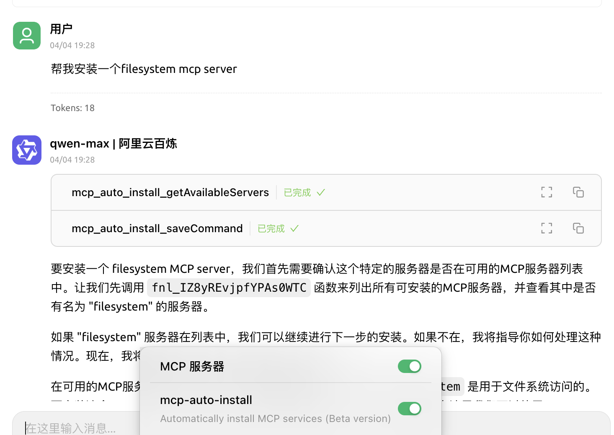


このドキュメントはAIによって中国語から翻訳されており、まだレビューされていません。


# MCPの自動インストール

> MCPの自動インストールには、Cherry Studioをv1.1.18以上にアップグレードする必要があります。

## 機能の概要

手動インストールに加えて、Cherry Studioには`@mcpmarket/mcp-auto-install`ツールが組み込まれており、より便利なMCPサーバーのインストール方法を提供します。MCPサービスをサポートする大規模モデルチャットで対応するコマンドを入力するだけで使用できます。


**テスト段階に関する注意:**

* `@mcpmarket/mcp-auto-install`は現在もテスト段階です
* 効果は大規模モデルの「知能」に依存し、自動的に追加される場合もあれば、**MCP設定で特定のパラメータを手動で変更する必要がある場合もあります**
* 現在の検索ソースは@modelcontextprotocolから行っており、自身で設定可能です（下記説明）


## 使用方法

例えば、以下のように入力できます：

```
帮我安装一个 filesystem mcp server
```

<figure><figcaption><p>MCPサーバーインストールのためのコマンド入力</p></figcaption></figure>

<figure><figcaption><p>MCPサーバー設定画面</p></figcaption></figure>

システムは自動的に要件を認識し、`@mcpmarket/mcp-auto-install`を通じてインストールを完了します。このツールは以下のような複数タイプのMCPサーバーをサポートしています：

* filesystem（ファイルシステム）
* fetch（ネットワークリクエスト）
* sqlite（データベース）
* など...

> MCP_PACKAGE_SCOPES変数でMCPサービス検索ソースをカスタマイズ可能で、デフォルト値は`@modelcontextprotocol`です。

## `@mcpmarket/mcp-auto-install`ライブラリの紹介


**デフォルト設定例:**

```json
// `axun-uUpaWEdMEMU8C61K` はサービスIDで、任意の値にカスタマイズしてください
"axun-uUpaWEdMEMU8C61K": {
  "name": "mcp-auto-install",
  "description": "Automatically install MCP services (Beta version)",
  "isActive": false,
  "registryUrl": "https://registry.npmmirror.com",
  "command": "npx",
  "args": [
    "-y",
    "@mcpmarket/mcp-auto-install",
    "connect",
    "--json"
  ],
  "env": {
    "MCP_REGISTRY_PATH": "詳細はhttps://www.npmjs.com/package/@mcpmarket/mcp-auto-installを参照"
  },
  "disabledTools": []
}
```

`@mcpmarket/mcp-auto-install`はオープンソースのnpmパッケージで、詳細情報と使用方法は[npm公式リポジトリ](https://www.npmjs.com/package/@mcpmarket/mcp-auto-install)で確認できます。`@mcpmarket`はCherry Studio公式のMCPサービスコレクションです。
