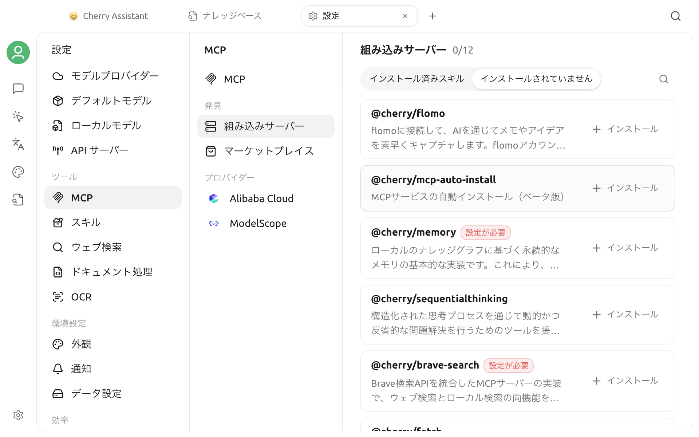

# 内蔵 MCP Server

Cherry Studio には、直接インストールできる内蔵 MCP Server が用意されています。アプリ内で実行されるものや、プリセットされた接続を使用するものがあり、JSON 設定を手動で作成する必要はありません。Web ページの読み取り、ファイル操作、コード実行、記憶、サードパーティサービスなどの機能を、アシスタントや Agent にすばやく追加できます。




「内蔵」であっても、すべてが自動的に有効になるわけではありません。最初に内蔵リストから Server をインストールしてください。**設定が必要** と表示された Server では、引数または環境変数の入力も必要です。


## インストールと使用

1. **設定 → MCP Server** を開きます。
2. **内蔵 Server** エリアで必要な Server を探します。**インストール可能** フィルターに切り替えることもできます。
3. **インストール** をクリックします。
4. Server に **設定が必要** と表示される場合は、インストール済み Server の一覧に戻ってその Server をクリックし、このページの説明に従って引数を入力します。
5. 保存して Server を有効にします。
6. 対象のアシスタントまたは Agent のツール設定で、その MCP Server を追加します。

会話では、ツール呼び出しに対応したモデルも必要です。Server をインストールしただけで現在のアシスタントまたは Agent に追加していない場合、モデルはそのツールを使用できません。

## 現在の内蔵 Server

| Server | 主な用途 | 追加の準備 |
| --- | --- | --- |
| `@cherry/fetch` | URL を HTML、Markdown、プレーンテキスト、JSON で読み取る | 不要 |
| `@cherry/browser` | 動的な Web ページの表示と操作、タブ管理、スクリーンショット | 不要 |
| `@cherry/filesystem` | 指定したディレクトリ内のファイルを検索、読み取り、編集、削除する | アクセスを許可するディレクトリを設定 |
| `@cherry/python` | Pyodide 環境で Python コードを実行する | 不要 |
| `@cherry/brave-search` | Brave Web 検索とローカルスポット検索 | `BRAVE_API_KEY` |
| `@cherry/memory` | ローカルのナレッジグラフで会話をまたぐ記憶を保存する | `MEMORY_FILE_PATH` |
| `@cherry/sequentialthinking` | 複雑なタスク向けに、段階的な思考、修正、分岐のツールを提供する | 不要 |
| `@cherry/dify-knowledge` | Dify ナレッジベースを検索する | API アドレスと `DIFY_KEY` |
| `@cherry/flomo` | メモやアイデアを flomo に書き込む | flomo アカウントの認証 |
| `@cherry/didi-mcp` | スポット検索、料金見積もり、配車注文の操作 | `DIDI_API_KEY`。中国本土のみ対応 |
| `@cherry/nowledge-mem` | ローカルで実行中の Nowledge Mem に接続する | Nowledge Mem をインストールして実行 |
| `@cherry/mcp-auto-install` | モデルに他の MCP Server を検索、インストールさせる | テスト機能。利用可能な NPX または内蔵 Bun が必要 |

## Web とコードのツール

### `@cherry/fetch`

複雑な操作を必要としない Web ページや API の読み取りに適しています。HTML、Markdown、プレーンテキスト、JSON の 4 種類の読み取り方法を提供し、リクエストにカスタム Header を渡すこともできます。

ログイン状態、JavaScript レンダリング、クリック操作が必要なページでは、`@cherry/browser` を使用してください。

### `@cherry/browser`

Cherry Studio が管理する Electron ブラウザーウィンドウで Web ページを操作し、次の機能を利用できます。

- URL を開き、ページスクリプトを実行する。
- ページのスナップショットまたはスクリーンショットを取得する。
- タブを一覧表示、切り替え、閉じる。
- ブラウザーセッションをリセットする。

ブラウザーはページの内容や、存在する場合はログイン状態にもアクセスします。使用前にモデルがアクセスしようとしているサイトを確認し、信頼できないプロンプトに機密アカウントの操作を実行させないでください。

### `@cherry/python`

Pyodide 環境で Python 3.12 コードを実行する `python_execute` ツールを提供します。データ計算、テキスト処理、形式変換に適しており、PEP 723 メタデータで依存関係を宣言することもできます。

各呼び出しのデフォルトのタイムアウトは 60 秒です。これは完全なローカル Python 環境ではないため、ネイティブバイナリ、システムコマンド、特定のハードウェアに依存するコードは実行できない場合があります。

### `@cherry/sequentialthinking`

修正や分岐が可能な段階的思考ツールをモデルに提供します。複雑な計画や分析には適していますが、すべての回答の品質を自動的に高めるものではありません。簡単な質問では通常、有効にする必要はありません。

## ローカルファイルと記憶

### `@cherry/filesystem`

`glob`、`ls`、`grep`、`read`、`edit`、`write`、`delete` ツールを提供します。Server がアクセスするのは、明示的に許可した作業ディレクトリだけにしてください。

インストール後、Server の詳細ページで次のいずれかの方法によりディレクトリを設定します。

- **引数**：1 行目に作業ディレクトリの絶対パスを入力します。
- **環境変数**：`WORKSPACE_ROOT=絶対パス` を入力します。

両方が設定されている場合は、`WORKSPACE_ROOT` が優先されます。`~` はユーザーディレクトリに展開できますが、曖昧さを減らすため、完全な絶対パスの入力を推奨します。


デフォルトでは、`write`、`edit`、`delete` は自動承認されません。許可するディレクトリを広げたり、確認を省くために不慣れな書き込みや削除操作を一括承認したりしないでください。


### `@cherry/memory`

エンティティ、関係、観察結果をローカルの JSON ファイルに保存し、モデルが会話をまたいで読み取り、更新できるようにします。インストール後に次を設定します。

```text
MEMORY_FILE_PATH=/绝对路径/memory.json
```

これは MCP Server 独自のナレッジグラフ記憶であり、Cherry Studio の [グローバルメモリ](../memory.md) とは別の機能です。一般ユーザーはまずグローバルメモリを使用し、エンティティと関係を直接制御する必要がある場合にのみ、この Server を有効にできます。

### `@cherry/nowledge-mem`

ローカルの `http://127.0.0.1:14242/mcp` に接続します。使用前に [Nowledge Mem](https://mem.nowledge.co/) をインストールして実行してください。Cherry Studio 側でリモート URL を入力する必要はありません。

## 検索、ナレッジベース、サードパーティサービス

### `@cherry/brave-search`

Web 検索とローカルスポット検索を提供します。最初に [Brave Search API](https://brave.com/search/api/) からキーを取得し、Server の詳細ページで次を入力します。

```text
BRAVE_API_KEY=你的 API Key
```

### `@cherry/dify-knowledge`

Dify ナレッジベースを一覧表示して検索します。**引数** にナレッジベース API のルートアドレスを入力し、**環境変数** に `DIFY_KEY` を入力する必要があります。詳しい手順は [Dify ナレッジベースに接続する](dify.md) を参照してください。

### `@cherry/flomo`

flomo のリモート MCP アドレスを使ってアカウントに接続します。インストールして有効にした後に認証ページが表示された場合は、案内に従って flomo アカウントを認証してください。flomo のログインパスワードを Cherry Studio の引数や環境変数に貼り付けないでください。

### `@cherry/didi-mcp`

スポット検索、料金見積もり、配車注文の作成またはキャンセル、注文とドライバー位置の確認などのツールを提供します。インストール後に次を入力します。

```text
DIDI_API_KEY=你的 API Key
```

このサービスは中国本土でのみ利用できます。注文の作成とキャンセルは実際の外部操作を発生させるため、**ツール** ページでこれらのツールの自動承認を無効にすることを推奨します。

### `@cherry/mcp-auto-install`

会話内でモデルが他の MCP Server を検索してインストールできるようにします。現在はテスト機能です。このプリセットは NPX で起動します。起動に失敗する場合は、先に MCP 設定で実行に必要な依存関係を確認してインストールしてください。詳しくは [MCP の自動インストール](auto-install.md) を参照してください。

## 権限に関する推奨事項

内蔵 Server では共通の MCP 権限設定を使用します。インストール後は項目ごとに確認してください。

- 現在のタスクに必要な Server とツールだけを有効にする。
- ファイル、ブラウザー、記憶、サードパーティアカウントのツールには、必要な範囲だけを許可する。
- ファイルの書き込み、削除、注文の作成、キャンセルなどの操作では手動確認を維持する。
- 使用しなくなった Server は速やかに無効化またはアンインストールする。
- API Key は Server の設定内にだけ保存し、プロンプト、スクリーンショット、共有記録には含めない。

## よくある質問

### インストール済みだが、会話でツールが見つからない

Server が有効になっており、現在のアシスタントまたは Agent に追加されていることを確認してください。次に、選択したモデルがツール呼び出しに対応しているか確認します。

### 「設定が必要」と表示される

インストール済み Server の一覧で該当する項目をクリックし、**設定** ページで引数または環境変数を入力して保存します。引数と環境変数は、どちらも 1 行に 1 項目ずつ入力します。

### Server の有効化に失敗する

Server 詳細のログを開き、引数不足、無効な API Key、ディレクトリ権限、ローカル依存関係を先に確認してください。詳しい対処方法は [MCP Server のよくある質問](chang-jian-wen-ti.md) を参照してください。

## 関連ドキュメント

- [MCP の設定と使用](config.md)
- [MCP の自動インストール](auto-install.md)
- [MCP Server のよくある質問](chang-jian-wen-ti.md)
- [フィードバックと提案](../../question-contact/suggestions.md)
