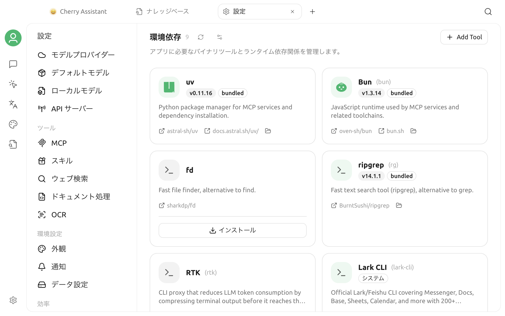

# MCP 環境のインストール

Cherry Studio では、よく使われる次の 2 種類の MCP ランタイムを管理できます。

- **UV**：`uv` または `uvx` で起動する Python MCP サーバーを実行します。
- **Bun**：JavaScript ツールを実行し、システムに NPX がない場合は一部の NPX サーバーの代替ランタイムとして機能します。


すべての MCP サーバーで UV と Bun のインストールが必要なわけではありません。リモートの SSE / Streamable HTTP サーバーと、Cherry Studio の大半の内蔵サーバーは、これら 2 つのランタイムに依存しません。必要な環境は、サーバーのドキュメントに記載された `command` を見て判断してください。




## アプリ内インストーラーを使用する

1. **設定 → 環境依存関係**を開きます。
2. **UV** または **Bun** を探します。
3. **未インストール**と表示されている項目で、**インストール**をクリックします。
4. 状態が**インストール済み**になるまで待ちます。

MCP サーバーページでも、環境依存関係が不足している場合は警告とリンクが表示されます。クリックすると、同じ環境依存関係ページに移動します。

アプリ内インストーラーは、現在の OS と CPU アーキテクチャに合う実行ファイルをダウンロードし、Cherry Studio の専用ディレクトリに保存します。



`C:\Users\<ユーザー名>\.cherrystudio\bin`



`~/.cherrystudio/bin`



インストール後は、依存項目の横にあるフォルダーアイコンをクリックして、このディレクトリを開くことができます。

## システムコマンドと専用ランタイム

STDIO サーバーを実行する際、Cherry Studio は次の順序でコマンドを検索します。

### `uv` と `uvx`

1. まず、ログイン Shell の環境から、システムにインストール済みの `uv` または `uvx` を探します。
2. 見つからない場合は、Cherry Studio が `~/.cherrystudio/bin` にインストールした UV を使用します。

### `npx`

1. まず、ログイン Shell の環境から、システムにインストール済みの `npx` を探します。
2. 見つからない場合は、Cherry Studio がインストールした Bun でパッケージの実行を試みます。

したがって、システムの PATH に正しくインストールされている UV、UVX、NPX も利用できます。**環境依存関係**ページの「インストール済み」状態は、Cherry Studio の専用ディレクトリだけを確認するものであり、システムコマンドが利用できないことを示すものではありません。


Node.js、NPX、UV、UVX をシステムにインストールした直後、または設定を変更した直後は、Cherry Studio を完全に終了してから再度開いてください。これにより、アプリがログイン Shell の環境を読み込み直します。


## 必要なランタイムの見分け方

MCP の開発者が提供する設定を確認します。

| 設定内のコマンド | 必要な環境 |
| --- | --- |
| `uvx` または `uv` | UV |
| `npx` | Node.js が提供する NPX、または Cherry Studio の Bun 代替ランタイム |
| `bun` または `bunx` | Bun |
| `node` | システムの Node.js |
| その他のコマンド | 開発者のドキュメントに従って対応するプログラムをインストール |
| リモート URL のみ | 通常、ローカルランタイムは不要 |

Cherry Studio の環境依存関係ページでは、Node.js や任意のサードパーティ製システムコマンドはインストールされません。

## 手動インストールを代替手段として使う

アプリ内でのダウンロードに失敗した場合は、各ランタイムの公式ドキュメントに従ってシステムへインストールできます。

- [UV 公式インストールガイド](https://docs.astral.sh/uv/getting-started/installation/)
- [Bun 公式インストールガイド](https://bun.com/docs/installation)
- [Node.js のダウンロード](https://nodejs.org/en/download)

インストール後、システムのターミナルで確認します。

```bash
uv --version
bun --version
npx --version
```

実際に使用するコマンドだけを確認すれば十分です。確認できたら Cherry Studio を再起動し、MCP サーバーを有効にしてください。

上級ユーザーは、現在の OS とアーキテクチャに合った実行ファイルを `~/.cherrystudio/bin` に配置することもできます。Windows では、対応するユーザーディレクトリを使用します。信頼できない提供元からバイナリファイルをダウンロードしないでください。

## よくある問題

### インストールをクリックすると失敗する

次の項目を順に確認してください。

- 現在のネットワークからランタイムのダウンロード元にアクセスできるか。
- プロキシ、ファイアウォール、セキュリティソフトが Cherry Studio を遮断していないか。
- ユーザーディレクトリへの書き込み権限があるか。
- OS と CPU アーキテクチャに対応するインストールパッケージがあるか。
- 十分な空きディスク容量があるか。

### インストール済みだが、サーバーでコマンドが見つからない

サーバー詳細の**コマンド**が正しく入力されていることを確認してください。たとえば、`uvx` の欄に引数を含む完全な文字列を入力しないでください。引数は、**引数**フィールドに 1 行ずつ入力します。

システムにインストールしたコマンドを使う場合は、ターミナルで確認した後、Cherry Studio を再起動します。アプリ内ランタイムを使う場合は、依存項目のディレクトリを開き、対応する実行ファイルが存在することを確認してください。

### UV と Bun をインストールしても、サーバーが起動しない

ランタイムはプログラムを起動するためのものであり、不正な引数、不足している API Key、サーバー自体の障害を修復するものではありません。MCP サーバー詳細のログを開き、[MCP Server のよくある問題](chang-jian-wen-ti.md)も参照してください。

## 関連ドキュメント

- [MCP 利用ガイド](README.md)
- [MCP の設定と使用](config.md)
- [MCP Server のよくある問題](chang-jian-wen-ti.md)
- [フィードバックと提案](../../question-contact/suggestions.md)
