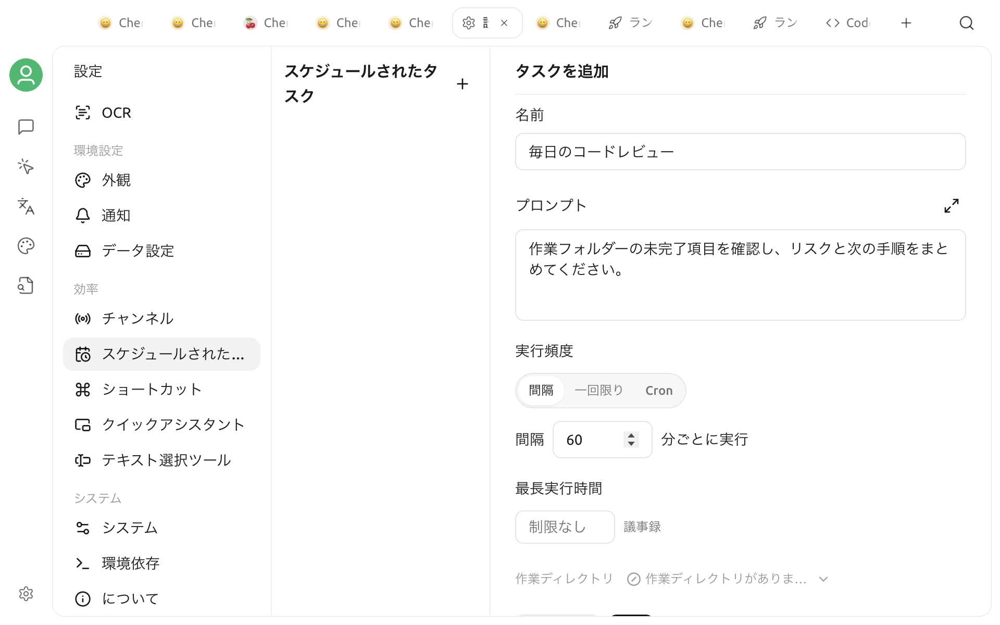

# スケジュールタスク

スケジュールタスクを使うと、[エージェント](agent.md)に指定した時刻にプロンプトを自動実行させることができます。日報の作成、定期的な確認、リマインダー、メッセージチャンネルへの結果送信などに適しています。実行のたびにセッションと実行履歴が作成されるため、結果やエラーを後から確認できます。

スケジュールタスクは Cherry Studio 内のローカルスケジューラーによって実行され、OS レベルのバックグラウンドサービスではありません。予定時刻に実行するには、Cherry Studio が起動している必要があります。アプリを再度開くと、アクティブなタスクのスケジュールが再開されます。


スケジュールタスクは無人で実行されます。タスクを実行するエージェントでは、自律モード（Soul / Autonomous）を有効にするか、権限モードを **権限チェックをバイパス**（フルオート）に設定する必要があります。自律モードを有効にすると、Cherry Studio は権限モードを自動的にフルオートへ切り替えます。ツールの実行ごとに確認は表示されません。エージェントがアクセスできる作業ディレクトリを制限し、プロンプトにパスワード、API Key、その他の機密情報を保存しないでください。


## 作成前の準備

1. [エージェント](agent.md)を作成または選択し、利用可能なモデルを設定します。
2. エージェント設定で **自律モード** を有効にします。設定ページから手動でタスクを作成するだけの場合は、**権限チェックをバイパス**（フルオート）に設定したエージェントも使用できます。
3. 通常のセッションで同じプロンプトを試し、モデル、ツール、作業ディレクトリの権限が想定どおりであることを確認します。
4. 結果を IM に送信する場合は、対応する[チャンネル](agent-channels.md)をあらかじめ設定して接続します。

設定ページの選択肢には、自律モードまたはフルオート権限モードが有効なエージェントだけが表示されます。スケジュールタスクの作成と実行に、API サーバーを別途有効にする必要はありません。

## チャットから作成する

チャットからスケジュールタスクを作成できるのは、自律モードを有効にしたエージェントだけです。たとえば、次のように依頼できます。

> 平日の毎朝 9 時に、過去 24 時間のプロジェクト更新を整理して 5 つの要点にまとめてください。

エージェントは組み込みのスケジュールタスクツールを使用して、タスクを作成、一覧表示、削除できます。依頼には、できるだけ次の内容を含めてください。

* タスク名と実行する内容
* 実行時刻、繰り返し間隔、または一回限りの日時
* 結果をチャンネルに送信するかどうか
* 長時間かかる見込みがある場合のタイムアウト

作成後は、**設定 → スケジュールされたタスク** を開き、スケジュール値、プロンプト、送信先チャンネル、次回の実行時刻を確認してください。

## 設定から作成する

1. **設定 → スケジュールされたタスク** を開きます。
2. 左側の **＋追加** をクリックします。
3. エージェントを選択し、フォームに入力します。
4. **保存** をクリックします。タスクは **アクティブ** 状態でスケジュールを待機します。

| フィールド | 用途 |
| :--- | :--- |
| 名前 | タスク一覧とセッション名に使用します。例：「毎日のコードレビュー」 |
| プロンプト | 実行のたびにユーザーメッセージとしてエージェントへ送信する完全な指示 |
| スケジュールタイプ | `Cron`、`間隔`、または `一回限り` |
| スケジュール値 | Cron 式、間隔の分数、または一回限りの日時 |
| タイムアウト | 1 回の実行に許可する最大時間（分） |
| チャンネルに送信 | 任意。生成中の出力と最終結果を選択したチャンネルへ送信します |


現在のバージョンでは、データ層のデフォルトタイムアウトは 2 分です。画面の空欄には **制限なし** と表示されますが、新しいタスクで未入力のまま保存すると、実際には 2 分に設定されます。長時間のタスクには、より大きい正の整数を明示的に入力してください。


### スケジュールタイプを選択する



正の整数で分数を入力します。`60` は 60 分ごとに 1 回実行する設定です。間隔は予定時刻を基準に計算されます。アプリが一時的に終了していた場合でも、実行できなかったすべての回を補うために連続実行されることはありません。



標準の 5 フィールド Cron 式を `分 時 日 月 曜日` の順で入力します。

| 式 | 意味 |
| :--- | :--- |
| `0 9 * * *` | 毎日 9:00 |
| `*/15 * * * *` | 15 分ごと |
| `0 9 * * 1-5` | 平日の毎朝 9:00 |

Cron はデバイスの現在のタイムゾーンで計算されます。保存後、画面に表示される **次回の実行** 時刻を確認してください。



日時選択で 1 回だけ実行する時刻を指定します。実行後、タスクは **完了** と表示され、編集、再実行、再開はできません。もう一度実行する場合は、新しいタスクを作成してください。



## チャンネルに送信する

タスクの作成時または編集時に、設定済みのチャンネルを 1 つ以上選択できます。タスクの実行中は、エージェントのテキスト出力が選択したチャンネルに送信されます。失敗した場合は、エラー通知も送信されます。

チャンネルは接続済みで、通知を受信できる有効な Chat ID が記録されている必要があります。**選択されたチャンネルには利用可能な受信者（Chat ID）が存在しません** と表示された場合は、対象プラットフォームで先に Bot へメッセージを送信し、Cherry Studio に送信先を記録させてから、チャンネルを選び直してください。

チャンネルを選択しなくてもタスクは実行され、結果は Cherry Studio のタスクセッションと実行履歴に保存されます。

## タスクを管理する

左側でタスクを選択すると、詳細ページで次の操作ができます。

* 名前、エージェント、プロンプト、スケジュール、タイムアウト、送信先チャンネルの変更
* **実行** をクリックして、以降のスケジュールを変更せずにすぐ 1 回実行
* 周期タスクの一時停止または再開
* 不要なタスクの削除

スケジュールを変更したとき、または一時停止から再開したときは、Cherry Studio が **次回の実行** を再計算します。同じタスクがすでに実行中の場合、2 つ目の実行が並行して開始されることはありません。

周期タスクは、前回正常に完了したセッションを優先的に再利用し、後続の実行でもコンテキストを保持します。初回実行時、または元のセッションが存在しない場合は、タスク名を使用した新しいセッションが作成されます。

## 実行履歴を確認する

詳細ページの **実行履歴** には、実行時刻、所要時間、ステータス、結果またはエラーが表示されます。履歴を検索したり、セッションアイコンをクリックして、その実行の完全な会話を開いたりできます。

1 回の実行がタイムアウトに達すると中止され、エラーとして記録されます。同じタスクが 3 回連続で失敗すると、スケジューラーが自動的に一時停止します。モデル、ネットワーク、ツール権限、プロンプトの問題を解消してから、手動で再開してください。

## 予定時刻に実行されない場合

次の項目を順に確認してください。

1. 予定時刻に Cherry Studio が起動していたか。
2. タスクの状態が **アクティブ** で、**次回の実行** が正しいか。
3. エージェントのモデルが利用可能で、プロバイダーの残高とネットワークに問題がないか。
4. エージェントが引き続き自律モードまたはフルオート権限モードになっているか。
5. 実行履歴にタイムアウト、ツール権限、チャンネル配信のエラーがないか。

スケジューラーは約 1 分ごとに期限を迎えたタスクを確認するため、実際の開始時刻が予定より少し遅れる場合があります。長時間のタスクはモデルのトークンを消費し続けます。高頻度のスケジュールを有効にする前に、まず手動で実行して出力を確認してください。
