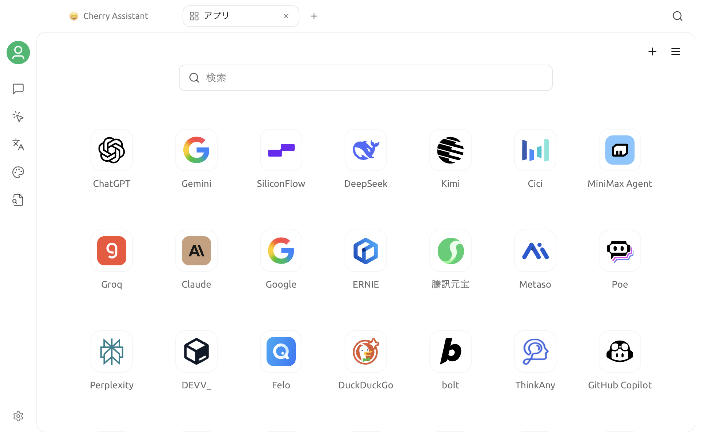

# ミニアプリ

ミニアプリを使用すると、Cherry Studio 内でよく使うウェブサイトを開けます。組み込みの一覧にはさまざまな AI、検索、開発サービスが用意されています。任意のウェブページのアドレスをカスタムミニアプリとして追加し、上部のタブで複数のウェブページを切り替えることもできます。


ミニアプリが読み込むのは第三者のウェブサイトそのものであり、Cherry Studio のモデル API ではありません。ウェブサイトのアカウント、機能、地域制限、料金体系は、各サービスの提供元によって決まります。


## ミニアプリを開く

上部タブバーの右側にある `+` をクリックして**ランチパッド**を開き、**アプリ**を選択します。

ミニアプリのホーム画面には次の項目があります。

- **検索ボックス**：名前または URL でミニアプリを絞り込みます
- **ミニアプリのグリッド**：現在表示されている組み込みまたはカスタムミニアプリを開きます
- **追加ボタン**：カスタムミニアプリを作成します
- **表示設定**：表示、順序、地域、キャッシュなどの動作を設定します

ミニアプリをクリックすると、ウェブサイトが上部の新しいタブで開きます。別のタブへ切り替えても、キャッシュの範囲内にあるミニアプリのページは読み込まれた状態を維持します。

## ミニアプリのウェブページを使用する

ウェブサイトを開くと、ページ上部のツールバーから一般的なブラウザー操作を行えます。

| 操作 | 用途 |
| --- | --- |
| 戻る／進む | 現在のミニアプリの閲覧履歴内を移動します |
| 更新 | 現在のウェブサイトを再読み込みします |
| ブラウザで開く | 現在の URL をシステムのデフォルトブラウザーで開きます |
| ピン留め | ミニアプリの入口をランチパッド／サイドバーへ追加、またはそこから削除します |
| 新しいウィンドウのリンクの開き方 | ウェブサイトが開く新しいウィンドウのリンクを Cherry Studio 内で開くか、システムブラウザーで開くかを切り替えます |

ミニアプリのウェブページでは、次のショートカットキーも使用できます。

| ショートカットキー | 役割 |
| --- | --- |
| `Ctrl / Command + F` | 現在のウェブページを検索します。`Enter`／`Shift + Enter` で一致項目を切り替えます |
| `Ctrl / Command + P` | 現在のウェブページを PDF として印刷します |
| `Ctrl / Command + S` | 現在のウェブページを HTML として保存します |

一部のキーはウェブサイト側で再定義されている場合があります。上記の操作については、Cherry Studio で実際に表示される結果を基準にしてください。

## カスタムミニアプリを追加する

ミニアプリのホーム画面右上にある追加ボタンをクリックし、次の項目を入力します。

| フィールド | 要件 |
| --- | --- |
| ID | 必須かつ一意です。英字、数字、アンダースコア、ハイフンだけを使用できます |
| 名前 | ミニアプリのグリッドとタブに表示される名前です |
| URL | 開くウェブページの完全なアドレスです。通常は `https://` を使用します |
| アイコン | 任意です。画像の URL を入力するか、ローカルから画像をアップロードできます |

保存すると、カスタムミニアプリが表示対象の一覧に追加され、グリッドに表示されます。


信頼できる URL だけを追加してください。カスタムミニアプリは Cherry Studio 内で対象のウェブサイトを読み込みますが、ウェブサイトはあなたが送信したログイン情報、ファイル、フォームの内容を受信できます。


現在のバージョンでは、保存済みミニアプリの ID、名前、URL、アイコンを直接変更できません。変更する場合は、元のカスタムミニアプリを削除してから、新しい情報で作成し直してください。

## ピン留め、非表示、削除

ミニアプリのグリッドでアイコンを右クリックすると、現在の状態に応じて次の操作を行えます。

- **ランチパッド／サイドバーに追加**、またはピン留めを解除する
- 組み込みまたはカスタムミニアプリを**非表示**にする
- **カスタムミニアプリを削除**する

組み込みミニアプリは削除できませんが、非表示にできます。完全に削除できるのは、自分で作成したミニアプリだけです。ピン留めした入口は、現在のナビゲーションバーのレイアウトに応じてランチパッドまたはサイドバーに表示されます。

ミニアプリを非表示にしたとき、そのアプリがキャッシュ一覧に含まれている場合は、対応するウェブページも現在読み込み状態を維持している一覧から削除されます。

## 表示と順序を管理する

ミニアプリのホーム画面右上にある表示設定を開きます。パネル上部には、**表示するミニアプリ**と**非表示のミニアプリ**の 2 つの一覧があります。

- 項目をクリックして表示と非表示の間を移動する
- 同じ一覧内でドラッグして順序を変更する
- **入れ替え**で現在の表示項目と非表示項目を交換する
- **リセット**で現在の非表示項目を表示状態に戻す

ピン留めしたミニアプリは常に表示され、通常の表示項目と一緒に非表示になることはありません。

## 地域で絞り込む

地域設定には、**自動検出**、**中国**、**グローバル**の 3 つの選択肢があります。組み込み一覧で宣言されている利用可能地域に基づいてグリッドを絞り込み、現在の地域では通常アクセスできないサービスの表示を減らします。

地域での絞り込みは現在の表示範囲にだけ影響します。アカウントの登録、サービス制限の回避、ウェブサイトへのアクセスを代行または保証するものではありません。カスタムミニアプリは、デフォルトで中国とグローバルの両方の表示に含まれます。

## リンクの開き方を設定する

**新しいウィンドウのリンクをブラウザで開く**を有効にすると、ウェブサイトが開こうとする新しいウィンドウはシステムのデフォルトブラウザーへ渡されます。無効にすると、新しいウィンドウは Cherry Studio のミニアプリ環境で処理されます。

この設定は表示設定から一括で変更でき、開いているミニアプリの上部ツールバーからもすぐに切り替えられます。設定にかかわらず、ツールバーの**ブラウザで開く**ボタンを押すと、現在の URL が直接開きます。

## ミニアプリのキャッシュ数

キャッシュ数は、読み込んだ状態を同時に維持するミニアプリのウェブページ数の上限です。`1` から `10` の間で調整でき、デフォルト値は `3` です。

- 数を増やす：ページに戻ったときにログイン後の状態が残りやすくなりますが、メモリ使用量が増えます
- 数を減らす：メモリ使用量を抑えられますが、以前に開いたピン留めされていないページがアンロードされ、再度開くときに再読み込みが必要になる場合があります

数を減らした場合、現在開いている一覧がその後変更され、新しい上限に達する過程で段階的に反映されます。上部タブでピン留めしたウェブページは、キャッシュ上限によって自動的に削除されません。

## ログイン状態とデータ

ミニアプリは、システムブラウザーとは独立した永続的なウェブセッションを使用します。そのため、次の点に注意してください。

- 初めてウェブサイトを使用するときは、通常、ミニアプリ内で個別にログインする必要があります
- Cherry Studio を終了して再度開いた後も、ウェブサイトの Cookie とログイン状態は通常そのまま利用できます
- システムブラウザーのログイン状態はミニアプリへ自動的に同期されません
- 複数のミニアプリは、同じ Cherry Studio のウェブセッションパーティションを使用します

アカウントのセキュリティポリシー、Cookie の有効期限、地域の変化、ウェブサイト自体の更新により、再ログインを求められる場合があります。

## よくある質問

### ウェブサイトの読み込みが終わらない／空白になる

まず更新してください。それでも失敗する場合は、ツールバーからシステムブラウザーで開き、URL とアカウントのサービス自体が利用可能か確認します。ネットワーク、プロキシ、地域制限も確認してください。一部のウェブサイトは埋め込み型のブラウザー環境を制限しているため、その場合はシステムブラウザーを使用する必要があります。

プロキシ設定については、[一般設定](settings/general.md)を参照してください。

### ログイン後にログインページへ何度も戻される

更新を試し、システム時刻が正しいこと、ウェブサイトで Cookie が許可されていること、ログイン中にネットワークやプロキシで通信が遮断されていないことを確認してください。サービスが埋め込み型のウェブログインに対応していない場合は、システムブラウザーを使用してください。

### ミニアプリが見つからない

検索語、地域での絞り込み、表示設定の非表示一覧を確認してください。ピン留め済みの場合は、ランチパッドまたはサイドバーの対応する入口も確認します。

### カスタムミニアプリを保存できない

ID に英字、数字、アンダースコア、ハイフンだけが含まれ、組み込みまたは既存のミニアプリと重複していないことを確認します。また、名前と URL の両方が入力されていることも確認してください。

### ページへ戻ると再読み込みされる

開いているミニアプリの数がキャッシュ数を超え、以前のピン留めされていないページがアンロードされた可能性があります。キャッシュ数を増やすか、継続して維持したい上部タブをピン留めしてください。

## プライバシーとセキュリティ

ミニアプリで入力したアカウント、メッセージ、ファイル、その他の内容は、現在の対話で選択しているモデルではなく、対象のウェブサイトへ送信されます。Cherry Studio の対話がミニアプリのウェブページ内容を自動的に読み取ることもありません。内容を引用する必要がある場合は、権限と機密性を確認してから、必要な部分だけを手動でコピーしてください。

***

問題が発生した場合や機能改善を希望する場合は、[フィードバックと提案](../../question-contact/suggestions.md)をご利用ください。
