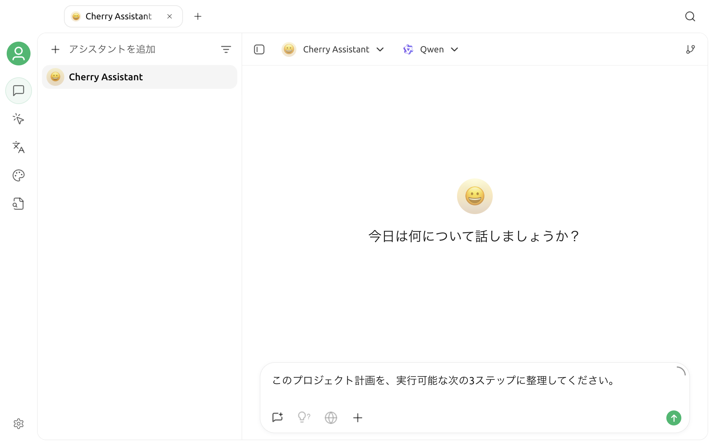

# 会話インターフェース

会話は Cherry Studio で最もよく使われるワークスペースです。用途ごとにアシスタントを作成し、各アシスタントで複数の独立したトピックを管理できます。必要に応じて、ファイル、ナレッジベース、Web 検索、MCP ツール、複数のモデルも追加できます。


初めて使用する前に、[モデルサービス](../../pre-basic/providers/)でプロバイダーを追加し、モデルを有効にして、接続チェックを完了してください。


## アシスタントとトピックを理解する

会話ページは、「アシスタント → トピック」の 2 階層で構成されています。

* **アシスタント**：役割プロンプト、現在のモデル、モデルパラメータ、ナレッジベース、MCP、Web 検索などの設定を保存します。
* **トピック**：独立した一連の会話履歴を保存します。

1 つのアシスタントに複数のトピックを作成できます。アシスタントの設定は共有されますが、メッセージ履歴が混ざることはありません。たとえば、同じ「コードレビューアシスタント」に「プロジェクト A」と「プロジェクト B」という 2 つのトピックを作成できます。

ワークスペースへ自律的にアクセスし、ファイルを読み書きしたり、コマンドを実行したりする必要がある場合は、[エージェント](../../advanced-basic/agent.md)を使用してください。対話アシスタントとエージェントは別の機能です。詳しくは、[コンセプト入門](../../advanced-basic/concepts-101.md)を参照してください。

## ページの構成

会話ページは、主に次の 4 つの領域で構成されています。

1. **アシスタントとトピックの一覧**：アシスタントの切り替え、トピックの作成、履歴の検索や管理を行います。
2. **上部バー**：現在のアシスタントとモデルを表示し、会話設定、検索、サイドバーの切り替えを提供します。
3. **メッセージ領域**：ユーザーのメッセージ、モデルの回答、思考過程、ツール呼び出し、引用を表示します。
4. **入力領域**：メッセージを入力し、添付ファイル、Web 検索、ナレッジベース、MCP、複数モデルなどのツールを使用します。

トピック一覧は、表示設定に応じて左側または右側に配置でき、サイドバーを折りたたむこともできます。表示位置が変わっても、アシスタントとトピックの階層関係は変わりません。

## 最初の会話を始める

1. サイドバーから**会話**を開きます。
2. アシスタントを選択するか、[アシスタントライブラリ](agents.md)から追加します。
3. **新しいトピック**をクリックします。
4. 上部で使用するモデルを選択します。
5. 入力欄に質問を書き、現在設定されている送信ショートカットで送信します。

モデルから回答がない場合は、モデルサービスが有効か、API Key とアドレスが正しいか、現在のモデルが利用可能かを確認してください。

## モデルを選択する

### 現在のアシスタントのモデル

上部のモデル選択欄で、現在のアシスタントが使用する基盤モデルを決定します。切り替え後のメッセージには新しいモデルが使用されます。アシスタントのデフォルトモデルや、新しいトピックでモデルをリセットするかどうかは、アシスタント設定で変更できます。

対話に使用できるモデルだけを選択してください。Embedding モデルと Rerank モデルはナレッジベースの処理に使用されるため、通常の対話モデル一覧には表示されません。

### 複数モデルから並行して回答を得る

入力領域でモデルのメンションボタンをクリックするか、`@` を入力すると、1 つ以上のモデルを選択できます。選択したモデルは入力欄の上に表示されます。

* 1 つのモデルだけを選択した場合、そのモデルがアシスタントの基盤モデルに代わって回答します。
* 複数のモデルを選択した場合、Cherry Studio が複数の回答を並行して生成するため、結果を比較できます。
* 入力欄の上にあるモデルタグを削除すると、アシスタントの基盤モデルに戻ります。

画像をアップロードする場合、メンションしたすべてのモデルが画像入力に対応している必要があります。対応していないモデルは、選択または送信できない場合があります。

## 入力ツール

入力領域のツールはドラッグして並べ替えられ、右クリックメニューから表示または非表示を切り替えられます。ウインドウが狭い場合やツールが多い場合は、一部のボタンが折りたたまれます。

| ツール | 役割 | 説明 |
| --- | --- | --- |
| 新しいトピック | 現在のアシスタントに独立したトピックを作成する | 元のトピックは削除されない |
| 添付ファイル | 画像、文書、テキストを追加する | 選択できる種類はモデルの機能による |
| Web 検索 | 検索結果を回答の根拠に追加する | モデルのネイティブ検索または設定済みの検索サービスが必要 |
| ナレッジベース | アシスタントで使用する 1 つ以上のナレッジベースを選択する | 削除するまで、選択内容はアシスタント設定に保持される |
| MCP | アシスタントに割り当てられた MCP ツールを表示または呼び出す | 先に MCP Server の設定が必要 |
| モデルをメンション | 入力に対して回答する 1 つ以上のモデルを選択する | `@` を入力して開くこともできる |
| クイックフレーズ | よく使うプロンプトテンプレートを挿入する | 設定で一元管理する |
| 思考 | 推論対応モデルの思考モードまたは強度を調整する | モデルが対応する場合だけ表示される |
| Web ページコンテキスト | 対応モデルが URL を読み取れるようにする | 互換性のあるモデルとプロバイダーの組み合わせでのみ表示される |
| 画像を生成 | 画像生成対応モデルから画像を返す | 画像制作を中心に行う場合は[画像生成](drawing.md)も利用できる |
| メッセージを消去 | 現在のトピック内のメッセージを削除する | 削除後は復元できない |
| 新しいコンテキスト | 画面上の履歴は残し、この位置からモデルへ送るコンテキストを切り替える | トピックを続けながら、古い内容をモデルに参照させたくない場合に適している |
| 入力欄を展開 | 入力領域を拡大または元の大きさに戻す | 長いプロンプトに適している |

ツールが表示されるかどうかは、現在のページ、モデルの機能、アシスタント設定、ツールバー設定によって決まります。ボタンが見つからない場合は、まず入力領域のツールバーを右クリックして非表示になっていないかを確認し、次にモデルやアシスタントが利用条件を満たしているかを確認してください。

### `@` と `/` のクイックパネル

入力クイックパネルを有効にすると：

* `@` を入力してモデル選択パネルを開けます。
* `/` を入力して利用可能な操作やリソースのクイックパネルを開けます。

クイックパネルに表示される内容は、現在の会話環境と有効なツールによって異なります。入力設定で文字による起動を無効にしても、ツールボタンから関連機能を使用できます。

## 添付ファイルを使用する

1. **添付ファイル**をクリックするか、ファイルを入力領域へドラッグします。
2. ファイルのプレビューが入力欄の上に表示されたことを確認します。
3. モデルにファイルをどのように処理してほしいかを質問内で明確にします。
4. メッセージを送信します。

選択できるファイルの種類は、モデルの機能によって変わります。

* 画像には、ビジョンモデルまたは画像生成や編集に対応するモデルが必要です。
* 文書とテキストは、まず添付ファイルとして処理され、その後メッセージと一緒にコンテキストへ追加されます。
* 複数のモデルをメンションする場合、添付ファイルは選択したすべてのモデルに共通する機能に対応している必要があります。

長いテキストは入力設定に応じて自動的にファイルへ変換できるため、入力欄を埋め尽くさずに済みます。個人情報や機密情報を扱う場合は、送信前に現在のモデルプロバイダーとデータポリシーを確認してください。

## ナレッジベースを使用する

1. 先に[ナレッジベース](knowledge-base.md)でナレッジベースを作成し、資料の処理を完了します。
2. 会話ページに戻り、**ナレッジベース**をクリックします。
3. 1 つ以上のナレッジベースを選択します。
4. 質問するときに、検索するテーマ、範囲、期間を明記します。

ナレッジベースのタグが入力欄の上に表示されます。現在のバージョンでは、一部の組み合わせで添付ファイルとナレッジベースの選択を同時に使えない場合があります。ボタンが使用できない場合は、現在の添付ファイルを削除してからナレッジベースを選択してください。

ナレッジベースの検索結果は、モデルが回答するときの参考情報であり、回答の正確性を保証するものではありません。重要な結論については、引用と元資料を確認してください。

## Web 検索と MCP を使用する

### Web 検索

Web 検索には、次の 2 種類の情報源があります。

* モデルプロバイダーが提供するネイティブ検索機能。
* Cherry Studio で設定した外部検索サービス。

具体的な設定については、[Web 検索モード](../../websearch/)を参照してください。有効にした後も、引用リンクがモデルの結論を実際に裏付けているかを確認する必要があります。

### MCP ツール

MCP を使用すると、対話アシスタントから外部のツールやデータを呼び出せます。使用前に：

1. MCP 設定で Server をインストールし、有効にします。
2. 必要な MCP Server を現在のアシスタントに割り当てます。
3. ツール呼び出し対応モデルを選択します。
4. 送信前に、有効なツールと権限を確認します。

詳しくは、[MCP](../../advanced-basic/mcp/)を参照してください。

## メッセージを操作する

メッセージの近くにポインタを移動すると、操作バーが表示されます。表示されるボタンは、メッセージの役割や設定によって異なります。

| 操作 | 用途 |
| --- | --- |
| コピー | メッセージ本文をコピーする |
| 編集して再送信 | ユーザーメッセージを変更し、その位置から再生成する |
| 再生成 | モデルにもう一度回答させる |
| 別のモデルで回答 | その位置から別のモデルを選び、別の回答を生成する |
| 翻訳 | モデルの回答を選択した言語に翻訳する |
| ノートに保存 | 回答を Cherry Studio のノートへ保存する |
| 削除 | 1 件のメッセージを削除する |
| 新しい分岐 | 現在のメッセージから新しい会話分岐を作成する |
| 複数選択 | 後続の操作に使用する複数のメッセージを選択する |
| 保存またはエクスポート | ファイルとして保存する、ナレッジベースへ追加する、またはコンテンツをエクスポートする |

再生成、過去のメッセージの編集、削除を行うと、その後の会話の流れが変わる場合があります。元の結果を残す必要がある場合は、先に新しい分岐を作成してください。

## 長い会話を管理する

| 操作 | メッセージが残るか | 以後も古いコンテキストを含めるか | 適した用途 |
| --- | --- | --- | --- |
| 新しいトピック | 元のトピックに残る | いいえ | 新しいタスクやプロジェクトを始める |
| 新しいコンテキスト | 現在のトピックに残る | マークした位置から再開する | 同じタスクの段階を切り替える、またはコンテキストが混乱した場合 |
| メッセージを消去 | 削除される | いいえ | 現在のトピックの内容が不要になった場合 |
| 新しい分岐 | 元の会話が残る | 選択したメッセージから続ける | 異なるプロンプトやモデルの進め方を比較する |


「メッセージを消去」は現在のトピックの内容を削除します。「新しいコンテキスト」は、モデルへ送信する履歴を途中で切り替えるだけです。この 2 つは異なる操作です。


入力領域に表示される Token 数は推定値であり、コンテキストがモデルの上限に近づいているかを判断するために使用します。モデルによってトークン化の方法が異なり、プロバイダーによって課金規則も異なるため、最終的な使用量はプロバイダーの記録を基準にしてください。

## アシスタント設定とグローバル設定

### アシスタント設定

アシスタント設定は、そのアシスタント内のすべてのトピックに適用されます。主な項目：

* 名前、アバター、システムプロンプト。
* デフォルトモデルとモデルパラメータ。
* ナレッジベース、Web 検索、MCP。
* コンテキスト数、最大出力長、ストリーミング出力、プロバイダー固有のパラメータ。

すべてのモデルが同じパラメータに対応しているわけではありません。明確な必要性がない場合はデフォルト値を優先してください。カスタムパラメータによって組み込み設定が上書きされる場合があります。

### 会話と入力の設定

会話設定には、次のようなグローバル表示や入力の設定も含まれます。

* メッセージのスタイル、フォント、コードブロック、数式、思考内容の表示。
* Token の推定、長文の貼り付け、入力内容の翻訳、送信方法。
* アシスタント一覧、トピックの位置、ツールバーの表示。

関連ページ：

* [デフォルトモデル](settings/default-models.md)
* [表示設定](settings/display.md)
* [ショートカットキー](settings/key-shortcut.md)
* [プロンプトとクイック挿入](../../pre-basic/settings/quick-phrase.md)

## よくある問題

### 送信ボタンを使用できない

入力欄が空でないか、まだ生成中でないか、添付ファイルの種類が現在のモデルに対応しているか、モデルサービスが有効になっているかを確認してください。

### ナレッジベースまたは MCP が見つからない

対応する機能が作成または有効になっていることを確認し、現在のアシスタントとモデルがツール呼び出しに対応しているかを確認してください。ナレッジベースボタンが使用できない場合は、先に入力領域の添付ファイルを削除します。

### 複数モデルの回答が表示されない

入力欄の上にメンションしたモデルが引き続き表示されていることを確認し、各モデルが利用可能かを確認してください。無効なモデル、残高不足のモデル、互換性のない API を使用するモデルは、個別に失敗する場合があります。

### 会話が徐々に遅くなる、または回答が話題から外れる

まず Token の推定値とコンテキスト数を確認してください。**新しいコンテキスト**を使用して現在のトピック内で再開するか、新しいトピックを作成してタスクを分けることができます。

解決しない場合は、Cherry Studio のバージョン、モデル名、プロバイダー、再現手順、エラー内容を添えて、[フィードバックと提案](../../question-contact/suggestions.md)からお知らせください。
