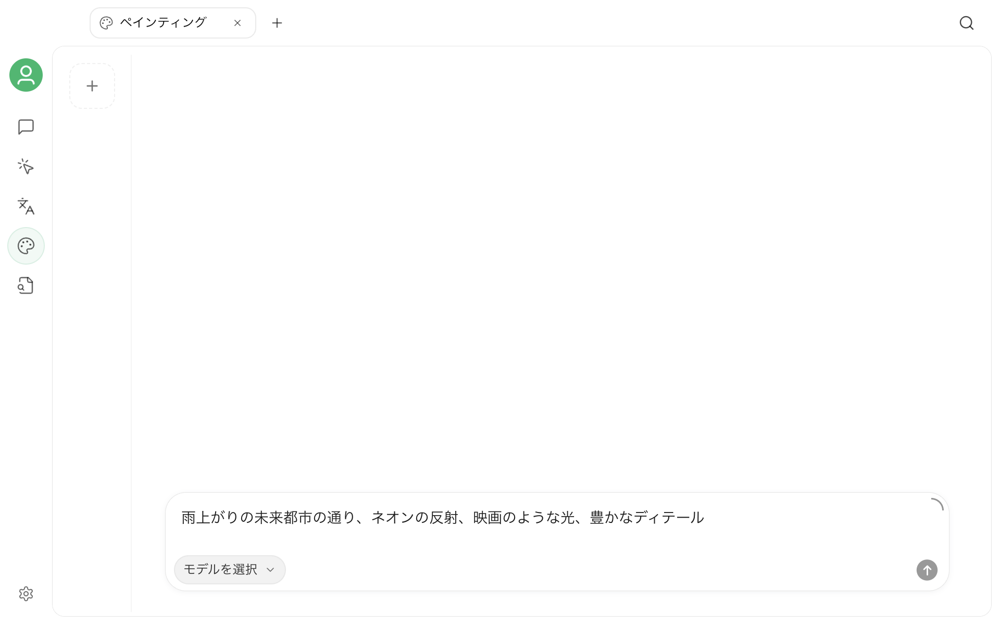

# ペインティング



ペインティングは、Cherry Studio の独立した画像生成ワークスペースです。設定済みのプロバイダーとモデルを読み込み、同じページ上で画像モデルの選択、プロンプトの入力、モデルが対応するパラメーターの調整、今回生成した画像の管理を行えます。


ペインティングページには、画像生成機能を持つ利用可能なモデルだけが表示されます。選択肢は現在のバージョン、有効にしたプロバイダー、モデル設定によって異なるため、実際に利用できるモデルはアプリ内の一覧で確認してください。


## 使用前の準備

ペインティングを使用するには、少なくとも 1 つの画像生成モデルが利用可能である必要があります。

1. `設定` → `モデルプロバイダー` を開きます。
2. プロバイダーを有効にし、必要な API キーまたは接続情報を設定します。
3. プロバイダーに画像生成対応モデルが追加されていることを確認します。

プロバイダーをまだ設定していない場合は、先に[モデルプロバイダーを設定する](../../pre-basic/providers/README.md)を参照してください。

## ペインティングを開く

上部タブバーの右側にある `+` をクリックして**ランチパッド**を開き、**ペインティング**を選択します。

ページは主に 3 つのエリアに分かれています。

| エリア | 用途 |
| --- | --- |
| 左側の設定エリア | プロバイダーとモデルを選択し、現在のモデルが対応する生成パラメーターを調整します |
| 中央キャンバス | 生成状況と結果を確認します。複数の画像が一度に返された場合は、画像を 1 枚ずつ切り替えられます |
| 右側の履歴エリア | 新しいペインティングの作成、履歴の切り替え、不要になった履歴の削除を行います |

画面下部にはプロンプト入力エリアがあります。モデルを選択して説明を入力すると、生成を開始できます。

## テキストから画像を生成する

テキストから画像を生成する場合は、作成したい画像を説明するだけです。

1. 左側でプロバイダーと画像生成モデルを選択します。
2. 画面下部にプロンプトを入力します。
3. 必要に応じて、サイズ、アスペクト比、解像度などのパラメーターを調整します。
4. 送信ボタンをクリックして生成を開始します。
5. 中央キャンバスに結果が表示されるまで待ちます。

例：

```text
丸眼鏡をかけた茶トラ猫が本の山の上に座っている。ヴィンテージ油彩風、暖かな夕暮れの光、ミディアムショット
```

生成中は、キャンバスに進行状況が表示されます。中止する場合は、実行中のタスクをキャンセルできます。モデルから複数の画像が一度に返された場合は、キャンバス上の前へ／次へボタンで切り替えます。

## 参照画像を使用する／画像を編集する

一部のモデルは、テキストからの画像生成に加えて、画像編集、合成、その他の画像モードにも対応しています。このようなモデルを選択すると、プロンプト入力エリアに画像を追加するためのボタンが表示されます。

次の方法で画像を追加できます。

- ローカルから画像を選択する
- 画像を入力エリアにドラッグする
- クリップボードから画像を貼り付ける
- モデルが対応している場合は複数の参照画像を追加する

画像を追加したら、残したい内容と変更したい内容を説明して生成を開始します。例：

```text
被写体と構図を維持し、背景を雨上がりの東京の街並みに変更して、ネオンの反射を加える
```


入力エリアに画像を追加するためのボタンが表示されない場合、現在選択しているモデルは画像編集機能に対応していません。該当するモードに対応したモデルへ切り替えてください。


## 生成パラメーターを調整する

パラメーターパネルは選択したモデルに応じて動的に変わり、そのモデルが対応を明示している項目だけが表示されます。一般的なパラメーターは次のとおりです。

| パラメーター | 役割 |
| --- | --- |
| サイズまたはアスペクト比 | 画像のキャンバス形状と出力サイズを調整します |
| 解像度 | モデルが対応している場合に出力の精細さを選択します |
| 画像数 | 1 回の生成で返される結果の数を指定します |
| 品質、スタイル、背景 | モデルが提供する画像表現のオプションを調整します |
| Seed、Guidance、Steps | ランダム性や生成処理を調整します。一部のモデルのみで利用できます |

パラメーターの名称、設定値、料金体系はモデルによって異なる場合があります。不明な場合は、まずデフォルト値で一度生成してから項目を 1 つずつ調整することをおすすめします。モデルに表示されないパラメーターを手動で追加する必要はありません。

## ペインティング履歴を管理する

右側の履歴エリアでは、個別のペインティングタスクを管理できます。

- 上部の `+` をクリックして空のペインティングを新規作成する
- サムネイルをクリックして既存の履歴に戻る
- 履歴が多い場合は下へスクロールして続きを読み込む
- 不要になった履歴を削除する際は、アプリに確認画面が表示される

生成結果は中央キャンバスに表示されます。画像をクリックすると拡大プレビューが開き、プレビュー画面の操作を使って結果の確認や保存ができます。

## より効果的なプロンプトを書く

プロンプトに決まった形式はありませんが、少なくとも次の情報を含めることをおすすめします。

- **被写体**：人物、物、場面
- **環境**：場所、時間、天候、背景
- **ビジュアルスタイル**：写真、イラスト、油彩、3D など
- **構図**：クローズアップ、全身、俯瞰、対称構図など
- **光と色**：柔らかな光、逆光、寒色、低彩度など
- **制約**：残したい要素、避けたい要素

言語やプロンプト構造の解釈はモデルによって異なります。結果が期待から外れる場合は、まず互いに矛盾する指示を減らし、その後で詳細を少しずつ追加してください。

## よくある質問

### 選択できるプロバイダーやモデルが表示されない

ペインティングページに表示されるのは、現在有効で画像生成機能を持つモデルだけです。プロバイダーが有効になっているか、API キーが有効か、モデルが追加されているか、モデル機能またはエンドポイント種別が正しく設定されているかを確認してください。

### 画像を追加するボタンが表示されない

現在のモデルはテキストからの画像生成にのみ対応しているか、Cherry Studio に画像編集機能を通知していません。画像編集に対応したモデルへ切り替えてから、もう一度お試しください。

### 生成が何度も失敗する

次の順に確認してください。

1. プロバイダーへの接続と API キー
2. モデルが現在も利用可能か
3. アカウント残高、利用枠、または呼び出し頻度の制限
4. プロンプトや参照画像がプロバイダーのコンテンツポリシーに抵触していないか
5. 現在のパラメーターの組み合わせにモデルが対応しているか
6. ネットワークまたはプロキシから、プロバイダーとその画像 URL にアクセスできるか

プロバイダーから返される詳細なエラーは、認証、利用枠、パラメーター、コンテンツ制限のどれが原因かを判断するのに役立ちます。

### 同じプロンプトでも結果が異なるのはなぜですか？

画像生成には通常、ランダムな処理が含まれます。モデルに `Seed` がある場合は、シード値を固定し、その他のパラメーターも同じにすると、結果の再現性を高められます。該当するパラメーターがない場合、生成するたびに結果が異なるのは正常です。

## プライバシーと料金

プロンプト、参照画像、生成パラメーターは、処理のために選択したプロバイダーへ送信されます。取り扱う権限のない機密画像はアップロードせず、使用前にプロバイダーのプライバシーポリシー、コンテンツポリシー、料金体系を確認してください。解像度を上げる、画像数を増やす、編集モードを使用すると、料金が高くなる場合があります。

***

問題が発生した場合や機能改善を希望する場合は、[フィードバックと提案](../../question-contact/suggestions.md)をご利用ください。
