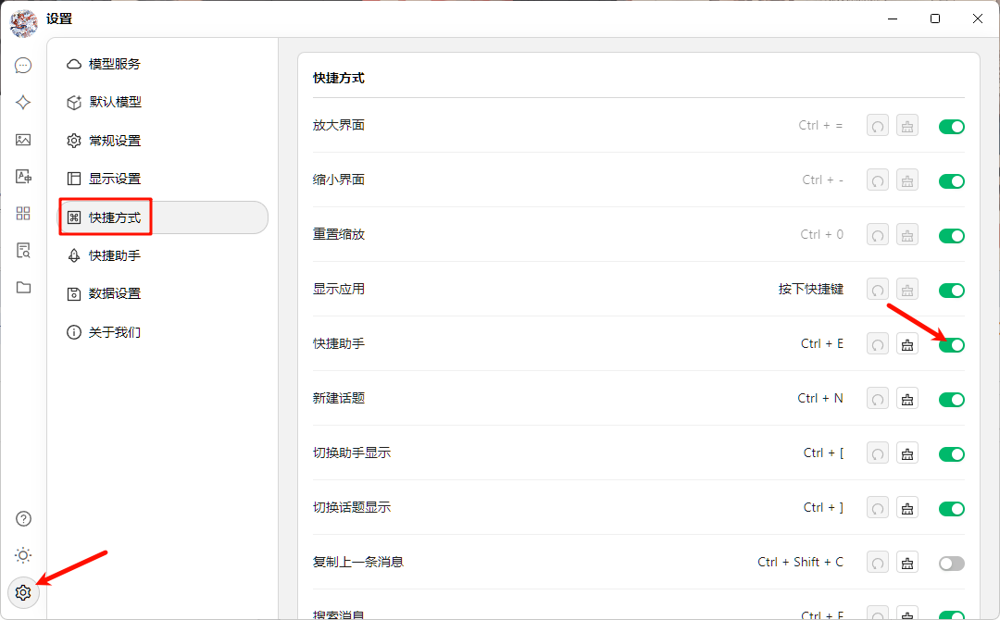


このドキュメントはAIによって中国語から翻訳されており、まだレビューされていません。


# クイックアシスタント

クイックアシスタントはCherry Studioが提供する便利ツールで、あらゆるアプリケーションからAI機能に素早くアクセスできるようにします。これにより、即時の質問、翻訳、要約、説明などの操作が可能になります。

### クイックアシスタントを有効にする

1. **設定を開く：** `設定` → `ショートカット` → `クイックアシスタント`に移動します。
2. **トグルを有効化：** `クイックアシスタント`の対応するボタンを見つけて有効にします。

<figure><figcaption>
クイックアシスタント有効化の図
</figcaption></figure>

3. **ショートカットキーを設定（オプション）：**
   * Windowsデフォルト：<kbd>Ctrl</kbd> + <kbd>E</kbd>
   * macOSデフォルト：<kbd>⌘</kbd> + <kbd>E</kbd>
   * 競合を避けたり使用習慣に合わせるため、ここでカスタマイズ可能です。

### クイックアシスタントの使用方法

1. **起動：** 任意のアプリケーションで設定したショートカットキー（またはデフォルトキー）を押して起動します。
2. **操作：** 表示されたウィンドウで直接以下が可能です：
   * **質問：** AIに直接質問
   * **テキスト翻訳：** 翻訳したいテキストを入力
   * **内容要約：** 長文を要約
   * **概念説明：** 説明が必要な用語や概念を入力
   
       <figure><figcaption>
クイックアシスタント操作画面
</figcaption></figure>
3. **終了：** <kbd>ESC</kbd>キーを押すか、ウィンドウ外をクリックして閉じます。


クイックアシスタントで使用されるモデルは[グローバルデフォルト対話モデル](settings/default-models.md#mo-ren-zhu-shou-mo-xing)です。


### ヒントとテクニック

* **ショートカット競合：** 他のアプリケーションと競合する場合はショートカットを変更してください。
* **機能拡張：** ドキュメント記載機能に加え、コード生成やスタイル変換など追加機能が利用可能な場合があります。実際の使用で探索をお勧めします。
* **フィードバック：** 問題や改善提案がある場合は、Cherry Studioチームへ[フィードバック](../../../question-contact/suggestions.md)をお願いします。