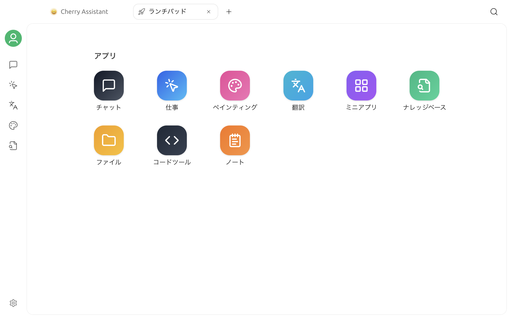

# ランチパッド

ランチパッドは Cherry Studio のホーム画面です。内蔵機能と固定したミニアプリをまとめて開けるため、新しい作業や複数タブでの作業をここから始められます。

## ランチパッドを開く

Cherry Studio を起動すると、最初にランチパッドが表示されます。使用中に戻ったり、新しいランチパッドを開いたりするには、次の方法があります。

* ウィンドウ上部のタブバー左側にある「ホーム」ボタンをクリックすると、既存のランチパッドタブに戻ります。
* タブバーの `+` をクリックすると、新しいタブが開きます。新しいタブはランチパッドから始まります。

ランチパッドでアプリをクリックすると、現在のタブにそのワークスペースが表示されます。複数の作業を同時に進める場合は、`+` でタブを追加してください。

## アプリの入口

ランチパッドの「アプリ」セクションには、次の入口があります。

| アプリ | 用途 |
| :--- | :--- |
| チャット | 会話を始めてアシスタントを使用する |
| ワーク | エージェントのタスクを作成して実行する |
| ペインティング | 画像モデルで画像を生成し、管理する |
| 翻訳 | 原文と訳文を見比べながらテキストを翻訳する |
| アプリ | Web ミニアプリを開いて管理する |
| ナレッジベース | ナレッジベース、データソース、検索設定を管理する |
| ファイル | Cherry Studio で使用したファイルを確認する |
| コードツール | 対応する AI コーディングツールを管理して実行する |
| ノート | Markdown ノートを作成して整理する |

アイコンをドラッグすると、内蔵アプリの並び順を変更できます。アイコンを右クリックすると、そのアプリを左サイドバーに固定したり、固定を解除したりできます。チャットなど必須の入口は固定を解除できません。

## ミニアプリのセクション

ランチパッドに固定したミニアプリは、「アプリ」セクションの下に表示されます。ミニアプリと内蔵アプリは別々に並び、ミニアプリのアイコンをドラッグして順序を変更できます。

入口を追加または削除するには、「ミニアプリ」ページで対象アプリの操作メニューを開き、「スタート画面に追加」または「スタート画面から削除」を選択します。


スタート画面からミニアプリを削除しても、ショートカットが解除されるだけで、ミニアプリ自体は削除されません。


## 使い方のヒント

* 新しい作業はランチパッドから始めます。以前の会話やタスクを再開する場合は、左側のサイドバーまたは各ページの履歴一覧を使用します。
* 複数のタブで別々の機能を開くと、現在のワークスペースを閉じずに並行して作業できます。
* よく使う Web ミニアプリをランチパッドに追加し、よく使う内蔵アプリをサイドバーに固定します。
