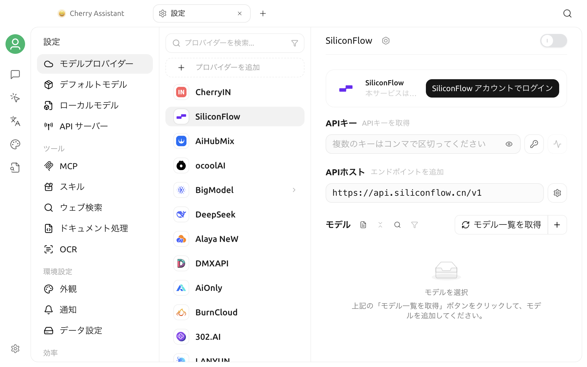

# ソフトウェア設定

Cherry Studio V2 では、モデル、ツール、環境設定、データ管理、効率化機能を設定センターに集約しています。このページは設定のナビゲーションです。各スイッチの詳細は繰り返さず、目的に応じて該当セクションを見つけた後、関連する個別ドキュメントを参照してください。

## 設定を開く

メインウィンドウ左下の**設定**アイコンをクリックします。

設定センターではデフォルトで**モデルプロバイダー**が開きます。先頭のモデル関連項目にはセクション見出しがなく、その後に 4 つの見出し付きセクションがあります。

1. モデルプロバイダー、デフォルトモデル、ローカルモデル、API サーバー
2. ツール
3. 環境設定
4. 効率
5. システム


OS、ウィンドウサイズ、バージョンによって、テキストや位置が多少異なる場合があります。機能が表示されない場合は、まず**について**でバージョンを確認し、特定のプラットフォームだけで利用可能な機能ではないか確認してください。


## モデル関連項目

| 設定項目 | 用途 | 関連ドキュメント |
| --- | --- | --- |
| モデルプロバイダー | モデルプロバイダー、API Key、API アドレス、接続方法、モデル一覧を追加・管理 | [モデルプロバイダー設定](providers.md) |
| デフォルトモデル | デフォルトアシスタント、クイック、翻訳、ペインティングの各モデルを設定 | [デフォルトモデル設定](default-models.md) |
| ローカルモデル | ローカルの Embedding モデルと OCR モデルのコンポーネントをダウンロードまたは削除 | [ローカルモデル](local-models.md) |
| API サーバー | Cherry Studio のモデル機能をローカルの OpenAI 互換インターフェースとして他のアプリへ提供 | [API サーバー](../../../advanced-basic/api-server.md) |

初回利用時は、次の順序で設定することをおすすめします。

1. **モデルプロバイダー**でプロバイダーを有効にし、接続チェックを完了します。
2. 必要なモデルがモデル一覧に表示されていることを確認します。
3. **デフォルトモデル**で各種デフォルトモデルを設定します。
4. チャットページへ戻り、テストメッセージを送信します。

モデルプロバイダーの API Key は機密認証情報です。実際の Key をスクリーンショット、公開ドキュメント、問題報告に含めないでください。

## ツール

| 設定項目 | 用途 | 関連ドキュメント |
| --- | --- | --- |
| MCP | MCP ツールをインストール・管理し、アシスタントやエージェントを外部機能へ接続 | [MCP 使用チュートリアル](../../../advanced-basic/mcp/) |
| スキル | エージェントが利用できるスキルを管理 | — |
| ウェブ検索 | キーワード検索と URL 読み取りプロバイダーを選択し、結果数、圧縮、ブラックリストを設定 | [ウェブ検索](../../../websearch/) |
| ドキュメント処理 | PDF や Office 文書の解析サービスを設定 | [ドキュメント処理](../../../pre-basic/settings/doc-process.md) |
| OCR | 画像内の文字認識を設定 | [ドキュメント処理](../../../pre-basic/settings/doc-process.md) |

ツールサービスの利用可否は、通常、次の条件すべてに依存します。

- 機能自体の設定が完了している
- 現在のモデルがツール呼び出しまたは対応する入力タイプをサポートしている
- アシスタントまたはエージェントにそのツールの権限が付与されている
- ローカルネットワークとサードパーティサービスへアクセスできる

画面にスイッチが表示されているだけで、機能が利用可能だと判断しないでください。設定後、実際のチャットで最小限のテストを実行してください。

## 環境設定

| 設定項目 | 用途 | 関連ドキュメント |
| --- | --- | --- |
| 外観 | 言語、テーマ、フォント、メッセージ表示、数式表示、カスタム CSS | [外観設定](display.md) |
| 通知 | アプリの通知を管理 | — |
| データ設定 | ローカルデータディレクトリ、インポート・エクスポート、バックアップ、WebDAV、S3、ノートサービス | [データ設定](../../../data-settings/) |

**外観**、**通知**、**データ設定**はそれぞれ独立した項目です。起動、プロキシ、プライバシーなどのシステムレベルの設定は**システム**を使用してください。


多くの外観設定はすぐに反映されますが、言語、プロキシ、保存場所、一部のシステム統合では、ウィンドウを開き直すかアプリを再起動する必要があります。再起動が必要かどうかは、設定項目の案内と実際の画面を基準にしてください。


## 効率

| 設定項目 | 用途 | 関連ドキュメント |
| --- | --- | --- |
| チャンネル | エージェントが Feishu、Telegram などの外部チャンネルを介してメッセージを送受信 | [チャンネル](../../../advanced-basic/agent-channels.md) |
| スケジュールされたタスク | スケジュールに従ってエージェントタスクを自動実行 | [スケジュールされたタスク](../../../advanced-basic/scheduled-tasks.md) |
| ショートカット | アプリおよびグローバルショートカットを表示、変更、有効化、無効化 | [ショートカット設定](key-shortcut.md) |
| クイックアシスタント | グローバルショートカットまたはトレイから軽量な質問ウィンドウを開く | [クイックアシスタント](../kuai-jie-zhu-shou.md) |
| テキスト選択ツール | 他のアプリで選択したテキストに翻訳、要約、説明などを実行 | [テキスト選択ツール](../selection-assistant.md) |

チャンネルとスケジュールタスクにより、エージェントがメインウィンドウの外や無人の状態で動作する場合があります。有効にする前に、モデル料金、ツール権限、アクセス可能なデータ、タスクの停止条件を確認してください。

## システム

| 設定項目 | 用途 | 関連ドキュメント |
| --- | --- | --- |
| システム | 起動、プロキシ、プライバシーなどのシステムレベルの設定を管理 | [一般設定](general.md) |
| 環境依存 | 機能が必要とする外部ランタイムを確認・管理 | — |
| について | バージョン、更新チャンネル、公式サイト、オープンソースリポジトリ、ライセンスを確認 | — |

## 推奨される初回設定の順序

Cherry Studio をインストールしたばかりの場合は、次の順序で最小限の設定を完了できます。

1. **モデルプロバイダー**：プロバイダーを 1 つ有効にし、認証情報を入力して接続を確認
2. **デフォルトモデル**：デフォルトアシスタントのモデルを選択
3. **外観**：言語とテーマを選択
4. **データ設定**：データの保存場所と、現在のバージョンで利用できるエクスポートまたは移行方法を確認
5. **ウェブ検索またはドキュメント処理**：現在本当に必要なツールだけを設定
6. **ショートカット**：グローバルキーの組み合わせが他のアプリと競合しないようにする
7. **について**：想定するバージョンを使用していることを確認

すべてのサービスを一度に有効にする必要はありません。まず基本的なチャットを安定して動作させてから、ウェブ検索、MCP、チャンネル、自動タスクを順に追加すると、設定上の問題を特定しやすくなります。

## 設定後の確認

設定を変更した後は、次の方法で簡単に確認できます。

| 変更 | 推奨確認方法 |
| --- | --- |
| モデルプロバイダーまたは API Key | 接続チェックを実行してから短いメッセージを送信 |
| デフォルトモデル | 新しいチャットを作成し、上部に表示されるモデルを確認 |
| ウェブ検索 | 地球アイコンを有効にし、最新情報が必要な質問をする |
| ドキュメント処理 | 小さなテストファイルをアップロードして解析結果を確認 |
| プロキシ | プロキシが必要なサービスへ再アクセスし、必要ならアプリを再起動 |
| ショートカット | 対象ウィンドウでキーの組み合わせを実際に押す |
| データ、インポート、エクスポート | 対象のファイルまたはアプリに期待した内容が実際に作成されたことを確認 |

## よくある問題

### 設定変更が反映されない

まず、入力欄からフォーカスが外れているか、保存または確認ボタンをクリックしたか確認します。次に該当ページを開き直してください。言語、ネットワーク、システム権限、保存場所に関する設定では、Cherry Studio を再起動します。

### ドキュメントに記載された設定項目が見つからない

確認項目：

1. 現在の Cherry Studio が V2 コミュニティ版の比較的新しいバージョンか
2. その機能が特定の OS だけに対応していないか
3. プロバイダー、モデル、実験機能を先に有効にする必要がないか
4. 設定ウィンドウの左側をさらにスクロールできないか
5. 記載された機能がアシスタント、エージェント、アプリページへ移動していないか

### すべての設定を別の機器へ同期できますか

バックアップ方法によって対象データが異なります。「バックアップ成功」だけで、すべての認証情報とローカルパスが同期されるとは判断しないでください。移行前に[データ設定](../../../data-settings/)を読み、移行先の機器でモデルプロバイダー、パス、システム権限を確認してください。

***

### ヘルプとフィードバック

設定中に問題が発生した場合は、[フィードバックと提案](../../../question-contact/suggestions.md)に記載された公式窓口から報告してください。Cherry Studio のバージョン、OS、設定項目名、機密情報を除いたエラーメッセージを添付することをおすすめします。
