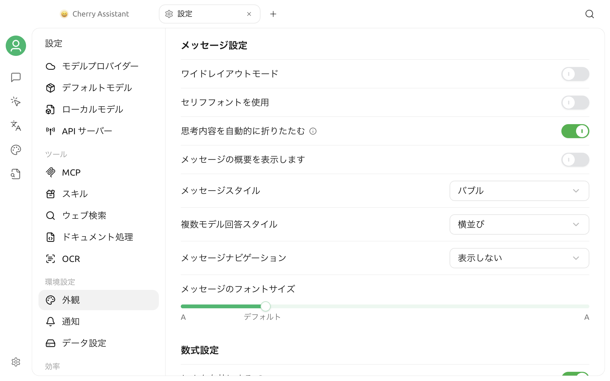

# 外観設定

**設定 > 外観**を開きます。このページには、表示と言語、フォント、入力、メッセージ、数式、コード表示、コード実行、カスタム CSS の各セクションがあります。本ガイドでは、テーマ、ズーム、フォント、メッセージ表示、数式レンダリングを中心に説明します。

## テーマとテーマカラー

### テーマの選択

**テーマ**には 3 つのモードがあります。

| モード | 効果 |
| --- | --- |
| ライト | 常にライトテーマを使用します |
| ダーク | 常にダークテーマを使用します |
| システム | OS の現在のライトまたはダークテーマに従います |

選択すると、アプリケーションのインターフェースが即座に更新されます。**システム**を使用する場合、OSの外観が切り替わると、Cherry Studioもそれに追従して変化します。

### テーマカラーの設定

**テーマカラー**は、主要なボタン、選択状態、強調要素に影響を与えます。以下のことが可能です：

- グリーン、レッド、アンバー、ブルー、またはパープルなどのプリセットから選択する。
- カラーピッカーをクリックして別の色を選択する。
- 入力フィールドに16進数カラーコード（例：`#3B82F6`）を入力する。

色の入力は `#RGB` と `#RRGGBB` に対応しています。保存時には大文字の完全な 6 桁形式に変換され、無効な色は適用されません。

デフォルトのテーマカラーは `#00B96B` です。


テーマカラーだけで完全なカスタムテーマを作成できるわけではありません。その他の画面スタイルを変更する場合は、[カスタム CSS](../../../personalization-settings/css.md)を使用し、変更前のスタイルを保存してください。


## プラットフォーム固有のウィンドウオプション

一部の表示オプションは、対応するシステムでのみ利用可能です。

- **macOS：透明ウィンドウ** — 透明なウィンドウと不透明なウィンドウのスタイルを切り替えます。
- **Linux：システムタイトルバーを使用** — システムが提供するウィンドウタイトルバーに切り替えます。確認するとアプリが再起動します。

Windowsではこれらは表示されません。異なるデスクトップ環境、システムテーマ、グラフィックカードの設定によって、透明度やタイトルバーの表示に影響が出る場合があります。

## インターフェースのズーム

**ズーム**エリアに現在の倍率が表示されます：

- `-` をクリックしてインターフェースを縮小します。
- `+` をクリックしてインターフェースを拡大します。
- リセットアイコンをクリックしてデフォルトの倍率に戻します。

調整は 10% 単位です。ズームは文字、アイコン、画面上のコントロール全体に影響し、チャットメッセージのフォントサイズだけを変更する設定とは異なります。

以下のデフォルトショートカットキーを使用することもできます：

| 操作 | macOS | Windows / Linux |
| --- | --- | --- |
| 拡大 | `⌘ + =` | `Ctrl + =` |
| 縮小 | `⌘ + -` | `Ctrl + -` |
| リセット | `⌘ + 0` | `Ctrl + 0` |

ショートカットの現在の状態は **設定 > ショートカット** で確認できます。詳しくは[ショートカット設定](key-shortcut.md)を参照してください。

## フォント設定

### グローバルフォント

**グローバルフォント**はアプリケーションインターフェースの通常のテキストに影響します。セレクタは現在システムで利用可能なフォントを読み取り、リスト上にプレビューを表示します。

フォント名が表示されない場合：

1. フォントがオペレーティングシステムにインストールされていることを確認してください。
2. Cherry Studio を閉じてから再度開き、アプリケーションにフォントリストを再読み込みさせます。
3. 再度フォントセレクタで検索してください。

右側のリセットアイコンをクリックすると、デフォルトのフォントに戻ります。

### コードフォント

**コードフォント**はコードと等幅表示が必要な領域に使用されます。使用する言語の文字、数字、一般的な記号を含む等幅フォントを選び、コードの位置ずれや文字の欠落を防いでください。

グローバルフォントとコードフォントは相互に独立しています。一方をリセットしても、もう一方には影響しません。


チャットメッセージのフォントサイズはメッセージ表示設定の一部であり、ここでは個別に調整できません。インターフェース全体が大きすぎる、または小さすぎる場合はズームを使用してください。フォントスタイルのみを変更したい場合は、グローバルフォントまたはコードフォントを使用してください。


## メッセージ設定

メッセージ設定では、会話内容のレイアウトと読み方を調整できます。

- **ワイドレイアウトモード：** メッセージ内容に使える横幅を広げます。
- **セリフフォントを使用：** メッセージ本文のフォントスタイルだけを変更します。
- **思考内容を自動的に折りたたむ：** モデルの思考内容をデフォルトで閉じます。
- **メッセージの概要を表示：** 長い会話の構造へ移動する入口を表示します。
- **メッセージスタイル：** バブルなどの表示形式を切り替えます。
- **複数モデル回答スタイル：** 折りたたみ、縦並び、横並び、グリッドを選びます。
- **メッセージナビゲーション：** 非表示、ボタン、アンカーを選びます。
- **メッセージのフォントサイズ：** 画面全体をズームせず、メッセージだけを拡大・縮小します。

メッセージのフォントサイズは 12～22 の範囲で、デフォルトは 14 です。

## 数式設定

**`$...$` を有効にする**は、単一のドル記号で囲まれた内容をインライン数式としてレンダリングするかどうかを制御します。デフォルトで有効です。通常の文章に含まれる金額が数式として誤認識される場合は、無効にしてメッセージを確認してください。

## よくある質問

### 「システム」テーマを選択してもすぐに変更されない場合

まず、オペレーティングシステム自体が別の外観に切り替わっているかを確認し、Cherry Studioで**システム**が選択されているか確認してください。システムテーマイベントがデスクトップ環境に正しく渡されていない場合は、アプリケーションを再起動してから再度確認してください。

### フォントリストに新しくインストールしたフォントがない場合

Cherry Studio は設定画面を開いたときにシステムフォントを読み込みます。フォントをインストールした後はアプリを開き直し、**表示と言語**を確認してください。

### カスタム CSS の適用による表示異常の場合

**設定 > 外観 > カスタム CSS** に進み、関連するスタイルを一時的に空にして、正常に戻るか確認してください。カスタム CSS のセレクタはバージョンによって調整される可能性があるため、深すぎる内部 DOM 構造への依存は避けてください。

問題が解決しない場合は、[フィードバックと提案](../../../question-contact/suggestions.md)から、OS、Cherry Studio のバージョン、表示設定の値、画面全体のスクリーンショットを送信してください。
