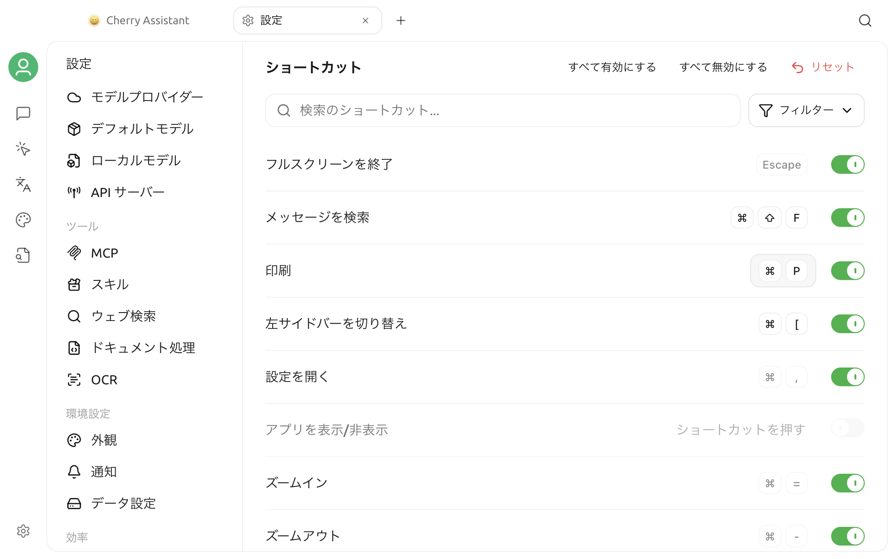

# ショートカット設定

ショートカット設定では、Cherry Studio のキーボード操作を一元管理します。現在の割り当ての確認、編集可能なショートカットの変更、操作の一時的な無効化、デフォルト設定への復元ができます。


本文中の `Cmd/Ctrl` は、macOS では `Command (⌘)`、Windows と Linux では `Ctrl` を表します。実際の画面には、現在の OS に対応するキーが表示されます。


## ショートカット設定を開く

**設定 > ショートカット**を開きます。

ページはすべてのショートカットを 1 つのリストで表示します。検索ボックス右側の**フィルター**を選択すると、すべての項目または 4 つのカテゴリのいずれかを表示できます。

| フィルター | 含まれる操作 |
| --- | --- |
| グローバルとウィンドウ | アプリの表示 / 非表示、設定を開く、全画面終了、印刷、ズーム、グローバル検索 |
| メッセージインタラクション | メッセージの検索、コピーまたは編集、モデルの選択 |
| 会話と話題 | 左右のサイドバー切り替え、トピックの新規作成と名前変更 |
| AIアシスタントツール | クイックアシスタントおよびテキスト選択ツールのグローバルショートカット |

機能が有効になっていない場合、対応するショートカットは表示されません。クイックアシスタントまたはテキスト選択ツールを有効にすると、対応する項目が**AIアシスタントツール**に表示されます。

ページ上部の検索ボックスは、現在のフィルター結果を操作名または表示中のキーの組み合わせでさらに絞り込みます。

## ショートカットの変更

### ショートカットを設定・変更する

1. 対象の操作を見つけます。
2. 右側のキー入力欄をクリックします。未設定の場合は、**ショートカットを入力**をクリックします。
3. 新しいキーの組み合わせを直接押します。
4. 入力内容が検証されると、すぐに保存されて有効になります。

編集中に `Esc` を押すとキャンセルできます。有効なショートカットには通常、修飾キーと通常のキーを組み合わせます。たとえば `Cmd/Ctrl + Shift + M` です。`Esc` と `F1`～`F12` は単独でも使用できます。

一部のシステムレベルのショートカット（設定を開く、全画面を終了する、インターフェースのズームなど）は編集できません。リストには表示されますが、キー入力欄はクリックできません。

### 有効化または無効化

各ショートカットの右側には個別のトグルスイッチがあります：

- スイッチをオフにしてもキーバインドは保持されますが、操作に応答しなくなります。
- 再度オンにすると、元のバインドを引き続き使用できます。
- ショートカットが未設定の項目は直接オンにできません。先にキーの組み合わせを設定してください。

**すべて有効化**と**すべて無効化**は、現在のフィルターと検索結果に含まれ、すでにショートカットが設定されている項目だけに適用されます。未設定の項目は変更されません。

### 競合の処理

Cherry Studio は2種類の競合をチェックします：

- **アプリ内の重複：** 新しいショートカットが、すでに有効な別の Cherry Studio の操作に割り当てられている場合、競合する操作名が表示され、保存できません。
- **システムまたは他のアプリによる使用：** OS がショートカットを登録できない場合、画面に「このショートカットはシステムまたは他のアプリケーションによって使用されています」という赤い警告が表示されます。

競合が発生した場合は、どちらかの操作に別のショートカットを設定してください。システムの予約キー、入力メソッドのショートカット、ウィンドウマネージャーのショートカット、常駐アプリのグローバルショートカットなどが登録失敗の原因になります。

## 現在のデフォルトショートカット

以下の表は、Cherry Studio V2 の現在のデフォルト設定に対応しています。アップグレード後の実際のバインディングは、以前のカスタム設定が保持される場合がありますので、アプリケーション内の表示を優先してください。

### グローバルとウィンドウ

| 操作 | デフォルトショートカット | デフォルト状態 | 説明 |
| --- | --- | --- | --- |
| フルスクリーン終了 | `Esc` | 有効 | フルスクリーンモードを終了します。 |
| メッセージ検索 | `Cmd/Ctrl + Shift + F` | 有効 | グローバルメッセージ検索を開きます。 |
| 印刷 | `Cmd/Ctrl + P` | 有効 | 現在のページを印刷します。 |
| 設定を開く | `Cmd/Ctrl + ,` | 有効 | 設定ウィンドウを開きます。 |
| アプリの表示 / 非表示 | 未設定 | 無効 | 設定後、他のアプリケーションがアクティブなときでも Cherry Studio の表示/非表示を切り替えられます。 |
| インターフェースの拡大 | `Cmd/Ctrl + =` | 有効 | インターフェースのズームレベルを大きくします。テンキーの `+` も使用可能です。 |
| インターフェースの縮小 | `Cmd/Ctrl + -` | 有効 | インターフェースのズームレベルを小さくします。テンキーの `-` も使用可能です。 |
| ズームのリセット | `Cmd/Ctrl + 0` | 有効 | デフォルトのズームレベルに復元します。 |

### メッセージインタラクション

| 操作 | デフォルトショートカット | デフォルト状態 | 説明 |
| --- | --- | --- | --- |
| 直前のメッセージのコピー | `Cmd/Ctrl + Shift + C` | 無効 | 現在のトピックの最後のメッセージ本文をコピーします。 |
| 最後のユーザーメッセージの編集 | `Cmd/Ctrl + Shift + E` | 無効 | 最後のユーザーメッセージの編集状態を開きます。 |
| 現在の会話内でメッセージを検索 | `Cmd/Ctrl + F` | 有効 | 現在のトピック内でメッセージを検索します。 |
| モデルの選択 | `Cmd/Ctrl + Shift + M` | 有効 | 現在のアシスタントの会話モデルセレクターを開きます。 |

### 会話と話題

| 操作 | デフォルトショートカット | デフォルト状態 | 説明 |
| --- | --- | --- | --- |
| 左サイドバーの切り替え | `Cmd/Ctrl + [` | 有効 | アシスタントサイドバーを表示、非表示、またはフォーカスします。 |
| トピックの新規作成 | `Cmd/Ctrl + N` | 有効 | 現在のアシスタントに新しい独立したトピックを作成します。 |
| トピック名の変更 | `Cmd/Ctrl + T` | 無効 | 現在のトピック名を変更します。 |
| 右サイドバーの切り替え | `Cmd/Ctrl + ]` | 有効 | トピックリストを表示、非表示、またはフォーカスします。 |

### AIアシスタントツール

| 操作 | デフォルトショートカット | デフォルト状態 | 使用条件 |
| --- | --- | --- | --- |
| クイックアシスタント | `Cmd/Ctrl + E` | 無効 | まずクイックアシスタント設定で機能を有効化する必要があります。 |
| テキスト選択ツールのオン / オフ | 未設定 | 無効 | 先にテキスト選択ツールを有効にします。 |
| テキスト選択ツール：テキストを取得 | 未設定 | 無効 | 先にテキスト選択ツールを有効にします。 |

クイックアシスタント、テキスト選択ツール、「アプリを表示 / 非表示」はグローバルショートカットです。これらはバインドして有効化すると、Cherry Studio ウィンドウにフォーカスが当たっていなくても応答します。その他のほとんどの対話およびウィンドウのショートカットは、Cherry Studio ウィンドウがアクティブな場合にのみ機能します。

各機能の設定方法については、[クイックアシスタント](../kuai-jie-zhu-shou.md)と[テキスト選択ツール](../selection-assistant.md)を参照してください。

## デフォルト設定への復元

変更した編集可能なショートカットの横には復元アイコンが表示されます。クリックすると、その項目だけがデフォルトの割り当てとデフォルトの有効 / 無効状態に戻ります。

ページ上部の **リセット** をクリックし、確認すると、すべてのショートカットがデフォルトの設定に戻ります。この操作は、ショートカットに設定したカスタムバインディングを上書きします。

## よくある質問

### ショートカットキーを押しても反応がない場合

以下の項目を順に確認してください。

1. 対応する項目にショートカットが設定され、有効になっているか。
2. 現在の機能（例：クイックアシスタントやテキスト選択ツール）が有効になっているか。
3. 会話系のショートカットを使うとき、Cherry Studio ウィンドウが前面にあるか。
4. インターフェース上にシステムや他のアプリケーションによる占有を示す赤い通知が表示されていないか。
5. オペレーティングシステム、入力メソッド、または常駐アプリケーションが同じ組み合わせキーを使用していないか。

上記を確認しても解決しない場合は、まず使用頻度の低いキーの組み合わせで試し、その後 Cherry Studio を再起動してください。

### テキスト選択ツールのショートカットキーが表示されないのはなぜですか？

テキスト選択ツールのショートカットは、機能が有効な場合だけ表示されます。まず**設定 > テキスト選択ツール**で機能を有効にし、ショートカットページに戻ってください。

### 「すべて有効化」を押しても一部の項目が有効にならないのはなぜですか？

一括操作は、現在のフィルターと検索結果のうち、すでにショートカットが設定されている項目だけに適用されます。「ショートカットを入力」と表示される未設定の項目は、先に 1 つずつキーの組み合わせを設定してください。

### デフォルト設定に素早く戻すにはどうすればよいですか？

一つだけ間違えた場合は、その項目の隣にある復元アイコンを使用してください。複数の設定が混乱してしまった場合は、ページ上部の **リセット** を使用してください。

それでも解決しない場合は、[フィードバックと提案](../../../question-contact/suggestions.md)から、OS のバージョン、Cherry Studio のバージョン、競合するショートカット、再現手順を添えて報告してください。
