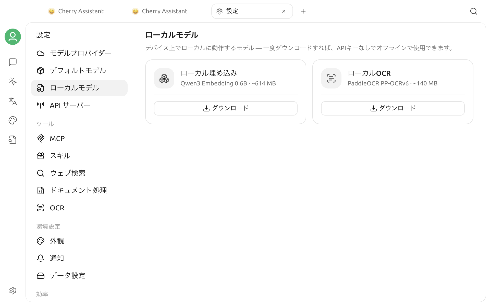

# ローカルモデル

ローカルモデルはデバイス上で動作します。ダウンロード後は API キーなしでオフライン利用できますが、最初のダウンロードにはインターネット接続が必要です。

## ローカルモデルを開く

**設定 > ローカルモデル** を開きます。ページには 2 つのモデルカードがあり、用途、おおよそのサイズ、現在の状態を確認できます。

## 利用できるモデル

| モデル | 表示サイズ | 用途 |
| --- | --- | --- |
| **ローカル埋め込み**（Qwen3 Embedding 0.6B） | 約 614 MB | ナレッジベースの内容からテキスト埋め込みを生成 |
| **ローカル OCR**（PaddleOCR PP-OCRv6） | 約 140 MB | 画像内の文字を認識 |

ローカル OCR が処理するのは画像だけです。ドキュメントから Markdown への変換には使用されません。

## ダウンロードと管理

1. 必要なモデルカードで **ダウンロード** をクリックします。
2. 進行状況バーとパーセントを確認します。停止する場合は **キャンセル** をクリックします。
3. 完了すると、カードに **準備完了** と表示されます。
4. 不要なモデルを削除するには、カード右上の削除アイコンをクリックします。

カードに表示されるのはモデルのおおよそのサイズです。最初のローカルモデルをダウンロードするときは、両モデルで共有するランタイムも取得される場合があるため、実際のダウンロード量とディスク使用量は少し大きくなることがあります。

## 削除の制約と自動動作

- ローカル埋め込みモデルをダウンロードすると、ナレッジベースの埋め込みモデルとして選択できるようになります。新しいナレッジベースを作成する前に準備完了になっている場合は、既定でこのモデルが使用されます。
- ナレッジベースがローカル埋め込みモデルを使用している間、Cherry Studio はモデルを削除しません。対象のナレッジベースで埋め込みモデルを変更してから、もう一度削除してください。
- ローカル OCR をダウンロードすると、ほかの画像文字認識処理を明示的に選択していない場合に限り、既定の処理として設定されます。削除すると、プラットフォームの既定に戻ります。

## プラットフォームの制限

Intel Mac ではローカルモデルを利用できません。ページには **このプラットフォームではローカルモデルはサポートされていません** と表示され、ダウンロードカードは表示されません。

## トラブルシューティング

### ダウンロードに失敗する

インターネット接続を確認し、もう一度 **ダウンロード** をクリックしてください。失敗またはキャンセルしたダウンロードは、利用可能なモデルとして残りません。

### 削除してもローカル埋め込みモデルが残る

少なくとも 1 つのナレッジベースがそのモデルを使用しています。埋め込みモデルを変更してから、このページに戻って削除してください。

### 削除に失敗する

このページを開き直して再試行してください。それでも失敗する場合は、アプリケーションログでエラーを確認してください。
