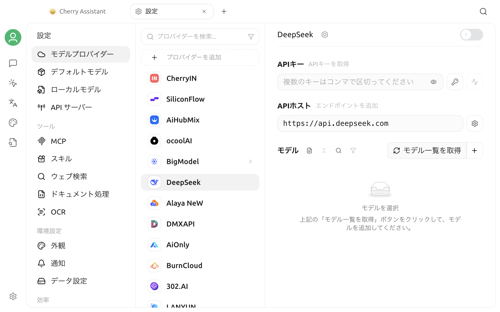

# モデルサービス設定

モデルサービスは、Cherry Studio が大規模言語モデル、ビジョンモデル、埋め込みモデル、および再ランキングモデルを呼び出すための接続インターフェースです。ここでは、プロバイダーの認証情報、リクエストURL、プロトコルエンドポイント、およびモデルリストを設定します。各プロバイダーの登録方法とキーの取得方法は[モデルサービス](../../../pre-basic/providers/)を参照してください。


プラットフォームによって、認証情報を「API Key」「シークレット」「トークン」などと呼ぶ場合があります。具体的な形式や権限はプロバイダーが決定するため、あるプラットフォームのキーが別のプラットフォームで互換性があるとは限りません。


## モデルプロバイダーを開く

移動先：

> **設定 → モデルプロバイダー**

左側はプロバイダーリスト、右側は現在選択されているプロバイダーの接続とモデル設定です。



プロバイダーリストでサポートされている機能：

- プロバイダー名、モデル名、またはモデル ID で検索；
- 有効、無効、すべて、またはエージェントに適したプロバイダーを表示；
- ドラッグ＆ドロップで表示順序の調整；
- 同じプリセット配下で作成された複数のインスタンスを展開；
- 右クリックメニューから管理可能なプロバイダーのコピー、編集、または削除；
- 検索ボックス下の**プロバイダーを追加**ボタンをクリックしてカスタムプロバイダーを作成。

すべてのプロバイダーが無効になっている場合、初回設定が容易になるよう、リストは自動的にすべてのプロバイダーを表示します。

## 内蔵プロバイダーの設定

### 1. プロバイダーの選択と有効化

左側でプロバイダーを選択し、右上のトグルスイッチをオンにしてください。

プロバイダーのスイッチは、そのプロバイダーがアプリケーションで使用可能かどうかのみを決定するものであり、APIキー、アドレス、モデルが正しく設定されていることを意味するわけではありません。

### 2. APIキーの入力

プロバイダーの管理画面で作成したAPIキーを「**APIキー**」に貼り付けてください。

入力フィールドの右側には通常、以下のオプションが表示されます：

- キーの表示/非表示
- キーのコピー
- 複数のキーの管理を開く
- 接続テストを開く

一部のプロバイダーはOAuth、クラウドアカウント認証、またはデバイス認証を使用するため、通常のAPIキー入力フィールドが表示されない場合があります。その場合は、対応するプロバイダーのページの手順に従ってログインするか、クラウドアカウントのパラメータを入力してください。


実際のAPIキーをスクリーンショット、公開リポジトリ、チャット履歴、またはフィードバック添付ファイルに含めないでください。スクリーンショットを撮る前には必ずキーの表示をオフにしてください。漏洩が疑われる場合は、直ちにプロバイダーの管理画面で古いキーを取り消してください。


### 3. リクエストアドレスの確認

内蔵プロバイダーは通常、デフォルトのAPIアドレスを提供しています。プロキシや互換性ゲートウェイを使用しない場合、またはプライベートデプロイメントの場合は、デフォルト値を維持することを推奨します。

一般的なBase URLの例：

```text
https://api.example.com/v1
```

プロバイダーのドキュメントに完全なリクエスト例が表示されていても、安易に`/chat/completions`、`/responses`、または`/messages`をBase URLの末尾に連結しないでください。Cherry Studioはモデルのエンドポイントタイプに基づいてリクエストパスを生成します。

アドレスが変更された場合、インターフェースで「**デフォルトアドレスに戻す**」オプションが表示されることがあります。リクエスト設定のエントリからは、異なるプロトコルのエンドポイントアドレスやカスタムリクエストヘッダーも管理できます。

### 4. 接続テストの実行

APIキー入力フィールドの右側にある「**接続テスト**」をクリックしてください。

現在のV2では、テストパネルが開き、以下の選択を求められます：

- 有効化されたAPIキー1つ
- テストに使用できる追加済みのモデル1つ

テストは、選択されたモデルに対して実際にリクエストを送信します。接続が成功したことは、このセットのキー、アドレス、エンドポイント、およびモデルが基本的な呼び出しを実行できることを示すにすぎず、すべてのモデル、画像、ツール呼び出し、または長文コンテキストのリクエストが利用可能であることを保証するものではありません。

## 複数の API キーを管理する

キー入力欄の横にある**キーリスト**ボタンをクリックすると、以下の操作ができます。

- 複数のキーを追加します。
- キーに識別しやすいラベルを追加します。
- キーを個別に有効化または無効化します。
- キーを編集、コピー、または削除します。
- 有効になっているキーの数を表示します。

実行時には、有効なキー間で順番にローテーションされます。無効化されたキーはローテーションの対象外です。有効なキーが一つもない場合、通常の API キーサービスプロバイダーはリクエストを完了できません。


旧バージョンでは、複数のキーをカンマ区切りで一つの入力欄に記述することが一般的でした。V2 は、キーリストを通じて個別に管理する方が適しています。これにより、名前の付け方、無効化、テストが個別にでき、誤って日本語のコンマを使用したり、ラベルをキーとして誤認したりするのを防げます。


複数のキーのローテーションは、プロバイダーのアカウントレベルのクォータ、組織レベルの制限、または利用規約を回避することはできません。同じアカウント内の複数のキーは、請求書や制限を共有する場合があります。

## API エンドポイントとURL

### ベースURL

ほとんどの場合、サービスのルートアドレスまたはバージョンルートパスを指定します。例：

```text
https://api.example.com/v1
```

`/v1`が必要かどうかは、サービスプロバイダーのドキュメントおよびCherry Studioの対応するプリセットに従ってください。アドレスは有効な `http://` または `https://` のURLを使用する必要があります。

### 完全エンドポイントと `#`

インターフェースが完全なエンドポイントのみを提供する場合は、末尾に `#` を残すことで、Cherry Studioがそれを認識し、それ以上の結合を停止させることができます。例：

```text
https://api.example.com/custom/chat/completions#
```

この書き方は、サービスプロバイダーが非常に特殊な完全パスを明示的に指定した場合のみ使用してください。現在識別可能な一般的なエンドポイントには以下が含まれます：

- `chat/completions`
- `responses`
- `messages`
- `generateContent`
- `streamGenerateContent`
- 画像生成または編集のエンドポイント

通常のベースURLに `#` を追加してはいけません。

### マルチプロトコルエンドポイント

カスタムサービスプロバイダーおよび一部の組み込みサービスプロバイダーでは、個別に設定が可能です：

| プロトコルエンドポイント | 一般的な用途 |
| --- | --- |
| OpenAI Chat Completions | ほとんどのOpenAI互換チャットモデル |
| OpenAI Responses | Responses APIを使用するモデル |
| Anthropic Messages | ClaudeネイティブまたはMessages API互換 |
| Google Generate Content | Geminiネイティブまたは互換インターフェース |

一つのゲートウェイが複数のプロトコルを表示しても、すべてのモデルがすべてのエンドポイントをサポートしていることを意味するわけではありません。モデルのエンドポイントタイプは、サーバー側の実際のプロトコルと一致する必要があります。

### カスタムリクエストヘッダー

**リクエスト設定**では、リスト形式またはJSON形式で追加のリクエストヘッダーを設定できます。

ゲートウェイのドキュメントで明確に要求されている場合（例：テナントIDやプロジェクト識別子）のみ追加してください。Cherry Studioが管理している認証ヘッダーを重複して追加したり、APIキーを複数の場所に同時に記述したりしないでください。

### サービスプロバイダーのAPIオプション

サービスプロバイダー名の横にある稲妻アイコンからは、以下のようなものが提供される場合があります：

- 配列の内容形式
- `developer` ロール
- Stream Options
- Service Tier
- 推論（思考）のオン/オフまたは冗長性 (verbosity)
- Anthropic Prompt Cache関連の設定

これらのオプションはリクエスト形式を変更するだけであり、サーバー側が元々サポートしていない能力を得るわけではありません。`400` エラー、未知のパラメータ、またはレスポンス形式のエラーに遭遇した場合は、まずデフォルトのオプションに戻すことをお勧めします。

## モデル同期リスト

プロバイダーの下にあるモデルリストで「**プル**」をクリックすると、Cherry Studio はプロバイダーから利用可能なモデルを取得し、まず同期プレビューを表示します。

プレビューでは通常、以下のように区別されます。

- サーバー側で新しく追加され、ローカルに追加できるモデル
- ローカルにあり、かつサーバー側にも存在するモデル
- ローカルには存在するが、サーバー側のリストから欠落しているモデル
- ユーザーが有効化、無効化、または保持を選択できる項目

選択を確定してから適用してください。プルを実行したからといって、サーバー上のすべてのモデルが自動的に有効になるわけではありません。

プロバイダーがモデルリストインターフェースを提供していない場合、またはプロキシが対応するインターフェースを実装していない場合は、「**追加**」を使用して手動でモデルを作成できます。

## モデルの手動追加と編集

手動で追加するには、正確な**モデル ID**が最低限必要です。モデル ID はリクエストでサーバーに送信される値であり、サービスプロバイダーのドキュメントと完全に一致している必要があります。

以下の設定も可能です：

- 表示名；
- グループ名；
- エンドポイントタイプ；
- コンテキストウィンドウ；
- 最大入力および出力トークン数；
- モデルの能力。

マークできる一般的な能力には以下が含まれます：

- ビジョン（画像認識）；
- ネイティブウェブ検索；
- 推論；
- ツール呼び出し；
- 埋め込み（エンベディング）；
- リランキング。


能力のタグ付けは、Cherry Studio がモデルをどのように使用すべきかを伝えるだけであり、サーバー側の実際の能力を変更するものではありません。通常のモデルを誤ってビジョン、ネイティブウェブ検索、またはツール呼び出しモデルとしてタグ付けすると、リクエストが失敗したり、外部ツールが正しく注入できなくなったりする可能性があります。


埋め込みモデルとリランキングモデルは、ナレッジベースなどの検索プロセスに使用されるものであり、通常のチャットモデルとして使用すべきではありません。

## モデルの可視性とヘルスチェック

サービスプロバイダーのスイッチとモデルのスイッチは、2つの独立した制御レイヤーです。

1. サービスプロバイダーが有効である必要があります。
2. 個別のモデルも有効である必要があります。

モデルリストツールバーでは、以下の操作が可能です。

- モデルを検索する；
- 機能でフィルタリングする；
- 可視なモデルを一括で有効化または無効化する；
- モデルのヘルスチェックを実行する；
- サーバー側のモデルを取得する；
- 手動でモデルを追加する。

ヘルスチェックは複数のモデルを一度に確認するのに適しています。接続テストは、指定されたキーと指定されたモデルを検証するのに適しています。どちらも実際の API リクエストと少額の費用が発生する可能性があります。

## カスタムプロバイダーの追加

プロバイダー検索ボックス下の**プロバイダーを追加**ボタンをクリックして、カスタムプロバイダーを作成します。

基本的な手順：

1. プロバイダー名を入力します。
2. アイコンを選択またはアップロードします。
3. メインの Base URL を入力します。
4. 任意で最初の API Key を入力します。
5. 必要に応じて、「**その他のエンドポイント**」を展開して他のプロトコルアドレスを入力します。
6. 作成後、詳細ページに入り、Key とモデルを補完します。
7. プロバイダーを有効にし、接続テストを実行します。

新規のカスタムプロバイダーは、デフォルトで OpenAI Chat Completions をメインエンドポイントとして使用します。ターゲットサービスが Anthropic、Google、または Responses API のいずれかにのみ対応している場合は、エンドポイント設定とモデル設定で正しいプロトコルを明示的に選択する必要があります。

また、組み込みプリセットから「**プロバイダーのコピー**」を行うことで、相互に独立した設定インスタンスを作成することもできます。例えば、同じゲートウェイにテスト用と本番用のアドレスがある場合、それぞれ別名でキーや有効/無効の状態を設定できます。

## 推奨設定順序

トラブルシューティングの範囲を減らすために、以下の手順を推奨します。

1. サービスプロバイダーを有効にする；
2. 有効なキーを1つ入力する；
3. デフォルトのAPIアドレスを保持するか確認する；
4. チャットモデルをプルまたは手動で追加する；
5. そのモデルが有効になっていることを確認する；
6. このキーとモデルを使用して接続テストを実行する；
7. チャットページに戻り、簡単なメッセージを送信する；
8. 基本的な呼び出しが正常に機能してから、複数のキー、カスタムヘッダー、高度なエンドポイントを追加する。

最初からキー、アドレス、エンドポイント、リクエストヘッダー、高度なオプションを同時に変更すると、失敗した場合の原因特定が困難になります。

## よくある質問

### プロバイダーは設定されているが、モデルセレクターにモデルがない

確認事項：

- プロバイダーの右上隅にあるトグルスイッチが有効になっているか。
- モデルリストに目的のモデルが追加されているか。
- 目的のモデル自体が有効になっているか。
- 現在のページで能力によるフィルタリングを行っていないか（隠れていないか）。
- モデルIDが正常に保存されているか。

### 接続テストで検出可能なモデルがないと表示される

まず、再ランキングされないモデルを少なくとも1つプルするか手動で追加し、それを有効にしてください。再ランキングモデルは通常の接続テストに使用できません。

### 401 または 403 が返される

通常、認証または権限に関連しています：

- Keyが完全であり、取り消されていないか。
- Keyが正しいプロジェクト、リージョン、または組織に属しているか。
- 選択したモデルが承認されているか。
- カスタムリクエストヘッダーが正しい認証ヘッダーを上書きしていないか。
- クラウドサービスがリージョン、プロジェクト、またはAPIバージョンを必要としていないか。

### 404 が返される

重点的に確認する点：

- Base URLに必要なバージョンのパスが含まれているか、または欠落していないか。
- 完全な `/chat/completions` を通常のBase URLと誤認していないか。
- モデルエンドポイントのタイプがサーバー側のプロトコルと一致しているか。
- カスタムゲートウェイがモデルリストとチャットパスを実装しているか。
- Azureなどのサービスがデプロイ名やAPI Versionを要求していないか。

### 400 または「未知のパラメータ」が返される

プロバイダーAPIオプションとモデル能力をデフォルト値にリセットし、不要なカスタムリクエストヘッダーを削除してから、最もシンプルなテキストチャットでテストしてください。

### モデルのプルに失敗する

一部のプロバイダーはモデルリストインターフェースを開放していないか、ゲートウェイがチャットインターフェースのみを代理している場合があります。この場合は、公式のモデルIDを手動で追加できます。

プルが成功しても、すべてのモデルが現在のアカウントに対して利用可能であるとは限りません。ヘルスチェックまたは実際の対話で検証する必要があります。

### 接続テストは成功したが、対話が失敗する

テストは通常、1つのKey、1つのモデル、および基本的なリクエストのみをカバーします。以下の点も引き続き確認してください：

- 対話で実際に選択されているのが同じモデルであるか。
- 複数Keyローテーション中に無効なKeyがないか。
- 長いコンテキスト、画像、インターネット検索、またはツール呼び出しがモデルの能力を超えていないか。
- アシスタントが互換性のないカスタムパラメータを設定していないか。
- プロバイダー側でクォータ、並行処理、またはコンテンツポリシーによる制限が発生していないか。

### Key が無効な認証情報にローテーションされた場合

キーリストを開き、失敗したKeyを無効化するか削除してから、残りのKeyを個別にテストしてください。無効なKeyが有効な状態のままだと、引き続きローテーションに参加してしまいます。

## セキュリティとバックアップ

- 本物のキーを使用してドキュメントのスクリーンショットを作成しないでください。
- 問題報告に完全なリクエストヘッダーを貼り付けないでください。
- 本番環境のキーとテスト環境のキーを識別できないリストに混在させないでください。
- サービスプロバイダーを削除またはデータをクリーンアップする前に、必ずバックアップを作成してください。
- バックアップまたは同期が完了したら、ターゲットデバイス上でローカルパス、プロキシ、クラウドアカウントの権限を再確認してください。
- 設定を共有する必要がある場合は、認証情報を含まないサービスプロバイダー名、アドレス構造、およびモデル ID を優先して共有してください。

***

### ヘルプの取得とフィードバックの送信

設定が失敗した場合は、[フィードバックと提案](../../../question-contact/suggestions.md)に記載されている公式チャネルを通じてフィードバックを送信してください。Cherry Studio のバージョン、サービスプロバイダー、モデル ID、エンドポイントタイプ、マスキングされた API アドレス、および完全なエラーテキストを添付することが推奨されますが、本物の API キーは添付しないでください。
