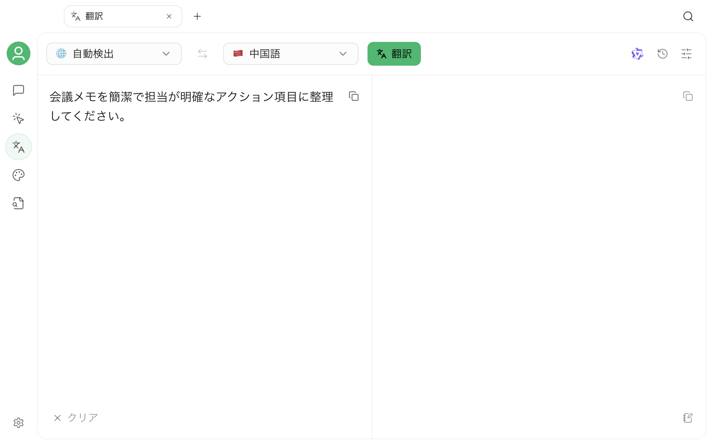

# 翻訳

翻訳ページでは、設定済みの言語モデルを使ってテキストを翻訳します。言語の自動検出、結果のストリーミング表示、テキストや文書のインポート、画像の OCR、翻訳履歴、カスタム言語に対応しており、短い文章、メール、コードスニペット、ファイルから抽出したテキストなどの処理に適しています。

## 使用前の準備

翻訳には、少なくとも 1 つの有効なテキストモデルが必要です。

1. `設定` → `モデルプロバイダー` を開き、プロバイダーとモデルを設定します。
2. 翻訳ページの右上で、翻訳に使用するモデルを選択します。
3. LLM による言語の自動検出を使用する場合は、`設定` → `デフォルトモデル` で**クイックアシスタントモデル**も設定します。

埋め込み、リランキング、画像生成の各モデルは、翻訳モデルの一覧には表示されません。利用可能なモデルがまだない場合は、先に[モデルプロバイダーを設定する](../../pre-basic/providers/README.md)を参照してください。

## 翻訳を開く

上部タブバーの右側にある `+` をクリックして**ランチパッド**を開き、**翻訳**を選択します。

ページは次の部分で構成されています。

| エリア | 用途 |
| --- | --- |
| 上部の言語バー | ソース言語と目標言語の選択、翻訳方向の入れ替え、翻訳の開始または停止 |
| 左側の入力エリア | 翻訳する内容の入力、貼り付け、インポート |
| 右側の結果エリア | 結果のストリーミング表示と翻訳結果のコピー |
| 右上のツール | モデルの選択、翻訳履歴と翻訳設定の表示 |

ウィンドウの幅が狭い場合、入力エリアと結果エリアは上下に配置されます。

## 1 回の翻訳を完了する

1. ソース言語を選択します。判断できない場合は、**自動検出**のままにします。
2. 目標言語を選択します。
3. 左側に内容を入力または貼り付けます。
4. **翻訳**をクリックするか、`Ctrl + Enter`（Windows / Linux）または `Command + Enter`（macOS）を押します。
5. 右側でストリーミング表示される結果を確認し、完了後にコピーボタンをクリックします。

翻訳中は、**翻訳を停止**をクリックして現在のリクエストを中断できます。左側の入力を消去すると、右側の結果も同時に消去されます。


翻訳結果は、現在選択しているモデルによって生成されます。専門用語、契約、医療、その他の高リスクな内容は、該当分野の能力を持つ人が確認してください。


## ソース言語と目標言語を選択する

### 自動検出

ソース言語で**自動検出**を選択すると、Cherry Studio は入力言語を判定してから翻訳を開始します。検出に成功すると、ソース言語の位置に検出結果が表示されます。

設定には 3 つの検出方法があります。

| 方法 | 動作 |
| --- | --- |
| 自動 | 内容の長さに応じて LLM またはローカルアルゴリズムを優先的に選択し、ローカルアルゴリズムで検出できない場合は LLM にフォールバックします |
| ローカルアルゴリズム | モデルを呼び出さずにローカルで素早く検出しますが、対応言語は比較的限られています |
| LLM | クイックアシスタントモデルを使って検出します。一般に短いテキストや判定しにくいテキストに適していますが、追加のモデル呼び出しが 1 回発生します |

LLM による検出が失敗する場合は、クイックアシスタントモデルが設定済みで利用可能か確認してください。

### 翻訳方向を入れ替える

ソース言語が**自動検出**以外の場合は、中央の入れ替えボタンをクリックできます。Cherry Studio はソース言語、目標言語、原文、既存の翻訳結果を同時に入れ替えます。

### 双方向翻訳

設定で**双方向翻訳設定**を有効にして言語の組み合わせを指定すると、Cherry Studio は検出した入力言語に基づき、組み合わせのもう一方の言語を目標言語として自動的に選択します。2 つの決まった言語間で繰り返しやり取りする場合に適しています。

入力言語が設定した組み合わせに含まれない場合、方向を判断できないというメッセージが表示されます。

## ファイルまたは画像をインポートする

入力が空の場合、左側にファイルのインポートエリアが表示されます。このエリアをクリックしてファイルを 1 つ選択するか、ページへファイルをドラッグします。クリップボード内の画像は直接貼り付けることもできます。

| コンテンツの種類 | 処理方法 |
| --- | --- |
| 画像 | 現在の OCR 設定でテキストを認識してから、入力エリアに追加します |
| プレーンテキスト、Markdown、コードなどのテキストファイル | テキストを直接読み取り、入力エリアに追加します |
| PDF、Word、PowerPoint、Excel、ODF 文書 | 読み取り可能なテキストを抽出し、入力エリアに追加します |

一度にインポートできるファイルは 1 つだけです。テキストファイルの上限は 5 MB、文書の上限は 20 MB です。実際に読み取れる内容は、ファイル形式、文書構造、ローカル環境のファイル処理能力によって異なります。


ファイルのインポートはテキストを抽出するための機能であり、元のレイアウトを維持した翻訳文書は生成しません。段落ごとに書式を調整する必要がある場合は、先に内容を抽出してから、分割して翻訳・整理することをおすすめします。


画像からテキストを認識できない場合は、`設定` → `ドキュメント処理` の OCR 設定を確認し、画像が鮮明で向きが正しいことを確認してください。

## 翻訳モデルを選択する

右上のモデルアイコンをクリックすると、有効なテキストモデルから翻訳モデルを選択できます。選択時は次の点を参考にしてください。

- 日常的な短いテキストでは、応答が速くコストを抑えやすいモデルを優先する
- 長いテキストでは、モデルのコンテキスト長と出力制限を確認する
- 専門的な内容では、用語や文体の処理を複数のモデルで比較する
- 翻訳専用モデルは独自のプロトコルで動作することがあり、カスタム翻訳プロンプトを使用しない場合がある

翻訳ボタンが常に無効な場合は、内容が入力済みで、有効なモデルが選択されていることを確認してください。

## 翻訳設定

右上の設定ボタンをクリックしてサイドパネルを開きます。

### 結果と操作

| 設定 | 役割 |
| --- | --- |
| Markdown プレビュー | 翻訳結果を Markdown としてレンダリングします。無効の場合はプレーンテキストで表示します |
| 翻訳完了後、自動的にコピー | 翻訳完了後に結果をクリップボードへ自動的に書き込みます |
| スクロール同期設定 | 長いテキストをスクロールする際に、左右の欄を相対位置に合わせて連動させます |

### 翻訳プロンプト

翻訳プロンプトは、通常の対話モデルが原文をどのように処理するかを制御します。デフォルトのテンプレートには次の項目が含まれています。

- `{{target_language}}`：現在の目標言語
- `{{text}}`：翻訳するテキスト

テンプレートを変更する場合は、この 2 つのプレースホルダーを残してください。削除すると、目標言語または原文がモデルに渡らない可能性があります。元に戻すには**リセット**をクリックします。

### カスタム言語

組み込み言語以外に、カスタム言語を追加することもできます。追加時に表示名と言語コードを入力してアイコンを選択します。作成後は、名前とアイコンの編集または言語の削除が可能です。

言語コードは一意である必要があり、組み込み言語と重複できません。信頼できる翻訳結果が得られるかどうかは、選択したモデルがその言語名と内容を理解できるかによって決まります。

## 翻訳履歴を使用する

翻訳が成功するたびに、原文、翻訳結果、言語の方向、時刻が翻訳履歴に保存されます。右上の履歴パネルを開くと、次の操作を行えます。

- 翻訳履歴を表示して再読み込みする
- 履歴内の原文または翻訳結果をコピーする
- よく使う履歴をお気に入りに追加し、お気に入りだけを表示する
- 履歴を 1 件削除する
- 確認後にすべての履歴を消去する

履歴を再読み込みすると、その時点の原文、翻訳結果、言語の方向も同時に復元されます。

## よくある質問

### 翻訳ボタンが使用できない

入力エリアが空ではないこと、翻訳モデルが選択されていることを確認し、ファイルの読み取り、言語検出、または前の翻訳が完了するまで待ってください。

### 自動検出でエラーが発生する

LLM による検出を設定している場合や、自動方式から LLM にフォールバックした場合は、クイックアシスタントモデルを確認してください。ソース言語を明示的に選択するか、ローカルアルゴリズムを試すこともできます。

### 結果が空になる／途中で失敗する

モデルプロバイダーのキー、ネットワーク、残高、呼び出し頻度の制限、モデルの利用状況を確認してください。長いテキストはモデルのコンテキストまたは出力制限を超える場合があるため、短い段落に分割して再試行してください。

### ソース言語と目標言語を入れ替えられない

ソース言語が**自動検出**になっている場合、翻訳中、言語の検出中、またはファイルの処理中は、入れ替えボタンが一時的に使用できません。ソース言語を明示的に選択し、現在の処理が完了するまで待ってください。

### ファイルのインポートに失敗する

一度に選択するファイルが 1 つで、対応形式であり、サイズ上限を超えていないことを確認してください。スキャンした文書、複雑な表、パスワードで保護されたファイル、破損したファイルでは、テキストを完全に抽出できない場合があります。

## プライバシーと料金

通常の翻訳内容は、現在選択しているモデルのプロバイダーへ送信されます。LLM による自動検出では、クイックアシスタントモデルも呼び出されます。画像は翻訳前に現在の OCR コンポーネントで処理されます。データの機密性に応じて適切なサービスと導入方法を選び、各プロバイダーのプライバシーポリシーと料金体系を確認してください。

***

問題が発生した場合や機能改善を希望する場合は、[フィードバックと提案](../../question-contact/suggestions.md)をご利用ください。
