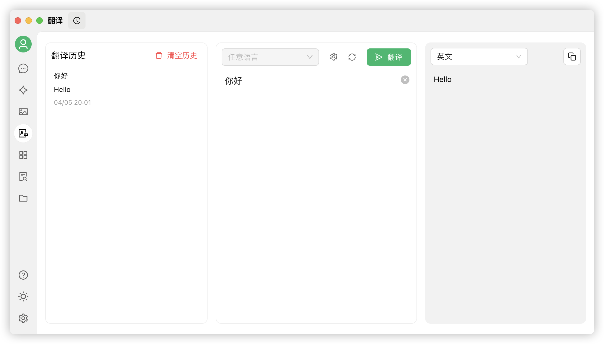


このドキュメントはAIによって中国語から翻訳されており、まだレビューされていません。


# 翻訳

Cherry Studioの翻訳機能は、迅速かつ正確なテキスト翻訳サービスを提供し、複数言語間の相互翻訳をサポートします。

### インターフェース概要

<figure><figcaption></figcaption></figure>

翻訳インターフェースは主に以下の部分で構成されます：

1. **原文言語選択エリア**：
   * 任意の言語：Cherry Studio が自動的に原文言語を認識して翻訳します。
2. **目標言語選択エリア**：
   * プルダウンメニュー：テキストを翻訳したい言語を選択します。
3. **設定ボタン**：
   * クリックすると [デフォルトモデル設定](settings/default-models.md) に移動します。
4. **スクロール同期**：
   * クリックでスクロール同期を切り替え（どちらか一方でスクロールすると、もう一方も連動してスクロール）。
5. **テキスト入力ボックス（左側）**：
   * 翻訳が必要なテキストを入力または貼り付けます。
6. **翻訳結果ボックス（右側）**：
   * 翻訳後のテキストを表示。
   * コピーボタン：クリックで翻訳結果をクリップボードにコピーします。
7. **翻訳ボタン**：
   * クリックで翻訳を開始します。
8. **翻訳履歴（左上）**：
   * クリックで翻訳履歴を確認できます。

### 使用手順

1. **目標言語を選択**：
   * 目標言語選択エリアで翻訳したい言語を選択します。
2. **テキストを入力または貼り付け**：
   * 左側のテキスト入力ボックスに翻訳したいテキストを入力または貼り付けます。
3. **翻訳を開始**：
   * `翻訳` ボタンをクリックします。
4. **結果の確認とコピー**：
   * 翻訳結果が右側の翻訳結果ボックスに表示されます。
   * コピーボタンをクリックすると翻訳結果をクリップボードにコピーできます。

### よくある質問 (FAQ)

* **Q: 翻訳が正確でない場合は？**
  * A: AI翻訳は強力ですが完璧ではありません。専門分野や複雑な文脈のテキストは、手動での校正をお勧めします。別のモデルに切り替えることもお試しください。
* **Q: 対応言語は？**
  * A: Cherry Studioの翻訳機能は主要な多言語に対応しています。具体的な対応言語リストは、Cherry Studio公式サイトまたはアプリ内説明をご参照ください。
* **Q: ファイル全体の翻訳は可能ですか？**
  * A: 現在のインターフェースはテキスト翻訳が主な用途です。ファイル翻訳については、Cherry Studioの会話ページでファイルを追加して翻訳する必要があります。
* **Q: 翻訳速度が遅い場合は？**
  * A: 翻訳速度はネットワーク接続状況、テキストの長さ、サーバー負荷などの影響を受ける可能性があります。ネットワーク接続が安定していることを確認し、お待ちください。